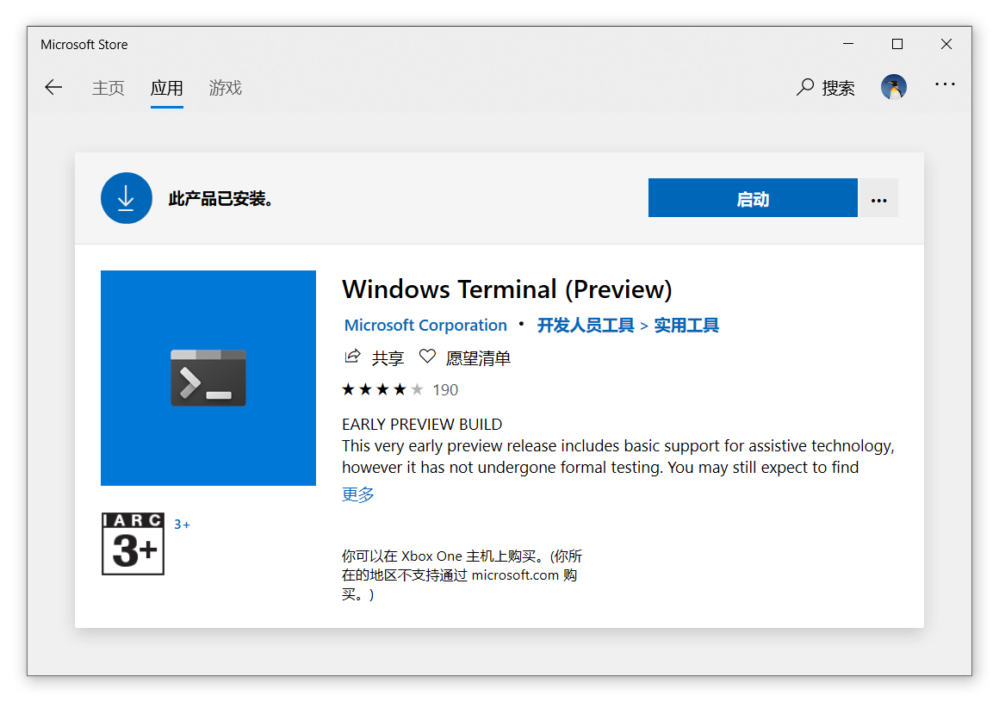
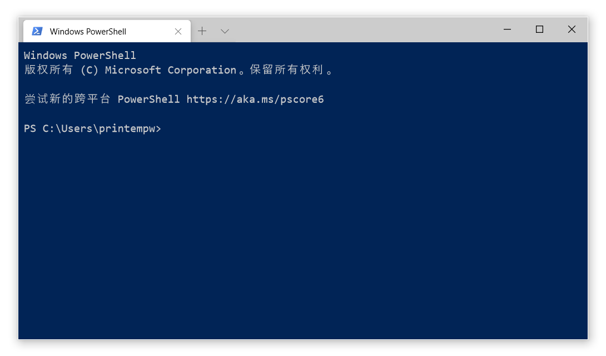
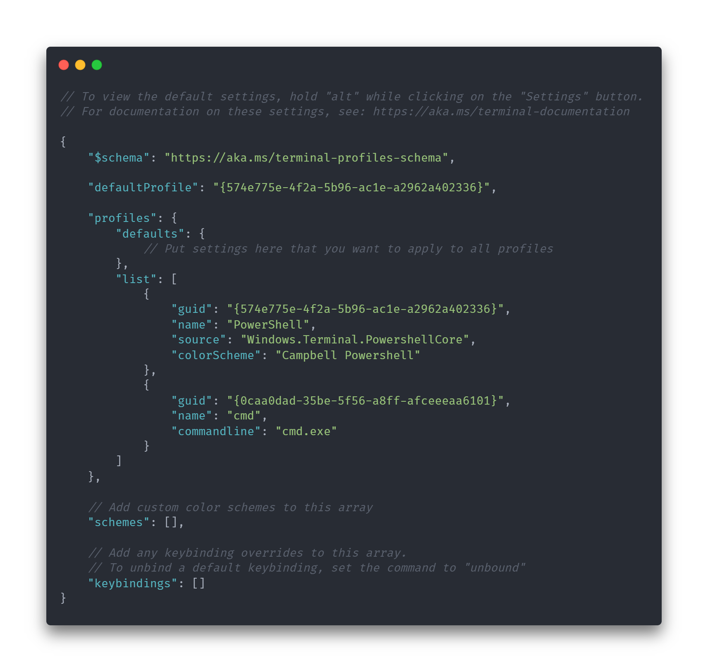
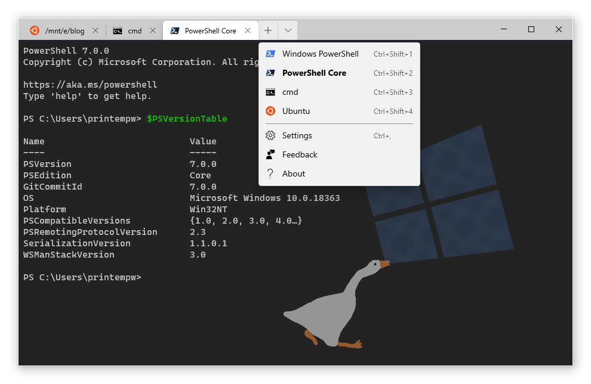
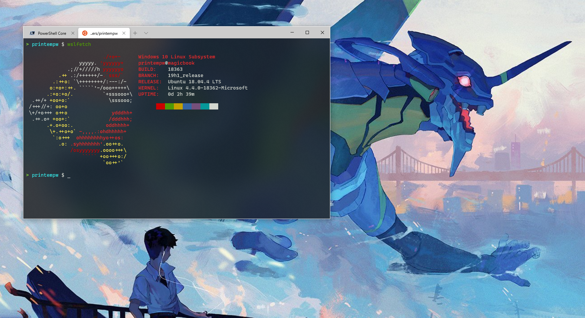
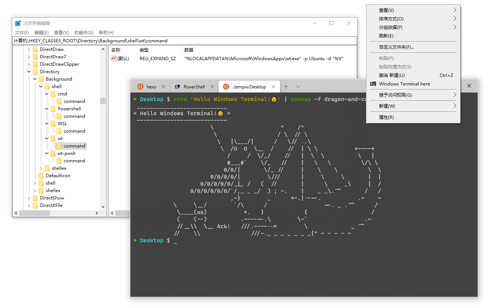

自今年微软开发者大会 Build 2019 中[首次亮相](https://devblogs.microsoft.com/commandline/introducing-windows-terminal/)以来，经历了近半年的发展，万众瞩目的 Windows Terminal 已经日趋成熟。从十月份开始，我将其作为主力终端使用了一段时间，暂时还没遇到什么严重的问题。

为了方便其他想要试试 WT 的选手，这里我将安装配置过程中的一些步骤以及踩到的坑整理成文，希望对各位有所帮助。

<!--more-->

## 1. WT 好处都有啥？

根据官方介绍，Windows Terminal 是一个面向命令行用户的全新、现代化、功能丰富的高性能终端应用程序。它在实现了社区用户热切期望的许多功能的同时（包括多标签页、富文本、全球化、可配置性、对主题与样式的支持等），依然保持快速与高效，不会消耗大量的内存或电量。

> 不清楚什么是终端？来看看这篇博客吧：[命令行界面 (CLI)、终端 (Terminal)、Shell、TTY，傻傻分不清楚？](https://prinsss.github.io/the-difference-between-cli-terminal-shell-tty/)

说得挺唬人，不过到底也就是一个终端模拟器，玩不出什么花儿来。终端一抓一大把，mintty、ConEmu、Hyper、Terminus……有什么特别的理由用 WT 吗？

在我看来，WT 的一些特性更偏向于「润物细无声」型。比如基于 DirectX 的字体渲染引擎，原生支持 Unicode 字符、Emoji、连字等，虽然不起眼，但确确实实地提升了用户体验。而且……亚克力背景真的很好看呀！~~好看是第一生产力嘛~~

作为微软团队主导开发的开源项目，我对其还是抱有很大信心的。

## 2. 总之先安装

**注意：Windows Terminal 要求 Windows 10 1903 (build 18362) 及以上版本。**

WT 现在已经上架 [Microsoft Store](https://www.microsoft.com/store/apps/9n0dx20hk701?cid=storebadge&ocid=badge)，所以直接在商店里搜索安装即可。



如果你无法使用 Microsoft Store，也可以下载 [releases](https://github.com/microsoft/terminal/releases) 页面打包好的 `.msixbundle` 手动安装（记得先安装依赖库 [Desktop Bridge VC++ v14 Redistributable Package](https://www.microsoft.com/en-us/download/details.aspx?id=53175)）。

也可以使用 Chocolatey 包管理器来安装：

```sh
choco install microsoft-windows-terminal
```

或者使用 Scoop 安装（通过 [@h404bi](https://github.com/h404bi) 维护的第三方 bucket）：

```sh
scoop bucket add dorado https://github.com/h404bi/dorado
scoop install windowsterminal
```

如果你愿意，你还可以手动编译安装，具体请参考 [官方文档](https://github.com/microsoft/terminal/blob/master/README.md#developer-guidance)。

## 3. 配置

安装完成之后，WT 默认是长这样的：



是不是感觉没什么出彩的？让我们给它打扮打扮！

> **2020/03/14 更新**：现在 Windows Terminal 自带 Cascadia Code 字体，开箱颜值就挺高了。而且这字体我很喜欢，Linux 上作为终端字体也很好看。

### 3.1 配置文件简介

目前（截至 2019 年 10 月 ~~2020 年 3 月也一样~~），我们只能通过 `profiles.json` 配置文件来配置 Windows Terminal。

在标签右侧的下拉菜单中点击「Settings」，即可用你默认的 `.json` 文件编辑器打开配置文件。该文件的实际位置在这里：

```text
%localappdata%\Packages\Microsoft.WindowsTerminal_8wekyb3d8bbwe\LocalState\profiles.json
```

按住 Alt 键再点击「Settings」，可以打开默认的配置文件 `defaults.json`。你可以将其作为参考修改 `profiles.json`，但注意不要直接修改 `defaults.json`，因为对其做出的改动均不会被保留。



下面我会简单描述一下各配置项的作用，如果想要更详细地了解，请参考官方文档：

- [Editing Windows Terminal JSON Settings](https://github.com/microsoft/terminal/blob/master/doc/user-docs/UsingJsonSettings.md)
- [Profiles.json Documentation](https://github.com/microsoft/terminal/blob/master/doc/cascadia/SettingsSchema.md)

### 3.2 全局配置

这里仅介绍些常用配置，剩下的看上面的文档去罢。

```json
{
    // 默认打开的 Profile GUID（下面会详细介绍）
    "defaultProfile": "{e1e1ac58-02c1-456a-a857-01149673a65d}",
    // 终端窗口默认大小
    "initialCols": 120,
    "initialRows": 30,
    // 亮色或暗色主题，可选值 "light", "dark", "system"
    "requestedTheme": "system",
    // 合并标题栏和标签栏
    "showTabsInTitlebar": true,
    // 如果 showTabsInTitlebar 与本值同为 false 时，自动隐藏标签栏
    "alwaysShowTabs": true,
    // 在标题栏上显示当前活动标签页的标题
    "showTerminalTitleInTitlebar": true,
    // 双击选择时用于分词的字符
    "wordDelimiters": " /\\()\"'-.,:;<>~!@#$%^&*|+=[]{}~?\u2502",
    // 选择时复制到剪贴板
    "copyOnSelect": true,
    // 标签页宽度不固定
    "tabWidthMode": "titleLength",

    // ...
}
```

### 3.3 添加新 Shell

以 WSL 为例（虽然 WT 自带了 WSL 的 Profile，不过这里不管它）：

```json
"profiles": {
    "defaults": {
        // 所有 Profile 共用的设置可以放这里，就不用写多次了
        // 字体设置
        "fontFace": "Cascadia Code",
        "fontSize": 11,
        // 光标类型，可选值 "vintage" ( ▃ ), "bar" ( ┃ ), "underscore" ( ▁ ), "filledBox" ( █ ), "emptyBox" ( ▯ )
        "cursorShape": "underscore",
        // 背景亚克力透明效果（窗口失去焦点时无效）
        "useAcrylic": true,
        "acrylicOpacity": 0.8
    },
    "list": [
        {
            // 每个 Profile 的唯一标识符，生成方法见下
            "guid": "{e1e1ac58-02c1-456a-a857-01149673a65d}",
            // 设置为 true 即可在新建菜单中隐藏
            "hidden": false,
            // 名字，会显示在菜单中
            "name": "Ubuntu",
            // 启动命令行
            "commandline": "wsl.exe",
            // 启动目录
            "startingDirectory": ".",

            // 背景图片
            // "backgroundImage" : "X:\\path\\to\\background.png",
            // "backgroundImageOpacity" : 0.5,
            // "backgroundImageStretchMode" : "uniformToFill",

            // 菜单与标签中显示的图标
            "icon": "X:\\path\\to\\ubuntu.png",
            // 配色方案，见下
            "colorScheme": "Tango Dark",
            // 光标颜色
            "cursorColor": "#FFFFFF",

            // ... 其他配置请参见官方文档
        }
    ]
}
```

GUID 网上有很多生成器，你也可以用 PowerShell 命令生成一个：

```powershell
[guid]::NewGuid()
```

把之前的 `defaultProfile` 设置为某个 Profile 的 GUID，打开 WT、新建标签页时就会默认使用这个 Profile。

另外你可能会注意到 `defaults.json` 中有些 Profile 的 `icon` 图片路径是以 `ms-appx:///ProfileIcons/` 开头的。这是 UWP 应用的 [URI Schemes](https://docs.microsoft.com/en-us/windows/uwp/app-resources/uri-schemes)，`ms-appx:///` 指向的物理路径是应用的实际安装路径。

官方文档中推荐我们把自定义图标、背景图之类的放到与 `profiles.json` 同一目录里去，然后在配置中用 `ms-appdata:///Local/xxx` 的形式来引用资源。不过如果嫌麻烦的话，直接使用绝对路径也是没问题的。



### 3.4 调整配色

从 `defaults.json` 中可以看出，WT 内建可用的配色方案有：`Campbell`、`Campbell Powershell`、`Vintage`、`One Half Dark`、`One Half Light`、`Solarized Dark`、`Solarized Light`。

如果你对这些都不感冒，[mbadolato/iTerm2-Color-Schemes](https://github.com/mbadolato/iTerm2-Color-Schemes) 这个 repo 里有超多的终端配色，总有一款适合你（而且都提供了 WT 的配置格式，复制粘贴就能直接使用）。比如说我习惯使用 Tango 配色：

```json
"schemes": [
    {
        "name": "Tango Dark",
        "black": "#000000",
        "red": "#cc0000",
        "green": "#4e9a06",
        "yellow": "#c4a000",
        "blue": "#3465a4",
        "purple": "#75507b",
        "cyan": "#06989a",
        "white": "#d3d7cf",
        "brightBlack": "#555753",
        "brightRed": "#ef2929",
        "brightGreen": "#8ae234",
        "brightYellow": "#fce94f",
        "brightBlue": "#729fcf",
        "brightPurple": "#ad7fa8",
        "brightCyan": "#34e2e2",
        "brightWhite": "#eeeeec",
        "background": "#000000",
        "foreground": "#D3D7CF"
    }
],
```

配上亚克力透明背景还是很好康的（背景图来自 [@pix_bun](https://twitter.com/pix_bun/status/1126230459510169600)）：



### 3.5 修改按键绑定

默认的一些热键：

- 打开新标签页：<kbd>Ctrl</kbd> + <kbd>Shift</kbd> + <kbd>T</kbd>
- 使用指定 Profile 打开标签页：<kbd>Ctrl</kbd> + <kbd>Shift</kbd> + <kbd>1...9</kbd>
- 关闭标签页：<kbd>Ctrl</kbd> + <kbd>Shift</kbd> + <kbd>W</kbd>
- 前一个标签页：<kbd>Ctrl</kbd> + <kbd>Tab</kbd>
- 后一个标签页：<kbd>Ctrl</kbd> + <kbd>Shift</kbd> + <kbd>Tab</kbd>
- 复制：<kbd>Ctrl</kbd> + <kbd>Shift</kbd> + <kbd>C</kbd>
- 粘贴：<kbd>Ctrl</kbd> + <kbd>Shift</kbd> + <kbd>V</kbd>

想自定义的话直接参照 `defaults.json` 修改 `keybindings` 即可。

### 3.6 添加右键菜单

一个趁手的终端，很重要的一点就是能够随时呼出。目前，有这么几种快速打开 Windows Terminal 的方式：

- `Win + S` 或者 `Win + R`，输入 `wt` 按回车；
- 资源管理器中按 `Ctrl + L`，输入 `wt -d .` 回车在当前目录中打开（如果设置了 `"startingDirectory": "."` 可以直接输入 `wt`）；
- 使用 [Quicker](https://getquicker.net/Sharedaction?code=4e7abb0c-f213-4ee4-39f5-08d7bfff7792) 或者 [AutoHotkey](https://www.autohotkey.com) 等第三方工具。

不过我还是比较习惯传统的右键菜单「在这里打开终端」的方式。WT 目前还没有内置这一功能，想要手动添加也比较麻烦（下文参考了这个 [issue](https://github.com/microsoft/terminal/issues/1060) 中的方法）。

以管理员权限打开 PowerShell，运行以下命令：

```powershell
$basePath = "Registry::HKEY_CLASSES_ROOT\Directory\Background\shell"
New-Item -Path "$basePath\wt" -Force -Value "Windows Terminal here"
New-ItemProperty -Path "$basePath\wt" -Force -Name "Icon" -PropertyType ExpandString -Value "X:\path\to\terminal.ico"
New-Item -Path "$basePath\wt\command" -Force -Type ExpandString -Value '"%LOCALAPPDATA%\Microsoft\WindowsApps\wt.exe" -p Ubuntu -d "%V"'
```

如果你足够熟练，也可以自行通过其他方式修改注册表，反正就那么些字段，路径正确就行了。Windows Terminal 的图标可以在 [这里](https://raw.githubusercontent.com/microsoft/terminal/master/res/terminal.ico) 获取 。

> **2020/03/14 更新**：Windows Terminal 0.9 版本之后添加了 `wt.exe` 的[命令行参数](https://github.com/microsoft/terminal/blob/master/doc/user-docs/UsingCommandlineArguments.md)，可以直接指定启动目录，不需要再修改 `profiles.json` 中的 `startingDirectory` 字段了。

另外 `wt.exe` 支持通过 `-p` 参数指定要打开的 Profile，所以除了 WSL，我还添加了一个在当前目录下打开 PowerShell 的菜单项（注册表中添加一个 `Extended` 项可以让该右键菜单项仅在按住 Shift 右键时才显示）。你甚至可以通过二级菜单的方式实现更多功能，具体可以参考上面给出的 issue 中的讨论。



## 4. 后记

到这里，WT 就基本配置完成了，下面是闲聊时间。

我用过很多终端，Windows Terminal 虽然不错，但也没到要吹上天的地步。

**我认为，真正决定操作系统命令行体验的，不是终端，是 Shell。**诚然，如果终端很漂亮的话，光看着也非常赏心悦目，但如果其中的 Shell 是 `cmd.exe`，那实际体验可能就令人抓狂了。

在之前[介绍 WSL 的文章](https://prinsss.github.io/wsl-guide/)中我也说过，我喜欢 WSL 的原因之一，就是它提供了一种以类 Unix 系统命令行的那一套东西去操作 Windows 的能力（比如 Bash 和各种 GNU 小工具）。PowerShell 是不错，论强大肯定不输给任何命令行 Shell，但我用不惯呀（不过最近我也有在学习）。以前的 Cygwin 等项目虽然也能达成同样的效果，但是因为其底层实现的不同，还是 WSL 来得更舒适一些。

所以当我得知 WSL2 底层实现换成了虚拟机的时候是很抗拒的。系统调用翻译层的设计不是很惊艳吗？怎么直接就变成个小 VM 了？原本 WSL 最为人称道的（至少我是如此）互操作性要怎么办？距离我接受 WSL2，看来还是需要一定的时间。

不过有一说一，Windows Terminal 还是很不错的。~~我又是软软了~~

Microsoft，干得漂亮！❤️
