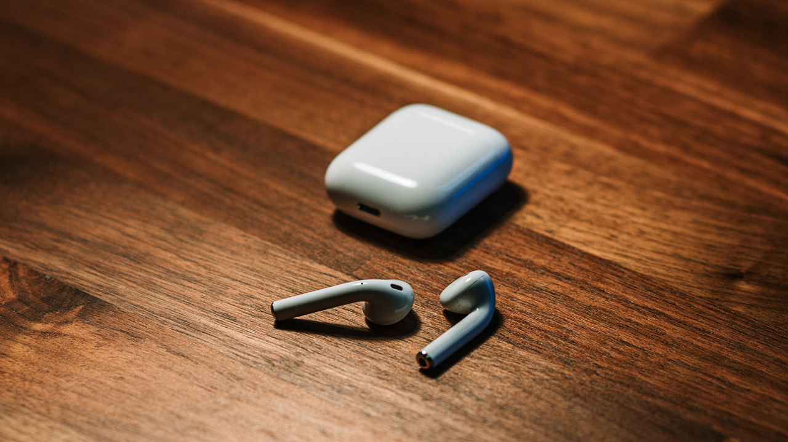
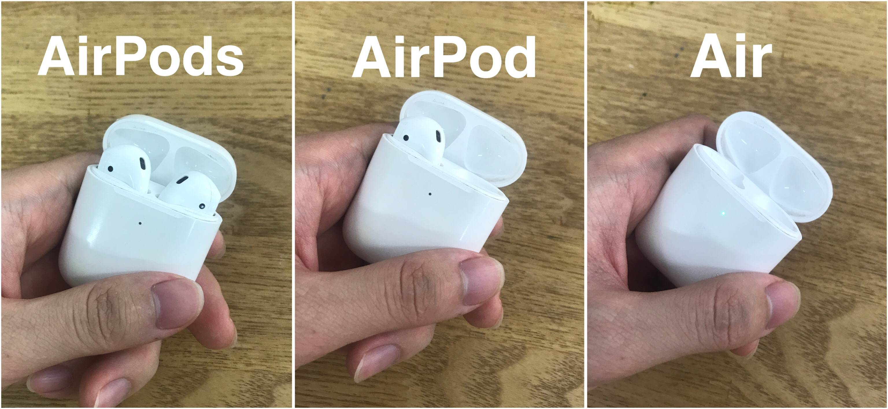
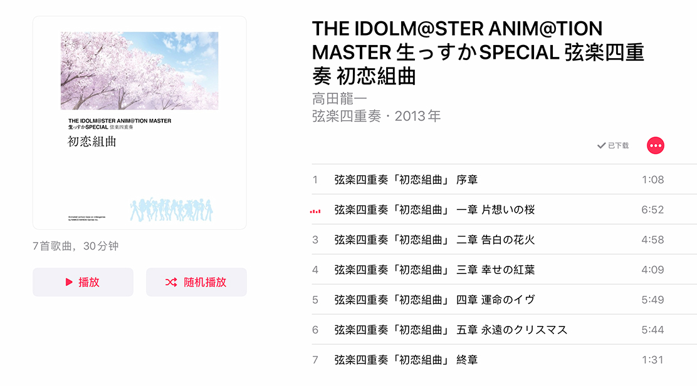
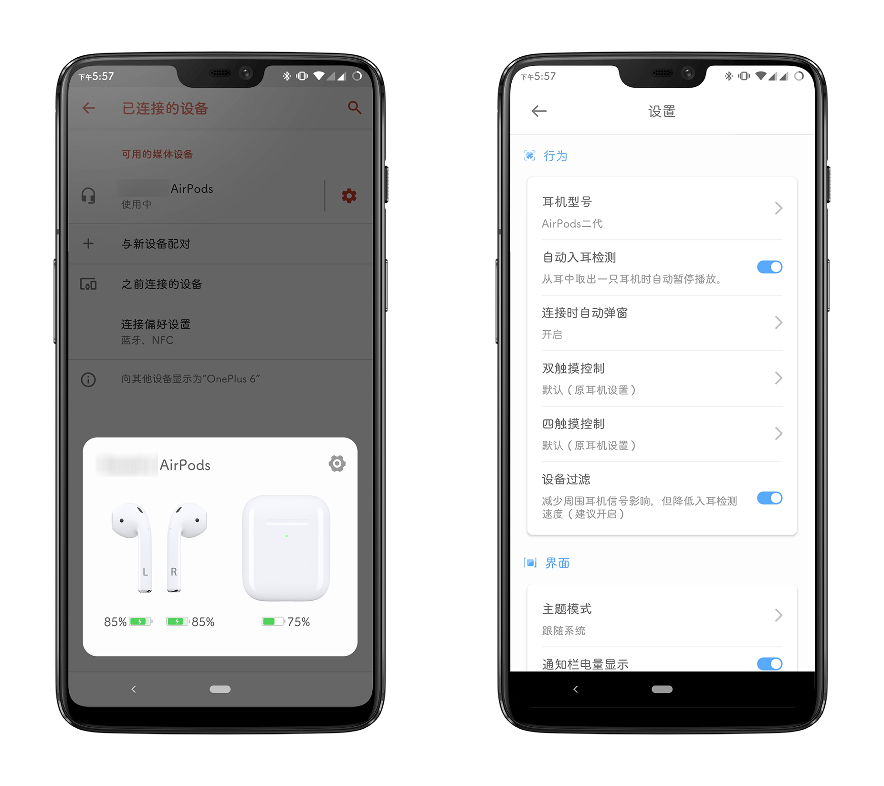
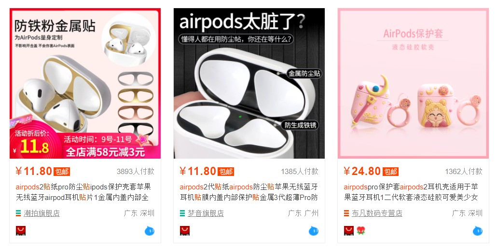

先说好，这不是安利文：我没有推荐任何人购买 AirPods 2 的意思。

这篇文章仅旨在向各位分享我入手 AirPods 2 后的**真实使用体验**，有吐槽也有真香。

数码圈有个很奇怪的现象，总有那么些人抢着当「厂商孝子」「精神股东」，批评一句产品好像要了他们的命似的（更好笑的是还会互相扣帽子），对此我实在是难以理解。反正我对数码产品的态度一直都是：喜欢就买，开心就好。

如果你恰巧在考虑是否要入手 AirPods 2，希望这篇文章能对你有所帮助。

<!--more-->

## 剁手的缘由

其实直到几个月以前，我对 AirPods 一直都是不怎么感冒的。虽然 AirPods Pro 发布的那段时间各路数码圈 KOL 都在吹，但我也并没有什么感觉。一是手头没有苹果设备，买了也无法发挥其最大能力；第二，就是穷。

就算有拼多多的百亿补贴，现在 AirPods 2 也要八百多好吗！AirPods Pro 更是要一千四百多，我一个穷逼大学生何德何能用这么贵的耳机！反正都是一万以下听个响，只有 QCY T1 和 Redmi AirDots 这种平民 [TWS 耳机](https://zhuanlan.zhihu.com/p/59097387)才是我的朋友呜呜呜。

然而，自从今年入手了 iPad Air 3 后（我买过最值的数码产品之一，以后有机会也会写一写），我却越来越按捺不住心中的欲望，对 AirPods 种的草也越来越高。正好前段时间接的外包项目也小赚了一点……

于是，在一个月黑风高的夜晚，我终究还是败给了欲望，于拼夕夕购入了本文的主角 —— [AirPods (第二代)](https://www.apple.com.cn/airpods-2nd-generation/)。

~~（￥839 分六期，一个月加手续费 ￥146，一天 ￥5，四舍五入就是不要钱）~~

*▲ 配图来自 [Unsplash](https://unsplash.com/photos/ZhToglVbSdY)，懒得自己拍了，反正到处都有*

## 在哪里买？

从近年的评论来看，在拼多多百亿补贴购买 AirPods 是个不错的选择。通过关键词在什么值得买、V2EX、酷安等社区搜索，大部分都是安全下车的案例。当然这里要注意必须认准拼多多的「百亿补贴」商品，在其他地方买可能就变成**并夕夕**了。

另外一个比较靠谱且实惠的渠道是 Apple 官方的教育优惠。今年 Apple 的[返校季活动](https://www.apple.com.cn/cn-k12/shop/back-to-school)是买 iPad/Mac 送 AirPods，合计起来性价比绝对是不输第三方的。当时看到教育优惠 ￥3701 就能买到 iPad Air 3 64G + AirPods 2 时，我也就只能安慰自己早买早享受了……

如果你只想要耳机，也可以去微博的 #iPad# 超话逛一逛，有很多买了平板的人在出耳机回血。AirPods 2 基本上 ￥800 左右就能收到，商量一下还可以刻字或者加钱上 Pro，就是对方靠不靠谱要自己斟酌了。

## 到手如何验机

最近的山寨 AirPods 完成度据说已经到了以假乱真的地步，包括开盖弹窗、反磁铰链（就是开盖以后把耳机盒横过来，盖子由于磁铁斥力不会自动合上）、电量显示、三码合一、改名、定位啥的都实现了，只能说华强北还是牛逼。

下面是一些现时点可用的鉴别真伪方法，供各位参考：

1. 耳机连接上 iPhone/iPad 后，在「设置 > 通用 > 关于本机」中可以看到 AirPods 的序列号，检查其与包装盒、充电盒上盖上的序列号是否一致，以及序列号是否可以在 [Apple 官网](https://checkcoverage.apple.com/cn/zh/)查询到；

2. AirPods 2 和 AirPods Pro 都可以在戴耳机时直接呼叫 Siri。把 iPhone/iPad 放在房间里，自己走到一个比较远声音传不过去的地方，说一声「嘿，Siri」，Siri 会回复「嗯？」~~（我经常在煮面时喊 Siri 帮忙倒计时）~~；

3. AirPods 2 背部有个黑色长条形的开孔，起到类似音箱导相管的作用，堵住以后耳机声音会明显失去低频，很容易听出来。至于 Pro，毕竟正品有主动降噪，这是目前华强北还做不到的，应该更好区分。

都验证了一遍后，拼爹爹安全下车，可喜可贺。

## 要不要买 Apple Care+

没错，耳机也有 [Apple Care+](https://www.apple.com.cn/support/products/headphones/)。简单来说，如果你花了 299 元买了 AC+，就可以享受为期两年的专家技术支持、额外硬件保修服务，以及最多两次的意外损坏保修服务。（每次事件收取 199 元，两只耳机带充电盒全坏了也收 199。而[保外维修费用](https://support.apple.com/zh-cn/airpods/repair/service)为 549 元一只）

299 都够再买一副普通耳机了……我这么小心的人，真的有必要吗？

众所周知，真无线蓝牙耳机是消耗品。随着长时间的使用，其内置的锂电池不可避免地会被损耗，而且 AirPods 的高集成度也使得电池更换十分困难（当然这可难不倒人民群众，现在淘宝上已经有 AirPods 换电池的服务了）。从其他用户实际体验来看，刚买来充满电可以使用五个小时的续航，使用两年后可能就只有两个小时不到了。

而如果你买了 AC+，那么在这两年内电池健康用到低于 80% 的话，可以免费更换。就算这两年内什么也没发生，到时候花个 199 直接换一副新耳机也未必不值。

所以最终我还是选择了购买 AC+，敞开用就完事儿了。

不过要注意的是，AC+ 的服务范围不包括 AirPods 变成 AirPod 或变成 Air。

## 要不要买无线充电盒

你可能并不需要无线充电盒。

买之前我也在纠结，无线充电听起来很诱人，每天回来把耳机盒往那一放就行，不怕忘记充电。但我又一想，我手机又不支持无线充电，难道还要专门再买个无线充电器不成？可是，我下一部手机可能就有无线充电了呀……

纠结良久，最后我还是下单了有线充电盒的版本（主要拼多多百亿补贴也没有无线充电版本）。实际使用下来，我并没有发现有线充电有什么不方便的地方。一天戴耳机五个小时左右的话，耳机盒基本可以做到三天一充，而且一小时就能充满。

当然，有钱人忽视就好，不就多加 300 嘛，不差那点钱。

## 音质

既然是耳机，音质肯定是个绕不开的话题。

但我这里必须要说，听感是个很玄学的概念。不要全盘相信网上的信息，吹捧也好贬低也好，只有自己耳朵收货才是最靠谱的。

曾经我也很纠结于 AirPods 的音质，毕竟网上的评价都是清一色的「白开水」「音质差」「抬走」。要是买回来真的很难听怎么办，硬着头皮习惯就好？虽然我并不是什么金耳朵 HiFi 玩家，但地摊水平的音质肯定也是难以接受的。

还好，事实证明 AirPods 2 的音质并不烂。至少对我而言，是「耐听」的水平。

我主要听的音乐是 J-pop 和 Anisong，在使用 AirPods 2 的过程中，我并没有感受到三频有明显的短板，乐器人声都挺好听，解析也足够到位。不过听纯音乐就比较拉胯了，总有种不太行的感觉，还比不上我的 AM800。

再说一遍，听感是非常个人的，如果真的很重视音质的话，买之前推荐先借别人的来试听一下。

## 降噪与佩戴舒适度

我购买 AirPods 2 的一个重要原因就是，它是半入耳式的耳机。

相比起入耳式耳机，半入耳式在佩戴舒适度上肯定是要领先一大截的。入耳式耳机我佩戴两个小时左右就得摘下来休息一下，不然耳朵堵得慌，而半入耳式可以戴一天也没什么异物感（当然也有部分人的耳朵戴不住 AirPods，我是没这个问题）。

虽然戴起来舒服了，但比起入耳式耳机，AirPods 2 可以说是一点降噪效果也没有。到了嘈杂的环境下，基本就是听个响。当然这也不能完全算缺点，走在街上用入耳式耳机总有种不踏实的感觉，半入耳式相对还更安全一些。

所以在我看来，AirPods 和 AirPods Pro 是互补而非互相替代的关系，预算允许当然是双持最爽啦（非要我选其中一个的话，我会选 AirPods 而非 Pro）。

## 连接稳定性与延迟

这个可以说完全不用担心了，配合 Apple 自家的设备使用，连接质量和延迟在所有 TWS 耳机中都是数一数二的。

实际体验下来，iPad 放在卧室里，人戴着耳机在家里到处乱走从来没出现过断连现象，这是我之前使用的 Redmi AirDots 完全比不了的。配合我的一加 6 手机会稍微逊色一点，隔两堵墙就不行了，但普通使用情况下也是完全没问题的。

至于延迟，我是真的没想到 AirPods 2 竟然可以拿来打音游，惊了个呆。

*▲ 实测关闭 SE，判定调节 +2 左右打邦邦体验非常不错*

## 多设备切换与兼容性

虽然我买了 AirPods，但其实我手头只有 iPad 一个果子家的设备，手机还是用的 Android。实际使用下来，AirPods 2 配合 Android 设备依然有着很 OK 的使用体验，包括开盖弹窗、电量显示、入耳检测、通话、轻点操作等功能都可以实现（有些需要配合第三方软件，我用的是 [AndPods](https://www.coolapk.com/apk/cn.xiaolongonly.andpodsop)）。

戴着耳机时可以在已配对的设备中无痛切换，爽到。

至于 Windows 嘛……能用是能用，但是一来 Windows 不支持蓝牙 AAC 音频编码，使用起来音质是可感知地明显下降了一截；二来 Windows 会抢连接：比如你当前正连着手机听音乐，一开电脑就自动给你连到电脑上去了，非常可恶。所以记得在 Windows 上使用完毕后顺手删除配对，不然真的烦人。

## 不足之处

说完优点说缺点。

首先，这玩意的光面外壳真的很容易刮花。如果平时经常放口袋里摩擦的话，过几个月可能外壳就惨不忍睹了。虽然有 AC+ 到时候可以换新，但磨花的外壳看着也不舒服啊是不是。所以不像手机随便裸奔，AirPods 还是推荐买个保护套。

第二，充电盒边缘容易吸附铁屑。虽然没有[这位兄弟这么夸张](https://www.zhihu.com/question/268689024)，但日常使用中还是会脏，看着很不爽，清理起来还麻烦。怪不得某宝上还有卖内盖防尘贴的……

第三，做工差。真的很难想象 AirPods 这感人的接缝竟然是出自 Apple 之手，我他妈一两百块的耳机都没你这么大的接缝好吗！我手上这台充电盒的铰链还能轻微左右晃动，什么品控啊这都。

不过其他倒是真没啥了，不愧是全球 TWS 耳机[出货量排名第一](https://www.canalys.com/newsroom/canalys-tws-smart-audio-shipments-Q1-2020)的选手。

## 写在后面

除了 AirPods 系列，近几年各大厂商也推出了不少 TWS 耳机，比如广受好评的 Galaxy Buds，中低端市场无敌的 QCY，以及音质说第二没几个敢说第一的森海塞尔 Momentum True Wireless 2，可以说是选择的余地非常多了。

而我也是看了很多各种各样的测评，最后选择了 AirPods 2。其他我不敢说，不过收到耳机这两个星期以来，我确实用得很快乐。从结果来看，这次的购物我十分满意。

以上就是我的真实体验，如果你正好在种草的话，不妨参考一下。
