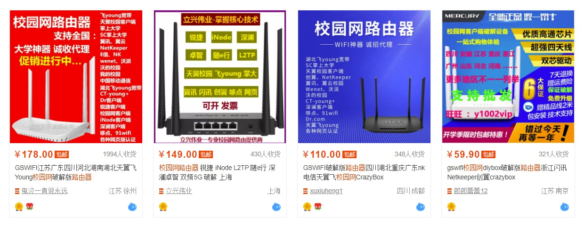
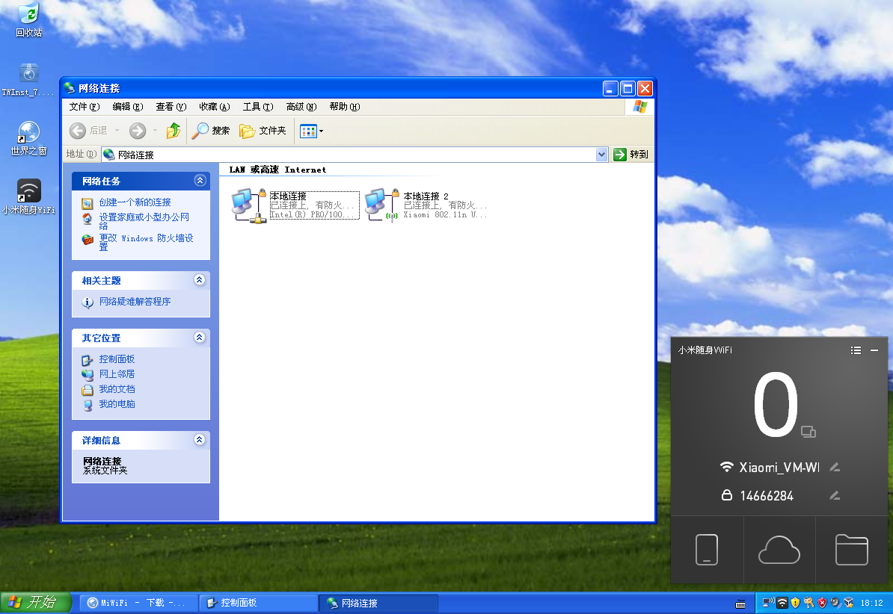
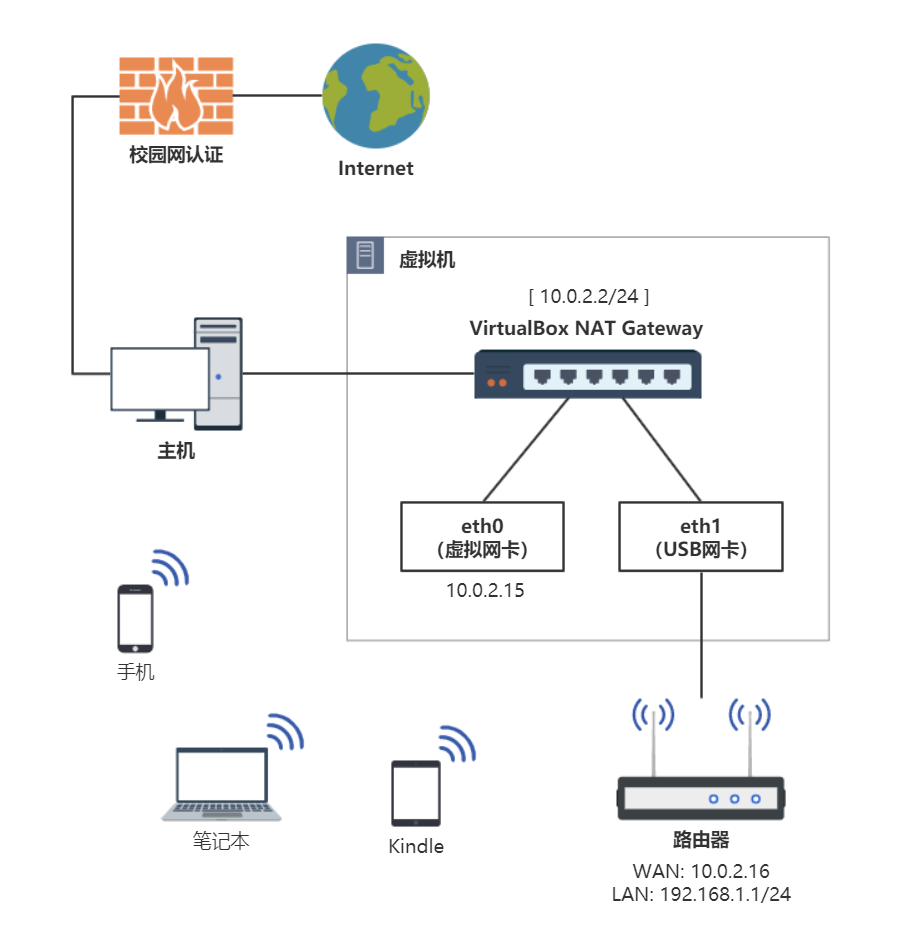
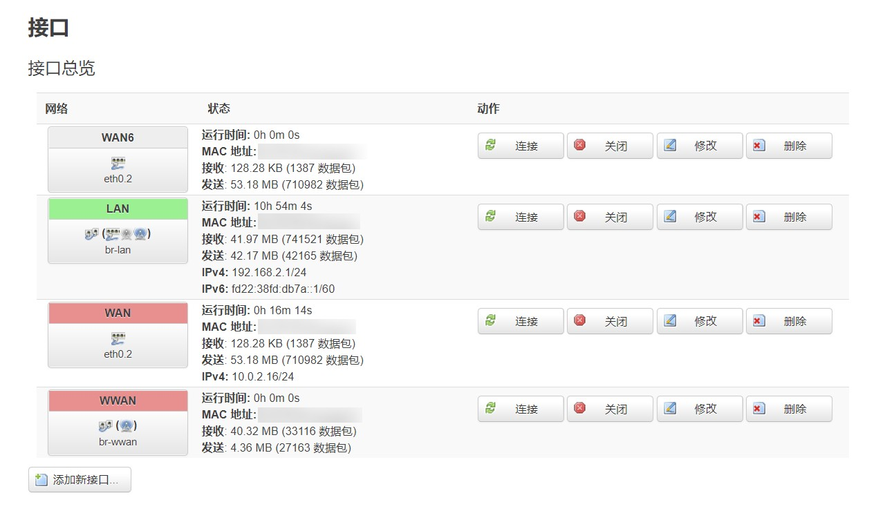
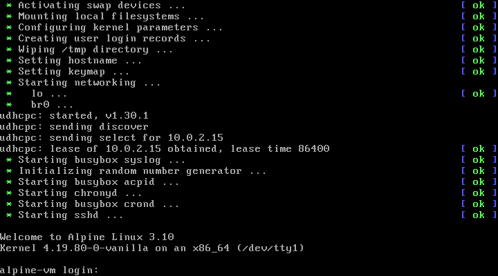

最近大一新生们开学了，就有几位学弟来问我说，咱们学校的校园网要怎么才能开 WiFi 热点、能不能用路由器。回想一下当初我也折腾了好一段时间，本来想水篇博客的，后来不知道怎么的就咕咕咕了……正好借此机会分享一下。

其实吧，学校有的是办法搞你。除了强制一人一号、恶心的专用拨号客户端防共享以外，还能通过 [IPID、TTL、时钟偏移检测](https://www.xavier.wang/post/45-suck-shit-lan/)，甚至是 DPI 深度包检测的方法来防私接，就看校方做得够不够绝了。当然破解的方法也有，但基本也不会让你好受。如果碰到这样的校园网，推荐你直接躺平，给这种垃圾网络交钱还不如开个无限流量套餐呢。

**免责声明：日后你惹出祸来，不把师父说出来就行了.jpg**

<!--more-->

## 校园网的限制

先说一下我们学校校园网恶心的地方。接入网线后，你需要：

1. 使用【软件A】进行第一次拨号：
   - 【软件A】会进行多网卡检测，如果你的系统里有一个以上的网络适配器，则拒绝拨号；
   - 上述网络适配器包括硬件网卡（USB 网卡、无线网卡）和虚拟网卡（各种虚拟机的虚拟网卡、TAP 网卡等）；
   - 认证类型为 802.1x 认证。
2. 使用【软件B】进行第二次拨号：
   - 【软件B】不检测网卡，但会拒绝在虚拟机中运行，如果宿主机开了 Hyper-V 还会误报；
   - 检测猎豹 WiFi、360 WiFi 等共享软件的进程；
   - 认证类型为 L2TP VPN。

而且这两个软件只能在 Windows 上跑，macOS、Linux 用户就干瞪眼吧。

~~其实说到这里，有些人应该都心里有数这俩软件是啥。不过我这里就不明说了，懂的都懂（x~~

接下来来看一下网上常见的破解方案，也就是**路由器拨号**。

据说网上有很多人在卖所谓的「校园网路由器」，其实说白了就是刷了 OpenWRT 的路由器 + 破解校园网的插件。如果有现成的插件能用，那自然是最好，刷个固件也不是什么难事。但不幸的是，目前网上并没有针对【软件A】新版本的拨号脚本，而旧版本的已经不再适用于我们学校的网络了。除非另有大神愿意开发新版本的拨号脚本，否则这条路是行不通的。更何况我们这还要二次拨号，更是难上加难。



而如果想要在电脑上直接分享热点，第一会被检测多网卡，第二可能会被检测进程。

emmmmm……🤔

那么，让我们的网卡不被检测到不就行了？

## 使用虚拟机绕过网卡检测

这个方法其实是以前我偶然发现的。

当时我在用虚拟机捣鼓 Kali Linux，用了 VirtualBox 的 USB Passthrough 功能把 USB 外接网卡穿透进虚拟机给 Kali 使用。此时，宿主机操作系统里是看不见这个 USB 网卡的，设备管理器、网络适配器里都没有，就像不存在一样。不存在……嗯？

于是我翻箱倒柜找出了几年前凑单买的小米随身 WiFi，在虚拟机里一通操作：



嘿，成了！

> 如何配置，搜索「VirtualBox USB 网卡」即可。

看来虚拟机的 USB 直通确实可以避开校园网认证客户端的多网卡检测，而且客户端也并没有对 VirtualBox 做什么手脚（后来查了一下，据说【软件A】会干扰 VMware 的 NAT 网络共享服务……）。那么，能做的事情可就多了。

## 使用有线网卡桥接路由器

上面的方案能用是能用，但效率过于低下。

1. 虚拟机系统没必要用 Windows，就算是 XP 也是性能浪费；
2. USB 无线网卡孱弱的 WiFi 性能不足以满足我的需求；
3. 每次开机都要启动虚拟机，操作繁琐复杂。

既然要用得爽，那肯定得把这些问题解决了。

首先，把 USB 无线网卡换成 USB 有线网卡，下联硬路由作为 AP。同时，把 Guest OS 换成轻量级的 Alpine Linux 并实现开机启动。完成后的网络拓扑图类似这样（综合考虑最后还是选择了两层 NAT）：



首先在虚拟机内安装 [Alpine Linux](https://alpinelinux.org/) 和对应的网卡驱动（注意不要用 virt 版本的内核，很多驱动都被精简掉了）：

```bash
ip link show
```

```plain
1: lo: <LOOPBACK,UP,LOWER_UP> mtu 65536 qdisc noqueue state UNKNOWN qlen 1000
    link/loopback 00:00:00:00:00:00 brd 00:00:00:00:00:00
2: eth0: <BROADCAST,MULTICAST,UP,LOWER_UP> mtu 1500 qdisc pfifo_fast master br0 state UP qlen 1000
    link/ether [mac addr] brd ff:ff:ff:ff:ff:ff
3: eth1: <BROADCAST,MULTICAST,UP,LOWER_UP> mtu 1500 qdisc pfifo_fast master br0 state UP qlen 1000
    link/ether [mac addr] brd ff:ff:ff:ff:ff:ff
4: br0: <BROADCAST,MULTICAST,UP,LOWER_UP> mtu 1500 qdisc noqueue state UP qlen 1000
    link/ether [mac addr] brd ff:ff:ff:ff:ff:ff
```

添加网桥，把 USB 网卡和虚拟机的虚拟网卡桥接到一起：

```bash
brctl addbr br0
brctl addif br0 eth0
brctl addif br0 eth1
brctl show
```

启动网络：

```bash
ip link set dev eth1 up
ip link set dev br0 up
ip link show
```

删除之前分配给虚拟网卡 eth0 的 IP，并启动 DHCP 客户端为 br0 获取 IP 地址：

```bash
ip addr flush dev eth0
udhcpc -i br0
ip addr show
```

此时应该虚拟机内、有线网卡端都能访问网络了，可以通过 `ping` 测试一下。

可以用的话就永久保存网络配置：

```bash
vi /etc/network/interfaces
```

```plain
auto lo
iface lo inet loopback

auto br0
iface br0 inet dhcp
        hostname alpine-vm
        bridge-ports eth0 eth1
        bridge-stp 0
```

接下来把 USB 网卡和路由器的 WAN 口用网线连接起来，测试是否工作正常。如果想省一层 NAT，可以连到 LAN 口上并关闭路由器 DHCP 功能，就当个单纯的 AP 使用。不过我为了相对稳定的内网环境，还是选择了前者。



一切正常的话，就可以愉快地使用 WiFi 啦。

如果想要让 Alpine 虚拟机开机后台运行，可以使用 [VBoxHeadlessTray](https://github.com/toptensoftware/VBoxHeadlessTray) 这个程序。



## 当前方案的不足之处

至此，我们的校园网网络共享方案已经算是比较完善了。

幸运的是，我校似乎并没有部署其他什么防私接技术，像这样用了半年多也一直相安无事，省下我不少流量费。

然而，这个方案还是有些不爽的地方。

1. 作为主机的电脑和其他设备不在一个子网下；
2. 电脑必须一直开着其他设备才能有网。

在这套方案下，**路由器下联的设备对于主机是几乎不可见的**（不然也绕不过校园网分享限制了）。你可以在其他设备上访问主机上的网络服务（VirtualBox 的 NAT 网络里宿主机的 IP 一般为 `10.0.2.2`，子网下的设备可以直接访问，效果和主机上访问 `localhost` 基本一致），但无法反过来访问子网里的其他设备。

虽然你也可以通过 VirtualBox 的端口映射实现一些变通的解决，比如把路由器的 22、80 端口映射到宿主机上方便访问，但 SMB 这类服务就不行了（Windows 访问 SMB 服务器时强制端口为 445，无法手动指定，要改只能改注册表），所以我完全无法在主机上访问子网下的 NAS 设备。

这也太难受了，继续改进！

既然这些软件都需要跑在一台 Windows 机器上，那我专门弄一台机器来跑校园网相关的东西不就好了吗？

## 入手双网口工控机软路由

于是我把目光投向了最近几年很火的软路由。

> 就像计算机有软件和硬件的区别，路由器也有「软」「硬」之分。通常我们在各个电商平台上搜索「路由器」这三个关键词所得到的几乎所有商品都属于硬路由，它是由路由器厂商基于自行开发或是开源的嵌入式设备操作系统，根据特定的硬件设备，设计出来的传统硬件设备。
>
> 而与之对应的软路由，是基于软件工具在普通的硬件上来实现传统路由器的功能。**我们可以在旧电脑、工控机、开发板、服务器甚至是硬件虚拟机中安装软路由系统，然后通过强大的软件实现各种各样的功能。**
>
> ——[《从听说到上手，人人都能看懂的软路由入门指南》](https://sspai.com/post/58628)

一番比较后，我在某鱼上入手了一台二手的双网口工控机，安装 Windows 7 系统后，将上面的所有校园网相关的软件都转移到了这台低功耗小主机上。

至于为什么买双网口的机器，虽然 VirtualBox 只能直通 USB 网卡所以还是得外接，不过考虑到以后不用校园网了还可以原地变身软路由，所以不如直接一步到位买个好点的。毕竟现在 CPU 差不多的也就几百块，没必要省那点钱买个电子垃圾。

## 写在后面

这套方案我用了一年多，基本上没啥问题。24 小时开机、低功耗、子网设备无感知，爽到。

另外，不要怪我写得这么笼统，毕竟每个学校的校园网都不太一样，很难写出一篇普适性的教程。这篇文章充其量算个 PoC，证明一下只要能折腾，还是能捣鼓出舒适的宿舍网络环境的。

如果你是大佬，甚至可以写个软件实现一样的功能，隐藏网卡、软件 NAT 啥的。不过我是菜鸡，也不想在这上面花太多心思，所以就这样吧。又不是不能用.jpg

至于这么折腾值不值得，那就见仁见智了。至少我是愿意的：**你不让我开热点我就不开，那我岂不是很没有面子。**老子又不是没交钱，凭什么？


最后，祝各位早日摆脱傻逼校园网。

