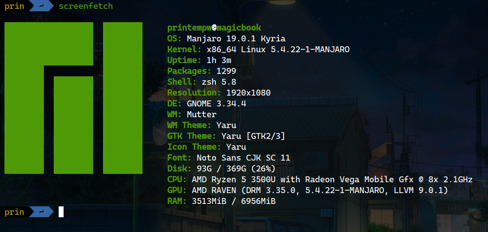

看到这标题你可能会觉得奇怪，Manjaro 不是滚动更新的发行版吗？`pacman -Syu` 一下就完事儿了，这有什么好写的。

其实不然。就算你一路滚上来所有包都是最新版本，也不代表你机器上的软件包就和最新的 ISO 一致了。

<!--more-->



在发行版的迭代中，软件包的增删、升级是常有的事。

- 如果新版本中有软件包被删除了：这些包不会被自动删除，除非你手动移除；
- 如果新版本中新增了软件包：升级时不会自动安装这些包，除非你手动安装；
- 如果新版本中软件包被另一软件包替代了：保持原样，除非你手动替换；
- 如此种种。

总的来说就是，rolling release != everything updated with latest release。

想来这也是很正常的处理，不然你东西用得好好的突然给你删了或者换成了其他的，本来卸载掉的软件升级完又给你装回来了，都挺不爽的。

所以虽然在滚动更新中大部分的软件包都已经更新到了最新版本，和 Manjaro 19.0 的 ISO 中一致，但还是有些新增的软件包是没有安装到系统里的。如果是 Arch 用户就基本不会有这方面的顾虑，毕竟几乎所有软件包都是自己安装的，升级了就是升级了，和 Manjaro 这种预装好一大票软件包的发行版不一样。

**那么要如何手动处理新版本中的软件包变更呢？**

在这里你可以找到 Manjaro 19.0 中完整的软件包列表：

[manjaro-gnome-19.0-200224-linux54-pkgs.txt](https://osdn.net/projects/manjaro/storage/gnome/19.0/manjaro-gnome-19.0-200224-linux54-pkgs.txt)

和本地的软件包列表比较一下（ref: [Manjaro Forum](https://forum.manjaro.org/t/manjaro-19-0-released-gnome-kde-xfce-architect/126010/31)）：

```bash
comm -1 -3 <(pacman -Q | cut -d' ' -f1 | sort) <(curl "https://osdn.net/projects/manjaro/storage/gnome/19.0/manjaro-gnome-19.0-200224-linux54-pkgs.txt" -L -o - | cut -d' ' -f1 | sort)
```

比如说我的机器上对比的结果是这样的：

```text
adwaita-maia
dash
empathy
evolution
farstream
firefox-gnome-theme-maia
game-devices-udev
gamemode
gfbgraph
gnome-maps
gnome-shell-extension-desktop-icons-ng
gnome-shell-extension-gamemode
gnome-shell-extension-nightshellswitcher
gnome-shell-extension-nightthemeswitcher
gupnp-av
hexchat
intel-ucode
jre8-openjdk
jre8-openjdk-headless
kvantum-theme-matchama
lib(...)
manjaro-browser-settings
manjaro-dynamic-wallpaper
manjaro-gdm-theme-19.0
manjaro-gnome-assets-19.0
manjaro-gnome-extension-settings-19.0
manjaro-gnome-settings-19.0
rygel
steam-manjaro
telepathy-farstream
telepathy-logger
```

其中 Empathy、Evolution、Hexchat、Steam 这些预装软件是我自己删掉的，游戏模式、自动切换夜间模式是 19.0 新增的功能，`gnome-shell-extension-desktop-icons-ng` 替换掉了原来的 `gnome-shell-extension-desktop-icons`（GNOME 桌面图标扩展，新 fork 支持与文件管理器互相拖放），等等。

对照列表自行安装需要的软件包即可。
