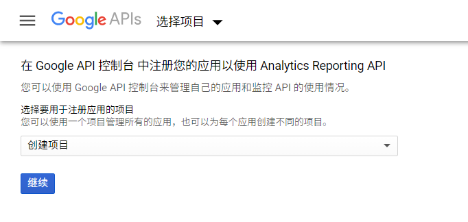

前段时间，Google Analytics 给我发了封邮件，说二月份我的博客有 9.3K 的 UV。点进去看了看热门的文章，访问量最多的是「[Twitter 账号被锁定是种怎样的体验](https://prinsss.github.io/twitter-account-has-been-locked/)」（17 年的博文了……），其他比较高的还有以前写的教程「[Windows Terminal 安装与配置指南](https://prinsss.github.io/windows-terminal-setup-guide/)」「[WSL 配置指北：打造 Windows 最强命令行](https://prinsss.github.io/wsl-guide/)」，以及后起之秀「[记一次 HNS 币空投薅 $500 羊毛的经历](https://prinsss.github.io/namebase-handshake-airdrop/)」，很真实。

看着报表上的访问量排名，我突然一寻思，这白花花的数据都在眼前，那能不能利用 GA 里的这些数据，给博客加个访问计数、阅读量统计功能呢？

<!--more-->

当然可以。

我 Google 了一下，事实上早就已经有人这么干过了：

- [用 Google Analytics API 为 hexo 博客加上阅读量统计 | 澪同学的博客](https://ihomura.cn/2018/07/26/%E7%94%A8-Google-Analytics-API-%E4%B8%BA-hexo-%E5%8D%9A%E5%AE%A2%E5%8A%A0%E4%B8%8A%E9%98%85%E8%AF%BB%E9%87%8F%E7%BB%9F%E8%AE%A1/)
- [Google Analytics APIでPVを集計しよう【実装編】 | 東京のWeb制作会社LIG](https://liginc.co.jp/210735)
- [Is this crazy? Hit counter pulling from Google Analytics](https://www.indiehackers.com/post/is-this-crazy-hit-counter-pulling-from-google-analytics-eae3cdc538)

既然 GA 有官方提供的 API，那事情就好办了。

## TL;DR

先说成果。我写了两个版本的程序，分别使用 Node.js 和 PHP 实现，都可以通过页面 URI 查询 PV 访问量，提供的 API 也是一样的。源码放在 GitHub 上：

- Node.js 版本：[prinsss/google-analytics-hit-counter](https://github.com/prinsss/google-analytics-hit-counter)
- PHP 版本：同一仓库的 [`php`](https://github.com/prinsss/google-analytics-hit-counter/tree/php) 分支

部署之后，前端通过其提供的 API 获取 PV，具体效果可以参考本博客。

程序的具体使用方法这里就不多说了，README 上都有写。下面具体讲讲怎么使用 Google Analytics API 以及可能遇到的坑，希望对各位有所帮助。

## 启用 API 与获取凭据

首先根据[官方的教程](https://developers.google.com/analytics/devguides/reporting/core/v4/quickstart/service-py)启用 Analytics Reporting API v4。

登录 Google 账号后打开 [setup tool](https://console.developers.google.com/start/api?id=analyticsreporting.googleapis.com&credential=client_key)：



点击创建项目后（也可以使用现有项目），会自动跳转至凭据页面。

页面会引导你回答一些问题以确定要创建的凭据的类型（API 密钥、OAuth 或者是服务账号），在我们这个场景下（服务器端访问 Google API 而非用户端访问）应该使用服务账号类型的凭据。


角色选择 Service Account User，密钥类型选择 JSON，点继续后浏览器会下载一个 JSON 文件，里面就是服务账号的密钥了。记得妥善保存这个密钥文件，下面的操作都要用到它。

## 安装相应语言的 API 库

Google 提供了很多编程语言的 API 支持库，封装简化了认证与请求的流程。具体支持的语言可以查看官方文档：[Client Libraries | Analytics Reporting API v4](https://developers.google.com/analytics/devguides/reporting/core/v4/libraries)。

Node.js

```sh
npm install googleapis
```

Python

```sh
pip install --upgrade google-api-python-client
```

PHP

```sh
composer require google/apiclient
```

## 通过 API 查询 PV 数据

下面以 Node.js 为例进行说明（也有[官方样例](https://github.com/googleapis/google-api-nodejs-client/blob/master/samples/analyticsReporting/batchGet.js)）。

使用凭据创建认证 client：

```typescript
// 省略了外层 async 和其他 import
import { google } from 'googleapis'

// 如果使用了服务账号以外的认证方式这里也要改
const auth = new google.auth.GoogleAuth({
  // 上面下载的密钥文件。除了直接给文件路径，也可以把
  // 文件里的内容通过 credentials, projectId 等参数传进来
  keyFile: path.join(__dirname, 'key.json'),
  // API 作用域，我们只需要访问 Analytics
  scopes: 'https://www.googleapis.com/auth/analytics.readonly',
})

const client = await auth.getClient()
const analyticsreporting = google.analyticsreporting({
  version: 'v4',
  auth: client,
});
```

构建请求查询 API：

```typescript
const res = await analyticsreporting.reports.batchGet({
  requestBody: {
    reportRequests: [{
      // 数据视图 ID，可以在 GA 的「管理 > 数据视图设置」内查看
      viewId: '213856884',
      dateRanges: [{
        // 查询起始日期，设置一个足够久远的时间以统计所有数据
        startDate: '2010-01-01',
        // 查询结束日期
        endDate: 'today',
      }],
      // Metric，官方翻译是指标，可以理解为要获取的数据字段
      // 可以指定多个 metric，比如 'ga:avgTimeOnPage'
      metrics: [{
        expression: 'ga:pageviews'
      }],
      // Dimension，官方翻译是维度，我们用这个来过滤数据
      // 这里使用页面路径，也可以通过 'ga:pageTitle' 按标题过滤
      dimensions: [{
        name: 'ga:pagePath'
      }],
      // 维度过滤器，只返回页面 URI 以所给字符串开头的数据
      dimensionFilterClauses: [{
        filters: [{
          'dimensionName': 'ga:pagePath',
          'operator': 'BEGINS_WITH',
          'expressions': ['/foo'],
        }, {
          'dimensionName': 'ga:pagePath',
          'operator': 'BEGINS_WITH',
          'expressions': ['/bar'],
        }]
      }],
      // 按照页面浏览量降序排序
      orderBys: [{
        fieldName: 'ga:pageviews',
        sortOrder: 'DESCENDING'
      }],
    }]
  }
})
```

其中 Metric 和 Dimension 的概念可能有点不好理解，可以参考官方 API 文档：

- [Creating a Report | Analytics Reporting API v4](https://developers.google.com/analytics/devguides/reporting/core/v4/basics)
- [Dimensions & Metrics Explorer - Google Analytics Demos & Tools](https://ga-dev-tools.appspot.com/dimensions-metrics-explorer/)

以查询我博客上最新两篇文章的 PV 为例，API 响应是这样的：

```json
{
  "reports": [
    {
      "columnHeader": {
        "dimensions": [
          "ga:pagePath"
        ],
        "metricHeader": {
          "metricHeaderEntries": [{
            "name": "ga:pageviews",
            "type": "INTEGER"
          }]
        }
      },
      "data": {
        "rows": [
          {
            "dimensions": [
              "/short-domain-name-for-blog/"
            ],
            "metrics": [{
              "values": [
                "135"
              ]
            }]
          },
          {
            "dimensions": [
              "/reverse-proxy-for-126-mail-pop-server/"
            ],
            "metrics": [{
              "values": [
                "76"
              ]
            }]
          }
        ],
        "totals": [{ "values": ["211"] }],
        "rowCount": 2,
        "minimums": [{ "values": ["76"] }],
        "maximums": [{ "values": ["135"] }]
      }
    }
  ]
}
```

不得不说很复杂、很强大，更高级的用法有待各位挖掘。

## 踩坑：Serverless 部署的可行性

其实最开始，我是没打算部署到自己的服务器上的，想着要是能直接用 Serverless 解决~~（白嫖免费版）~~最好。然而折腾了一天，在 [CloudFlare Workers](https://workers.cloudflare.com/) 与 [ZEIT Now](https://zeit.co/docs) 上的尝试均以失败告终。

CloudFlare Workers 上遇到的问题是 CPU 执行时间超时（script exceeded time limit）。我排查了很长时间，甚至怀疑是 Google 的 Node.js 库没有用 fetch API 的问题，还把 Analytics API 请求的部分用原生 fetch 重写了一遍。结果最后发现是因为 Google 服务账号的鉴权用的是 JWT，HS256 的签名算法。你妈的，难怪啊！

如果在 API 请求中手动指定 HTTP 请求头 `Authorization: Bearer <access token>` 认证的话屁事没有一切正常，但要签发 token 的话就不行了，sad。

不过我还不死心，又去 ZEIT Now 平台写了个 lambda 试了一下。这次运行是可以正常运行了，我却发现了一个挺要命的问题：**缓存**。在我们这个场景下，缓存肯定是必要的。API Client 认证获得了 access token 要缓存，从 API 那查询拿到的数据也要缓存，不然总不能每次请求都重新签发 token、查询数据吧。

然而我翻遍了文档，也没找到适用于这些 Serveless 平台的缓存解决方案（内存缓存？生命周期不允许；文件缓存？不允许读写文件；NoSQL？我靠，那还得去别的地方弄个远程服务来），或许是应用场景不合适吧。

无奈之下，只好部署到自己的乞丐版 VPS 上了。白嫖计划泡汤，遗憾。

## 写在后面

我捣鼓博客这几年以来，在阅读量统计上也花过一些心思：

- [为 Ghost 博客添加页面访问计数器](https://prinsss.github.io/add-page-view-counter-for-ghost-blog/)
- [为 Hexo 博客添加页面访问计数器](https://prinsss.github.io/add-page-view-counter-for-hexo/)

直接使用 GA 的数据作为阅读量展示，有其优势也有其局限性。优势是不用自己维护统计的后端了，一个 GA 统计代码就可以通吃，数据也比较一致。

不足之处我目前想到就是数据更新不及时（GA 本身的延迟和缓存），以及统计代码容易被浏览器屏蔽吧（可以使用 [SukkaW/cloudflare-workers-async-google-analytics](https://github.com/SukkaW/cloudflare-workers-async-google-analytics) 这类异步 GA 解决方案）。不过我的博客浏览量统计对时效性和准确度并不敏感，所以目前看来，直接使用 GA 的数据对我来说应该是最好的方案了。

另外这也是我第一次在实际项目中使用 TypeScript，体验确实很不错，类型提示和自动补全不要太爽。不过就这么一个小 API 常驻一个 Node 服务有点太占资源了，顶不住，所以我又拿 Lumen 写了个 PHP 的版本。

两边实现的 API 都是一样的，各位有需要的话可以自行选择。
