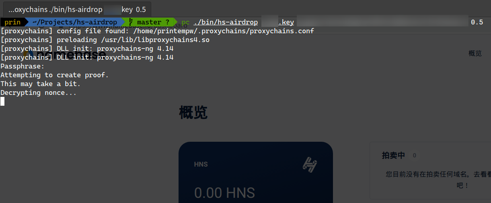
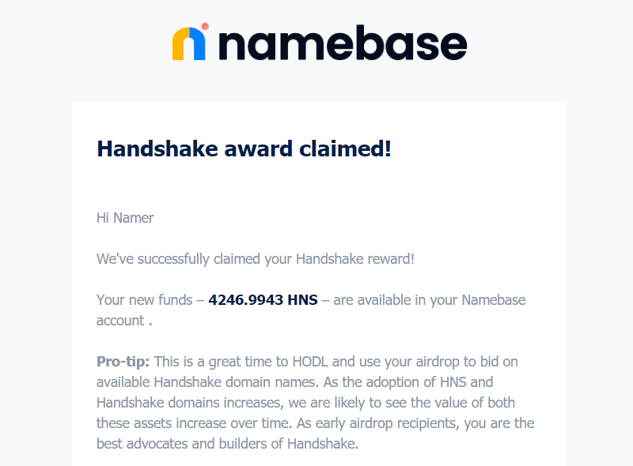
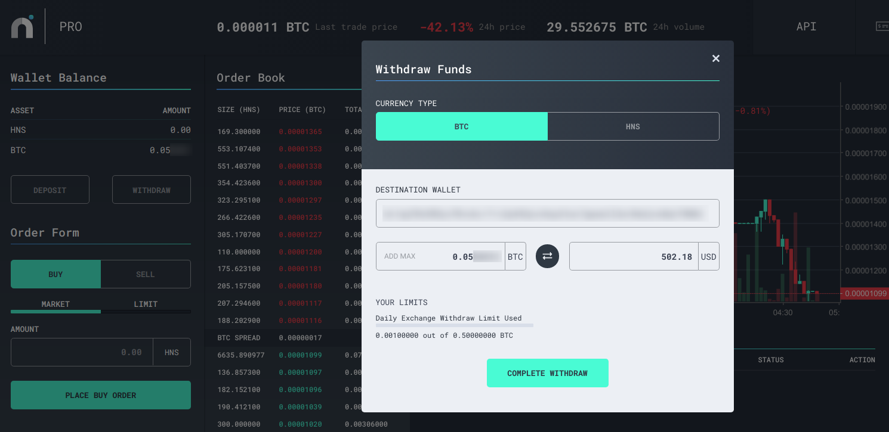

没想到我人生中第一次 Cryptocurrency 实操经验，竟然是白嫖出来的。

<!--more-->

昨天刷 Twitter 的时候，看到这样一条推文：

> 白撸 700刀的 BTC 🤣 https://t.me/zuoluotvofficial/111
> 如果满足下面这两个条件
>
> 1. Github 账号在 2019-02-04 的时候超过 15 个粉丝
> 2. Github 在 2019-02-04 之前上传过 SSH & PGP keys
> 亲测成功，猝不及防，白撸一台iPhone
>
> (Twitter [@luoleiorg](https://twitter.com/luoleiorg/status/1230046924134207488))

我当时就寻思，还有这种好事？天上掉馅饼，事出反常必有妖啊。

但这位博主也是我挺久之前就关注了的，不像是骗人的主，我就点进去链接看了下，发现 V2EX 上也有相关讨论贴（都被移动到「无要点」节点了，登录才能看）：

- [20190204 以前有 16 位以上 GitHub 粉丝的，可领取目前价值 $2000 的空投](https://www.v2ex.com/t/645078)
- [开源开发者免费来薅 1000 刀资本主义羊毛](https://www.v2ex.com/t/645480)

看了帖子里的评论，又去搜了下相关信息，感觉还是比较靠谱的。

-----

按照 Namebase 官网上 [Handshake Airdrop](https://www.namebase.io/airdrop) 的说明：

> The Handshake Organization raised money from top Silicon Valley investors including A16Z and Sequoia. They donated $10.2mm to GNU, Mozilla, and other internet foundations.
>
> Now they're giving away ~4662 Handshake coins to qualifying developers on GitHub.

差不多就是「我们拉到了很多投资，很有钱，现在要大撒币」。🤔

那这 Handshake 又是何方神圣，哪拉来的那么多钱？根据[官网](https://handshake.org/)：

> **Decentralized naming and certificate authority**
>
> Handshake is a decentralized, permissionless naming protocol where every peer is validating and in charge of managing the root DNS naming zone with the goal of creating an alternative to existing Certificate Authorities and naming systems. (...)
>
> Handshake uses a coin system for name registration. The Handshake coin (HNS) is the mechanism by which participants transfer, register, and update internet names. (...) Therefore, Handshake allocates the majority of its initial coins towards the FOSS community with absolutely no obligation attached, as it is this community most relevant with decentralized software and tools. (...)
>
> Handshake's incentive design assumptions relies upon Metcalfe's Law (Beckstrom's Law, etc.). While Bitcoin's value is derived from it being a costly store of value, Handshake's value is derived from its network of users. Metcalfe's Law asserts that an increase in userbase increases the value of the network (sub)exponentially. This means that allocation of value to potential developers and users of this system be a benefit to everyone, with network effect derived benefiting all users.

嗯，看起来挺靠谱的。利用区块链技术构建的去中心化的域名注册、认证、交易和解析系统，使用 HNS 代币进行域名交易等操作，也解释了为啥要把这么多代币直接白送给 FOSS 开发者。

毕竟这还是我第一次接触币圈（之前只是有所耳闻，知道点原理而已），所以又去做了不少功课。

根据 Wikipedia，数字货币领域的 [空投 (Airdrop)](https://zh.wikipedia.org/wiki/%E7%A9%BA%E6%8A%95_(%E5%8C%BA%E5%9D%97%E9%93%BE)) 是这样定义的：

> 区块链领域的空投是一种将数字货币通过区块链技术大规模分发到一些已有的数字货币，比如以太币、比特币、EOS.IO 钱包地址上的技术。空投在区块链领域亦视作一种提升一个产品概念影响力的市场策略。在 Facebook 等社交媒体拒绝刊登数字货币广告后，空投在区块链的营销中已变得越发重要。

推广用户群体、扩散知名度、吸引投资以及参与者……从这些方面考虑，空投确实不失为一种方法。毕竟要不是这次听说有羊毛薅，我压根就不会知道还有 Handshake 这玩意儿。如果将其视作赚吆喝的营销手段，那至少在我身上效果确实是达到了。

然后我又寻思，HNS 发了这么多出去，这币怎么还能值钱呢？听说最开始这 4246 HNS 是值 $2000 的，到 2/18 的时候差不多 $1400，2/19 下午 $700，我 2/20 中午卖的时候就只有 $500 左右了（汇率 0.000013 BTC）。

可以看到虽然贬值很快，但作为白薅的羊毛还是很值钱的（也许是因为有初始资金撑着，或者除了羊毛党卖出外还有不少人在投资？或许操盘的都预料到了）。至于为什么能值钱，经济学方面就不是我的专门领域了。什么价值共识啊、供求关系之类的我也就看了点皮毛懂个大概，不贻笑大方了，等多看点书再来吧。

自认为韭菜我也没兴趣持币观望，感觉在可见的未来内还会跌，趁早换 BTC 跑路吧。

-----

下面是我自己换币变现的记录。

**官方教程在这里**：https://www.namebase.io/airdrop

我的 GitHub 账号上传过 SSH 公钥，在 2019/02/04 之前也有百来个 follower，所以应该是符合条件。当然前提是你得保留着当时的私钥，要是丢了就 GG 了。另外，可能不是所有符合条件的用户都被快照到了，看论坛上的帖子说还得看脸。除了 GitHub，符合 PGP WoT Strong Set 等条件的用户也可以领币，具体参见官网。

下载 `hs-airdrop` 软件源码：

```bash
git clone https://github.com/handshake-org/hs-airdrop.git
```

安装依赖（软件是用 Node.js 写的）：

```bash
cd hs-airdrop && npm install
```

运行：

```bash
./bin/hs-airdrop <path to key> <address> <fee>
```

其中 `<path to key>` 是你 SSH 私钥的路径（也可以是 PGP 私钥，具体看文档），`<address>` 是 HNS 钱包地址（可以在上面那个官方教程页面上直接生成），`<fee>` 是给矿工的费用（我设置了 `0.5`，官方示例的 `0.01` 可能导致状态一直卡在 Almost mined，推荐设置高一点）。

大部分人在这里都会警觉，要我 SSH 私钥干嘛？这么重要的东西，能保证安全吗？

当然没有绝对的安全，小心点不是坏事。从密码学角度，你之所以能领到这些 HNS 币，是因为 Handshake 团队抓取了 GitHub 上 Top 250,000 的开发者的公钥信息，并且把这些公钥经过某种算法处理放到了 HNS 的区块链上。那你要如何证明这个公钥是你的，如何证明你可以拿这些 HNS 币呢？除了提供私钥别无他法。

> 说到 GitHub 用户的公钥……
>
> 有兴趣的话可以试试 [`ssh whoami.filippo.io`](https://twitter.com/FiloSottile/status/1229093553269362689) 😏

你用你的私钥生成一个密码学上的证明，放到 HNS 区块链上，这样网络就会承认你拥有这些 HNS 币了。`hs-airdrop` 就是这么一个工具，用你的私钥进行签名，并生成 merkle proof。**关于隐私和安全性**，README 里也都写得挺清楚，我就不赘述了。源码我看过，也是我自己 build 的，我选择相信它。如果实在不放心，可以直接薅完换一个 SSH 密钥（事实上我这个密钥就是当时旧机器上的 :P）。

运行的过程中会从 GitHub 下载 50MB 左右的 merkle tree 和 nonce，如果网络不好的话可能会失败。可以直接挂代理运行，或者手动把 [handshake-org/hs-tree-data](https://github.com/handshake-org/hs-tree-data) 的内容下载到 `~/.hs-tree-data` 目录里即可。

如果一切顺利，把最后生成的一串 base64 字符串粘贴到网页上提交就 OK 了。



空投到账需要一段时间的确认（100 个区块，一个块 10 分钟，大概要 16 小时），Namebase（HNS 官方交易所）网页上会显示状态（Almost mined/waiting for more confirmations），到账后会有邮件通知。



邮件里还会鼓励你拿这些币去捣鼓 Handshake 域名，如果你相信他们的鬼话和项目的前景，倒是可以试一试，不过我这种羊毛党就是薅完就跑的选手（x）。

~~等待的这段时间里你可以坐和放宽，像我一样看着汇率不停往下跌。~~

-----

空投到账后，接下来就是把 HNS 换成 BTC 了。

和其他交易所一样，在 Namebase 交易同样需要通过 KYC 身份认证，需要上传身份证/护照之类的。KYC 用的是 Netverify，查了一下好像是挺老牌的，这方面的安全性就请各位自行斟酌了。看 V2EX 上说身份证用网图也能过，不过我没试过。

卖 HNS 最好去 [Namebase Pro](https://www.namebase.io/pro) 交易，比起直接一键 Sell HNS，有K线图、成交量、阶梯挂单等高级功能。

最后卖得的 BTC，可以从交易所提到自己的比特币地址（点 Withdraw）：



从截图可以看到，比起我清仓时的汇率，我现在写文时的汇率又有所上涨（0.000013 BTC）。大佬可以尝试再观望一下回升甚至抄底上车，咱就不奉陪了哈哈。

如果自己没有比特币地址，可以去比特币交易所注册个账号（火币、币安、OKEx 这些都是比较著名的数字货币交易所，哪个好我也不清楚，就不推荐了），从 Namebase 提到这些交易所的充币地址上，确认后 BTC 就会到你交易所的户头上了。

不过注意地址别填错，不然币就没咯。

-----

最后的步骤是提现，变成手里实实在在的钱。

交易所一般都有渠道进行法币兑换，这里就不多说了。我实际测试提现了一点到支付宝，很快就到账了没问题，白嫖大成功，爽死了。

不过我其实还是挺看好比特币以后的行情的，所以打算把大部分币都留着。

网上经常说，投资要用丢了不心疼的钱去投，我这点钱正好又是天上掉馅饼，那就当作年轻人的第一笔投资吧（笑）
