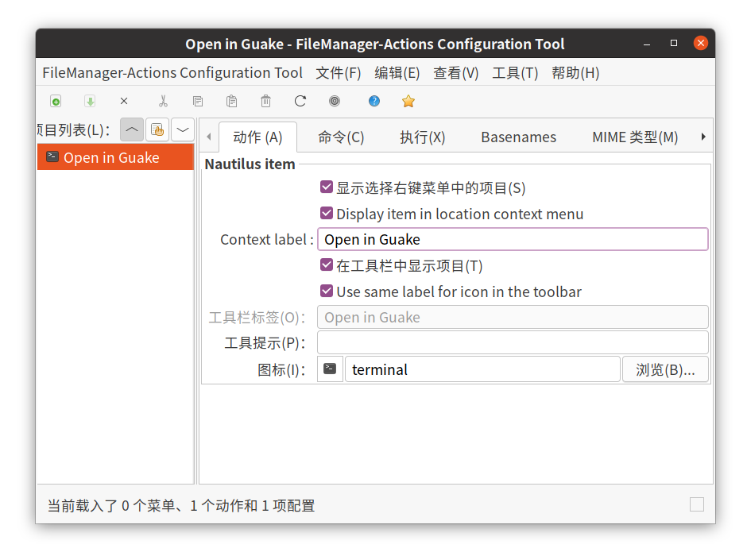
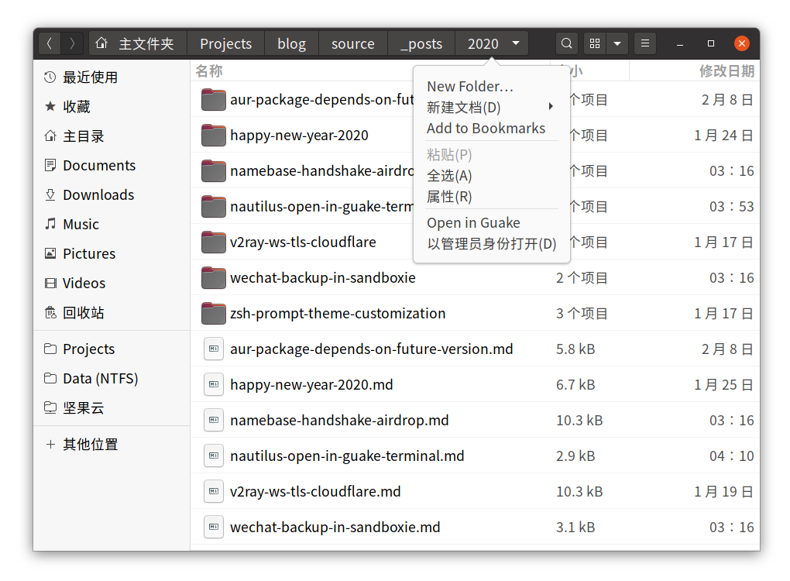

自从前段时间开始使用 [Guake](https://github.com/Guake/guake) ~~挂科~~后，这个下拉式的终端模拟器可谓是深得我心，基本上就没其他终端什么事儿了。快捷键呼之即来挥之即去，设置成半透明背景后呼出占半屏也不遮挡其他窗口，各方面都很优秀。

不过在 GNOME 桌面默认的 Nautilus 文件浏览器里，「在终端中打开」右键菜单打开的还是 GNOME Terminal，得想个办法把它改成「在 Guake 中打开」。

<!--more-->

我的系统是 Manjaro Linux 19.0，下面的操作在其他发行版应该也大同小异。

-----

首先移除原来的「在终端中打开」右键菜单。从 Nautilus 3.14 版本开始，这个菜单变成了 `gnome-terminal` 软件包的一部分（所以没法自定义这个菜单打开的终端）。

```text
$ pacman -Ql gnome-terminal | grep nautilus

gnome-terminal /usr/lib/nautilus/
gnome-terminal /usr/lib/nautilus/extensions-3.0/
gnome-terminal /usr/lib/nautilus/extensions-3.0/libterminal-nautilus.so
```

所以把这个扩展移除就好（或者直接卸载 `gnome-terminal`）：

```bash
sudo mv -vi /usr/lib/nautilus/extensions-3.0/libterminal-nautilus.so{,.bak}
```

退出 Nautilus 使改动生效：

```bash
nautilus -q
```

为了添加自定义右键菜单，我们可以使用 [FileManager-Actions](https://gitlab.gnome.org/GNOME/filemanager-actions) 这个扩展（当然也有其他添加右键菜单的方法，不过用这个比较方便）：

```bash
sudo pacman -S filemanager-actions
```

打开 FileManager-Actions Configuration Tool 配置界面：

```bash
fma-config-tool
```

添加新动作，配置如下：



「命令」选项卡中，路径与参数分别设置为：

```
/usr/bin/guake
--show -e "cd %f"
```

如果希望在新的终端 Tab 中打开，可以设置参数：

```
--show -n '%f'
```

其他自定义参数请参见 Guake 文档。

打开「编辑 > Preference」，取消勾选「Create a root 'Nautilus-Actions' menu」，不然默认会把所有动作都放在二级右键菜单里。

最后「文件 > 保存」，重新打开 Nautilus 即可生效。



**参考链接：**

- [Can I remove the "open in terminal" menu item from nautilus? - Ask Ubuntu](https://askubuntu.com/questions/827838/can-i-remove-the-open-in-terminal-menu-item-from-nautilus/967154)
- [Ubuntu16.04或Ubuntu18.04设置右键打开terminator而非系统terminal](https://blog.csdn.net/zhanghm1995/article/details/89419109)
- [How to open directory in Guake from Nautilus - Ask Ubuntu](https://askubuntu.com/questions/152193/how-to-open-directory-in-guake-from-nautilus)
