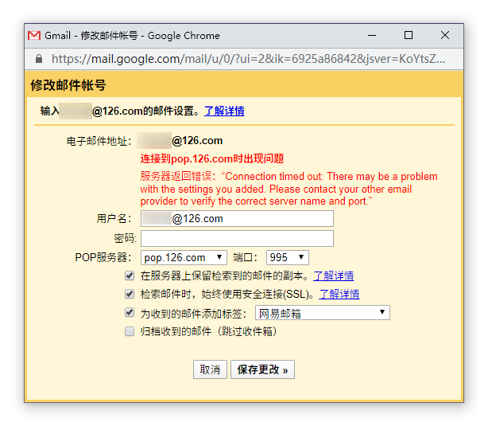
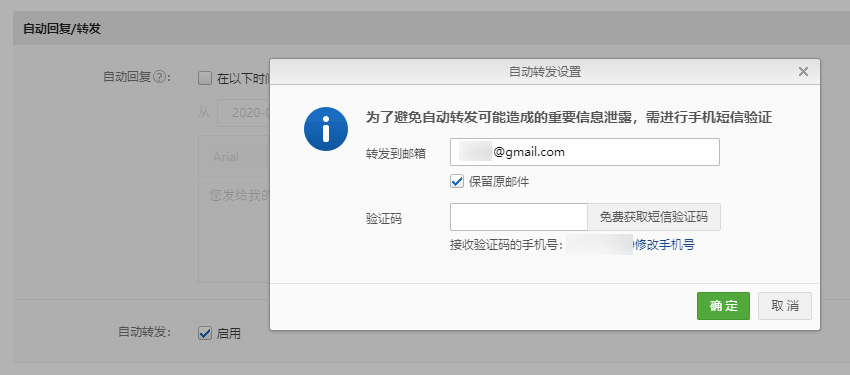

我有很多个电子邮箱地址，并且都设置了转发或者代收到 Gmail 上，方便集中处理。其中看重实时性、邮件需要尽快处理的邮箱地址（比如 [printempw#gmail.com](mailto:printempw@gmail.com)）是设置的自动转发规则，其他无关紧要的邮箱则是在 Gmail 上设置了 POP3 代收信（[查收其他帐号的邮件](https://support.google.com/mail/answer/21289)），一直用到现在也没什么问题。

然而前段时间我却突然发现，Gmail 里收不到网易 126 邮箱里的邮件了。

<!--more-->

打开 Gmail 配置一看，报错如下：

```plain
连接到pop.126.com时出现问题

服务器返回错误：“Connection timed out: There may be a problem with the settings you added. Please contact your other email provider to verify the correct server name and port.”
```



看来是 Gmail 用于收件的服务器无法连接至网易 126 邮箱的 POP3 服务器了。搜了一下，似乎 2011 年时就有过类似的问题（[#1](https://groups.google.com/forum/#!topic/fans/fvPR1BSmqWk)、[#2](https://cyq.me/744)）。虽然不知道为什么之前都正常，不过有理由怀疑是网易邮箱屏蔽了 Gmail 的代收服务器。

本来想改成自动转发的，却不知为何一直收不到手机验证码，只能暂时作罢。



然而等了一个多星期还是收不到验证码（搞什么鬼），只能另寻他法代收邮件了。

-----

既然网易的 POP3 服务器屏蔽了 Gmail，那我们要做的也很简单，找一台能正常访问网易 POP3 的服务器转发代理一下就可以了（也就是反向代理）。端口转发方面我用了 [socat](http://www.dest-unreach.org/socat/)，配合 systemd 服务实现守护进程。

首先在 VPS 上测试一下能否正常访问网易 POP3 服务器：

```sh
nc pop.126.com 110
```

一切正常的话可以看到 POP3 服务器的欢迎语：

```plain
+OK Welcome to coremail Mail Pop3 Server (126coms)
```

运行 socat 端口转发：

```sh
socat -d -d TCP4-LISTEN:1110,reuseaddr,fork TCP4:pop.126.com:110
```

其中 `-d -d` 参数表示调试信息的输出级别，`TCP4-LISTEN:1110` 即监听在本机的 `1110` 端口（Gmail 的 POP3 服务器端口设置只接受 110、143、993、995、1110 和 2221），`TCP4:pop.126.com:110` 表示转发至网易服务器。

在另一台机器上测试端口转发（记得修改防火墙规则放行端口）：

```sh
nc <address of vps> 1110
```

可以看到网易 POP3 服务器的欢迎语就 OK。

接下来修改 Gmail 上的代收设置：

- POP 服务器：VPS 的域名/IP 地址
- 端口：上面设置的监听端口
- 取消勾选「检索邮件时，始终使用安全连接(SSL)」

这样 Gmail 就可以正常代收网易邮箱的邮件了。

> 如果想要配置支持 SSL 的 POP3 反向代理，可以使用 Nginx 实现，参考：[Configuring NGINX as a Mail Proxy Server](https://docs.nginx.com/nginx/admin-guide/mail-proxy/mail-proxy/)。不过我这邮箱就是注册垃圾站用的，没什么重要内容，懒得折腾，还是直接转发非 SSL 端口算了。

接下来添加 systemd 服务（可跳过）：

```sh
sudo vim /etc/systemd/system/pop-proxy.service
```

```ini
[Unit]
Description=Port forwarding for 126 Mail POP server
After=network.target

[Service]
Type=simple
User=nobody
ExecStart=/usr/bin/socat -d -d TCP4-LISTEN:1110,reuseaddr,fork TCP4:pop.126.com:110
Restart=always

[Install]
WantedBy=multi-user.target
```

启动服务 & 设置开机启动：

```sh
sudo systemctl start pop-proxy
sudo systemctl enable pop-proxy
```

查看连接日志：

```sh
journalctl -u pop-proxy
```

\- EOF -
