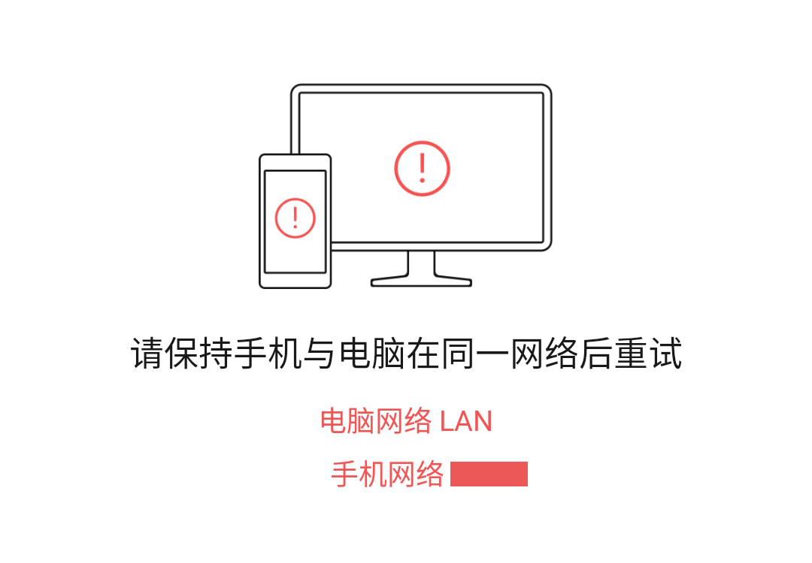
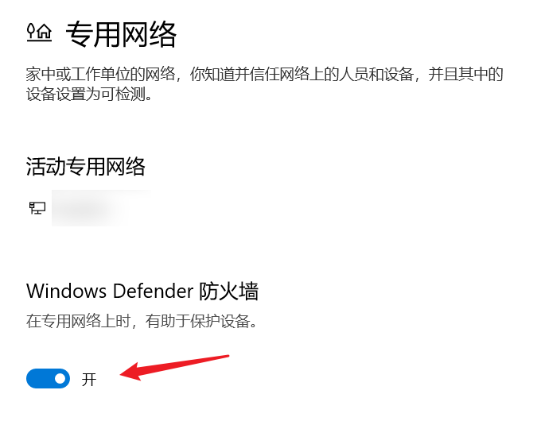

微信，骂归骂，用还是得用的，没办法。

聊天软件嘛，主要还是得看聊的对象 TA 们用什么。毕竟在国内生活，如果大部分人都是微信、QQ，那你一个人坚持 Telegram、Slack 也不过是一厢情愿而已。

今天在用微信 PC 版的「备份聊天记录至电脑」功能时，出现了奇怪的问题，明明已经连接同一个 WiFi 网络了，却老是提示「请保持手机与电脑才同一网络后重试」。最后发现其实是 Sandboxie 导致的，姑且在此记录一下。

<!--more-->

-----

我有点数字洁癖，不愿意在个人电脑上直接跑各种国产毒瘤软件（包括不限于微信、QQ、百度网盘客户端、迅雷、阿里旺旺）。但也不至于到开虚拟机的程度，所以我选择用 Sandboxie 来把它们隔离起来。

> Sandboxie 是一款非常经典老牌的沙盒程序/沙盘工具，功能类似以前的“影子系统”，它可以在 Windows 上创造出一个虚拟的程序运行环境，并牢牢地限制住软件只能在其“沙盒环境”范围内运行，与真实系统完全隔离开来。所有运行在 Sandboxie 的虚拟“沙盘环境”里的应用程序都无法对真实系统产生任何影响，也无法修改你的硬盘数据。([Ref](https://www.iplaysoft.com/sandboxie.html))

另外 Sandboxie 之前已经宣布免费了（就在我刚续完一年授权之后😂），有类似需求的朋友都可以试试。使用体验真的很棒，再也不用担心毒瘤软件在电脑里到处拉屎、改注册表了。

微信我也是放在 Sandboxie 中运行的，其他功能都正常，然而备份手机聊天记录至电脑时就出问题了。

众所周知，微信对聊天记录的处理非常奇葩。不像 QQ 那样提供聊天记录漫游，[美其名曰](http://news.sina.com.cn/o/2018-01-02/doc-ifyqchnr8366660.shtml)「微信不留存任何用户的聊天记录，聊天内容只存储在用户的手机、电脑等终端设备上」。~~当婊子还立牌坊~~ 至于你信不信，我反正信了。

然而我在尝试使用官方的备份聊天记录至电脑功能时，却提示我不在同一网络下：

明明我手机电脑已经连到同一个 WiFi 了啊？为什么还说电脑网络是 LAN 呢？

排查了好久，最后发现是 Windows 防火墙的问题。

微信这个聊天记录备份涉及局域网内通信，一般来说第一次运行时就会弹出 Windows 网络防火墙的提示，问你允不允许。然而在 Sandboxie 内这个提示似乎是被吞了，直接失败，导致了上面的问题。

解决方法就是 **暂时关闭 Windows 防火墙**，关了就可以正常备份了。

如果不放心，也可以临时开一个热点来备份。
