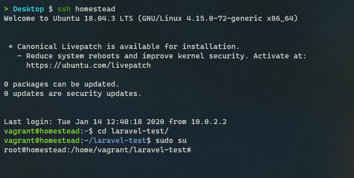
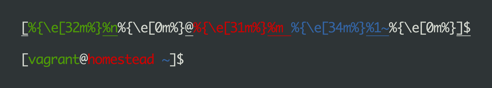
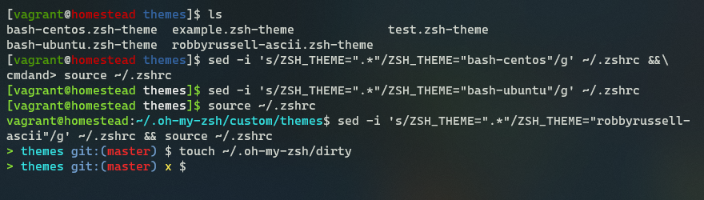

昨天在配置新 VPS 时突然想到，推荐 Zsh 主题、讲如何设置主题的中文教程有很多，但似乎鲜有教人怎么去自己编写一个 Zsh 主题的。搜索了一下确实没多少，Bash 自定义提示符的教程倒是挺多。既然如此，那就我来写一个吧。

<!--more-->

## 1. 基础知识

开始动手之前，先来了解一下类 Unix 系统中命令行的一些基础知识。如果你之前有过自定义 Bash 等 Shell 的提示符的经验，可以直接跳过这一段，毕竟除了一些 Zsh 特有的东西之外都是一样的。

> 再次推荐一下我的这篇文章：[命令行界面 (CLI)、终端 (Terminal)、Shell、TTY，傻傻分不清楚？](https://printempw.github.io/the-difference-between-cli-terminal-shell-tty/)



在上面的截图中，`vagrant@homestead:~$` 这样的部分就叫做命令行提示符（Prompt）。顾名思义，提示符就是提示你输入 Shell 命令用的，每次运行完一个命令后都会再显示一次提示符，等待下一个命令。

不同发行版、不同 Shell 的默认提示符格式也不同。比如 CentOS 中默认的 Bash 提示符就是 `[printempw@localhost ~]$` 这样的。一般来说，提示符都会包含这些信息：当前用户、主机名、当前目录等。有些人的可能更高级，包括了当前 Git 状态、环境信息、时间、上一条命令的返回值等等。

那么这个提示符要怎么修改呢？答案就是 `$PS1` 环境变量。

> 当然，并不是所有 Shell 都使用 `$PS1` 来控制提示符，比如 [fish](https://fishshell.com/docs/current/tutorial.html#tut_prompt)。

`PS1` 的意思是 ~~PlayStation~~ Prompt String One，控制最外层命令行的提示符，也是我们平时最常看到的。另外还有 `PS2`，当你输入一条多行命令时，左边的 `>` 就是它。`PS3`、`PS4` 平时一般用不到，有兴趣的话可以看一下 [这篇文章](https://www.thegeekstuff.com/2008/09/bash-shell-take-control-of-ps1-ps2-ps3-ps4-and-prompt_command/)。

你可以在你的机器上尝试一下，看看这几个环境变量的值：

```zsh
➜  ~ echo $PS1
%(?:%{%}➜ :%{%}➜ ) %{$fg[cyan]%}%c%{$reset_color%} $(git_prompt_info)
➜  ~ echo $PS2
%_>
```

卧槽？这一大堆乱七八糟的是什么？

## 2. 必要元素之 Prompt 转义字符

在 `$PS1` 中，我们可以加入一些特殊的转义字符，Shell 会将它们解析成相应的值。不同 Shell 的转义字符也不同，比如 Bash 中显示主机名的转义字符是 `\h`，而 Zsh 上则是 `%m`。

Zsh 中可用的转义序列主要有：

| 转义字符 | 描述                                                         |
| --------- | ------------------------------------------------------------ |
| `%n`        | 当前用户名 `$USERNAME`                                       |
| `%m`        | 不带域名的本地主机名                                         |
| `%M`        | 完整的主机名                                                 |
| `%#`        | 普通用户显示一个 `%` 字符，超级用户显示 `#` |
| `%?`        | 上一条命令的执行结果                                         |
| `%d`<br/>`%/` | 当前工作目录    |
| `%~`        | 当前工作目录，并使用 `~` 符号替换目录中的 `$HOME`<br />（`%1~` 表示当前目录名，等效于 `%c`） |
| `%D`        | 当前日期，格式为 *yy-mm-dd*                                  |
| `%T`        | 当前时间，24 小时制                                          |
| `%{...%}`   | 用于包裹 ANSI 转义序列                                       |

这里只列举了一部分，完整列表请参考 [Zsh 文档](http://zsh.sourceforge.net/Doc/Release/Prompt-Expansion.html)。

实际操作一下（直接运行 `PS1='...'` 即可，仅在当前会话生效）：

```zsh
PS1='[%n@%m %1~]$ '
[vagrant@homestead ~]$
```

```zsh
PS1='%n at %m in %1~ λ '
vagrant at homestead in ~ λ
```

```zsh
PS1='我的天啊你看看都几点了 (%*)%# '
我的天啊你看看都几点了 (20:11:45)%
```

## 3. 给点颜色看看！ANSI 转义序列

如果你看过我写的那篇关于终端的文章，应该知道 Shell 可以通过一些特殊的转义序列，控制终端上的字符颜色、光标位置等。[ANSI 转义序列](https://zh.wikipedia.org/wiki/ANSI%E8%BD%AC%E4%B9%89%E5%BA%8F%E5%88%97) 就是这些特殊序列的一种标准，基本上所有终端都支持（就连著名的小黑窗，Win32 控制台在 Windows 10 TH2 之后也支持 ANSI 转义序列了）。

以文本颜色为例，16 色 ANSI 转义序列大概长这样：

| 序列   | 文本颜色 | 序列   | 文本颜色   |
| :----- | :------- | :----- | :--------- |
| `\e[30m` | 黑       | `\e[90m` | 亮黑（灰） |
| `\e[31m` | 红       | `\e[91m` | 亮红       |
| `\e[32m` | 绿       | `\e[92m` | 亮绿       |
| `\e[33m` | 黄       | `\e[93m` | 亮黄       |
| `\e[34m` | 蓝       | `\e[94m` | 亮蓝       |
| `\e[35m` | 品红     | `\e[95m` | 亮品红     |
| `\e[36m` | 青       | `\e[96m` | 亮青       |
| `\e[37m` | 白       | `\e[97m` | 亮白       |

其中 `\e` 表示 `ESC` 的转义序列，也可以写作 `\033`、`\x1B`。

随着终端的发展，转义序列也有了更多的定义，支持到了 8 位（256 色）、16 位甚至 24 位色。详细的 ANSI 转义序列可以参考以下链接：

- [ANSI escape code - Wikipedia](https://en.wikipedia.org/wiki/ANSI_escape_code)
- [bash:tip_colors_and_formatting - FLOZz' MISC](https://misc.flogisoft.com/bash/tip_colors_and_formatting)

> ANSI 标准规定了有哪些颜色，而这些颜色具体又显示成什么样，就得看终端的设置了。很多人乐此不疲地折腾「终端配色」，说的就是这个。

测试一下：

```zsh
print -P '[%{\e[32m%}%n%{\e[0m%}@%{\e[31m%}%m %{\e[34m%}%1~%{\e[0m%}]$ '
[vagrant@homestead ~]$
```

看花了？来张图，看得更清楚一点：



但是像这样手写一长串不直观的转义序列未免也太过低效，所以 Zsh 提供了几种方便地设置文本颜色的方法：

|         命令         |                             描述                             |
| :------------------: | :----------------------------------------------------------: |
| `$fg[color]` | 设置文本颜色，`color` 的取值可以是 `black` `red` `green` `yellow` `blue` `magenta` `cyan` `white` `default` 等 |
|  `$fg_bold[color]`   |                设置文本为粗体同时设定文本颜色                |
|    `$reset_color`    | 重置文本颜色为默认颜色 |
| `$bg[color]` | 设置背景颜色 |

完整的定义可以在 [Zsh 源码](https://github.com/zsh-users/zsh/blob/master/Functions/Misc/colors) 中查看。

> 如果你没有使用 oh-my-zsh 之类的配置框架，你需要在 `.zshrc` 中手动加入 `autoload -U colors && colors` 才能使用这些颜色代码。

所以上面的示例也可以改写成这样（注意这里必须用双引号）：

```zsh
print -P "[%{$fg[green]%}%n%{$reset_color%}@%{$fg[red]%}%m %{$fg[blue]%}%1~%{$reset_color%}]$ "
[vagrant@homestead ~]$
```

## 4. Zsh 主题与 oh-my-zsh

[oh-my-zsh](https://github.com/ohmyzsh/ohmyzsh) 是一个配置框架，自带了很多方便的函数、插件、主题，可以大幅简化复杂的 Zsh 配置。但是需要明确的是，并不是只有安装了 oh-my-zsh 之后才能自定义 Zsh 的命令提示符。

原生 Zsh 就内置了几种提示符主题，你可以这样来启用：

```zsh
autoload -U promptinit
promptinit
prompt -l
prompt adam1
```

不喜欢内置的，你可以直接把自定义的 `PROMPT=...` 写到 `.zshrc` 里去，大部分的 oh-my-zsh 主题也可以直接通过 `source` 使用。但是……都 2020 年了，真的还有直接用 Zsh 的人吗？请允许我膜拜一下。

所以咱也不用太咬文嚼字，「Zsh 主题」「oh-my-zsh 主题」都差不多，核心内容都是一样的。下文我介绍的是通过 oh-my-zsh 框架编写自定义 Zsh 主题的方法。

新建一个自定义主题：

```zsh
touch $ZSH_CUSTOM/themes/my-theme.zsh-theme
```

编辑我们想要的提示符格式：

```zsh
PROMPT="[%{$fg[green]%}%n%{$reset_color%}@%{$fg[red]%}%m %{$fg[blue]%}%1~%{$reset_color%}]$ "
```

应用主题：

```zsh
sed -i 's/ZSH_THEME=".*"/ZSH_THEME="my-theme"/g' ~/.zshrc
source ~/.zshrc
```

## 5. 进阶功能

至此，你的主题已经初具雏形。

但是光提示用户名、当前目录这些信息可能还差点意思，网上那些大佬的主题可是五花八门啥都有，Git 分支、仓库状态、venv 信息、PHP 版本……看起来很高级。不过其实这些都没什么难的，理解了上面那些东西之后，去看一下源码 ~~借鉴一下~~ 就懂了。

下面以 oh-my-zsh 的默认主题 [`robbyrussell`](https://github.com/ohmyzsh/ohmyzsh/blob/master/themes/robbyrussell.zsh-theme) 为例解剖一下：

```zsh
PROMPT="%(?:%{$fg_bold[green]%}➜ :%{$fg_bold[red]%}➜ )"
PROMPT+=' %{$fg[cyan]%}%c%{$reset_color%} $(git_prompt_info)'

ZSH_THEME_GIT_PROMPT_PREFIX="%{$fg_bold[blue]%}git:(%{$fg[red]%}"
ZSH_THEME_GIT_PROMPT_SUFFIX="%{$reset_color%} "
ZSH_THEME_GIT_PROMPT_DIRTY="%{$fg[blue]%}) %{$fg[yellow]%}✗"
ZSH_THEME_GIT_PROMPT_CLEAN="%{$fg[blue]%})"
```

先看最重要的前两行：

```zsh
%(?:%{$fg_bold[green]%}➜ :%{$fg_bold[red]%}➜ )
```

重温一下 Zsh 的 [Prompt Expansion](http://zsh.sourceforge.net/Doc/Release/Prompt-Expansion.html)，这是一个三元表达式。`?` 在上一条命令的返回值为 `0` 为 True，其他情况下为 False。在这里就是上一条命令成功的话输出绿色箭头，否则输出红色箭头。

```zsh
%{$fg[cyan]%}%c%{$reset_color%} $(git_prompt_info)
```

`%c` 即当前目录名（虽然文档里说了 deprecated），等效于 `%1~`。整句的意思就是输出蓝色的当前目录名，然后重置回默认颜色，运行 `git_prompt_info`。

[`git_prompt_info`](https://github.com/ohmyzsh/ohmyzsh/blob/master/lib/git.zsh) 是 oh-my-zsh 内置函数，功能是解析当前目录的 Git 仓库状态（如果是的话），按照以下格式输出：

```zsh
$ZSH_THEME_GIT_PROMPT_PREFIX$ref$(parse_git_dirty)$ZSH_THEME_GIT_PROMPT_SUFFIX

# parse_git_dirty 的输出为
$ZSH_THEME_GIT_PROMPT_DIRTY or $ZSH_THEME_GIT_PROMPT_CLEAN
```

[默认情况下](https://github.com/ohmyzsh/ohmyzsh/blob/master/lib/theme-and-appearance.zsh#L48)，这个函数的输出是这样的：

```text
git:(master*)
```

不过这里主题覆盖了 `$ZSH_THEME_GIT_*` 系列变量，所以最后的输出是：

<!-- ➜ blog git:(master) ✗ -->

<pre><code class="plain"><span style="color:#8AE234">➜&nbsp;</span><span style="color:#34E2E2">blog</span><span style="color:#D3D7CF">&nbsp;</span><span style="color:#729FCF">git:(</span><span style="color:#EF2929">source</span><span style="color:#729FCF">)&nbsp;</span><span style="color:#FCE94F">✗</span></code></pre>
其他高级功能也差不多，都是利用 Shell 脚本实现的，这里就不多展开。

## 6. 我在用的主题

我个人对那些华丽的主题也没啥兴趣，够用就行。

比如各大发行版默认的 Bash Prompt 就挺好（服务器上也用不到那些花里胡哨的），所以我把它们移植到了 Zsh 上。oh-my-zsh 的默认主题也不错，但是其中的 Unicode 箭头显示效果不尽如人意，我将其修改为了 ASCII 字符。

这些主题的源码可以在 [Gist](https://gist.github.com/printempw/1ae3b8ae3091a6cfd65a22e1872af7ab) 上查看。



截图是 WSL + Windows Terminal，[Tango](https://store.kde.org/p/1232062/) 配色，[Cascadia Code](https://github.com/microsoft/cascadia-code) 字体。另一台装 Manjaro 的笔记本上用的是 GNOME Terminal + [Powerline](https://github.com/jeremyFreeAgent/oh-my-zsh-powerline-theme)，也挺好看的。

## 7. 参考链接

- [zsh: 13 Prompt Expansion](http://zsh.sourceforge.net/Doc/Release/Prompt-Expansion.html)
- [Customize your zsh prompt - richard zhao](https://rzhao.io/blog/2015/08/26/zsh-prompt/)
- [ANSI escape code - Wikipedia](https://en.wikipedia.org/wiki/ANSI_escape_code)
- [bash:tip_colors_and_formatting - FLOZz' MISC](https://misc.flogisoft.com/bash/tip_colors_and_formatting)
- [zsh/colors at master · zsh-users/zsh](https://github.com/zsh-users/zsh/blob/master/Functions/Misc/colors)
- [Bash/Prompt customization - ArchWiki](https://wiki.archlinux.org/index.php/Bash/Prompt_customization)
- [Zsh - ArchWiki](https://wiki.archlinux.org/index.php/Zsh)
