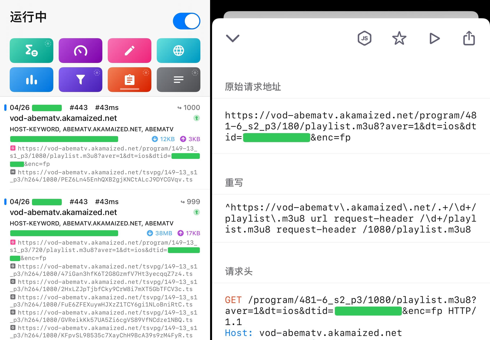

最近在看动画[《佐贺偶像是传奇 卷土重来》](https://zombielandsaga.com/)（ゾンビランドサガ リベンジ），官方的同步网络放送有 Amazon Prime Video 和 AbemaTV。因为我已经订阅 Netflix 了，感觉 Prime Video 不怎么用得到，所以还是用免费的 Abema 吧。

然而 Abema 很不爽的一点就是动态分辨率（不如说很多流媒体网站都这样），就喜欢自己判断你网速够不够，然后给你播放带宽相应的清晰度。初衷估计是为了任何网络环境条件下都能流畅播放，可是讲道理，我就没见过这个自动判断准过几次。

就算在设置里开到最高画质，还是动不动给我跳到 480p 甚至是 360p。我他喵的到底是哪里不行，就只配看你这马赛克画质？

<!--more-->

真是叔可忍婶不可忍，于是我去网上找有没有 Abema 强制 1080p 的方法（因为也有个 Chrome 启用 Netflix 1080p 的扩展），[正好找到了一个](https://gist.github.com/Last-Order/43199b7a701fc94e800c2de0ed021f1c)：

```js
const open = XMLHttpRequest.prototype.open;
XMLHttpRequest.prototype.open = function () {
  arguments[1] = arguments[1].replace('720/playlist.m3u8', '1080/playlist.m3u8');
  open.apply(this, arguments);
};
```

看了一下，没想到原理还挺简单，就是油猴脚本劫持 XHR 请求方法，把其他清晰度的 m3u8 playlist 全部重定向到 1080p 的 playlist 上。这样不管怎样请求，实际返回的都是 1080p 清晰度的源了。想想确实是这个理，高啊！

还好以前捣鼓过一段时间 HLS 相关的东西，所以这些不算陌生。不过实际使用的时候发现 `XMLHttpRequest` 并没有拦截到 `playlist.m3u8` 之类的请求，看了一下，原来是 Abema 请求的时候改用了 fetch API。反正大同小异，稍微修改一下就行了。

修改后的脚本同样放在 [Gist](https://gist.github.com/printempw/0c7730cdac336dfeddd3f22da6ad08a5) 上：

```js
// ==UserScript==
// @name Abema 强制 1080p
// @description 把其他清晰度的播放列表强制指向1080p
// @version 1.1.0
// @run-at document-start
// @namespace Violentmonkey Scripts
// @match https://abema.tv/*
// @grant none
// ==/UserScript==

const originalFetch = window.fetch

window.fetch = (...args) => {
  const regex = /\/\d+\/playlist\.m3u8/

  if (typeof args[0] === 'string' && args[0].match(regex)) {
    args[0] = args[0].replace(regex, '/1080/playlist.m3u8')
    console.log(args[0])
  }

  return originalFetch(...args)
}
```

题外话，好久没追过新番了，但佐贺二期开播后我现在每天都想快进到周四……

啊啊啊！


好了，网页端的问题解决了，那么客户端是不是也可以用这个方法呢？

抓包看了一下，客户端请求的确实是同样的 URL，直接如法炮制。

不过要修改客户端的请求就不像 Web 浏览器那么简单了，需要用到 MitM（中间人）攻击。目前 iOS 平台上主流的代理软件应该都支持 MitM，比如 Surge/Quantumult X/Shadowrocket。下面以 [Quantumult X](https://github.com/crossutility/Quantumult-X) 为例。

开启 MitM 功能，添加主机名如下：

```text
vod-abematv.akamaized.net
```

安装并信任证书（过程略），修改配置文件，添加重写规则：

```ini
[rewrite_local]
^https://vod-abematv\.akamaized\.net/.+/\d+/playlist\.m3u8 url request-header /\d+/playlist.m3u8 request-header /1080/playlist.m3u8
```

验证强制 1080p 是否成功（开启 HTTP 调试功能查看）：



可以看到原本是要加载 720p 的，经过重写后实际加载的是 1080p 的 segment。

爽！

