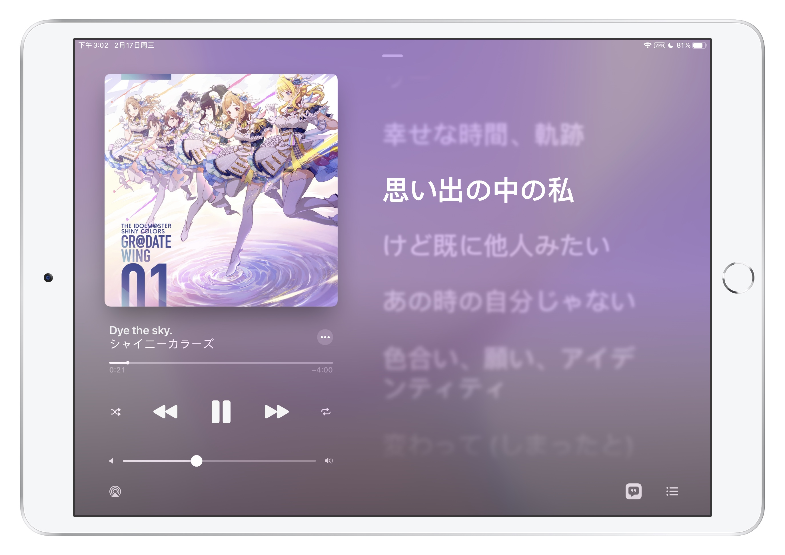

想在一个平台上听到所有喜欢的歌，太难了。

虽说在大版权时代，资源还是存到自己的硬盘里最踏实，但下载党也不是那么好当的。而且习惯了流媒体的便利以后，我是越来越不愿意花那个心思了。然而国内音乐平台版权之争使得听歌体验愈发水深火热，我也不得不面对现实……

在网易云音乐的歌单灰掉一大片后，我终于决定跑路。

这篇文章算是我个人使用了半年多日区 Apple Music 的感受，如果你恰巧也在纠结如何选择，希望对你有所帮助。

<!--more-->

## 理想的流媒体音乐服务

- 曲库丰富
- 订阅价格适中
- 可以自己上传音乐
- 跨设备同步
- 个性化推荐
- 不要有花里胡哨的功能
- 界面好看
- ~~梦里什么都有~~

## 我主要听什么

- Anisong（动画歌曲，~~俗称二刺螈~~）
- J-Pop（日本流行音乐）
- J-Rock（日本摇滚乐）

其实我涉猎挺广泛的，各种类型都听一点。~~真不是精日~~

## 其他候选服务

国内的网易云、QQ 音乐啥的是靠不住了，还是放眼海外吧。

除了外区 Apple Music，还有其他几个也是我考虑过的：

- Spotify
- YouTube Music
- ANiUTa

最后还是选了 AM，原因下面说。

当然，每个人的音乐口味千差万别，最适合我的不一定最适合你。

## 曲库还算可以

Apple Music 官方说的是「7000万曲聴き放題」，在日本所有音乐流媒体服务中算是数一数二（当然也还是得看你主要听什么）。

同样是日区，Spotify 我也试用过，**可以说大部分 AM 没有的，Spotify 也没有；而 Spotify 有的，AM 基本也有**，属于旗鼓相当的对手。比如说ヨルシカ、YOASOBI、Official髭男dism、あいみょん这些热门音乐人的歌，就是基本每家都有。

按照我自己使用下来的体验，其实想听的大部分歌都能在 Apple Music 里找到。

（当然这只是我个人的情况，毕竟我也不知道你要听什么）


## iCloud 音乐资料库

按照[官方文档](https://support.apple.com/zh-cn/guide/itunes/itnsa3dd5209/windows)的描述：

> 如果订阅了 Apple Music 或 iTunes Match，您可以使整个 iCloud 音乐资料库在使用同一个 Apple ID 登录的所有设备上都可用。只要接入互联网，即可随时访问您的资料库。

可以理解为网易云那样的音乐云盘，曲库里没有的歌，可以自己上传。

- 最多可以上传 100,000 首，每首最大 200MB
- 不占用 iCloud 存储空间

这也是我选择 Apple Music 的最大原因：就算你曲库再大，总有些歌是没有的，比如各种特典 CD、会场限定等等，允许自己上传歌曲就很方便。

据说 Spotify 也可以播放本地音乐，但并不是上传到云端，还是没有 AM 好用。

## 与 iTunes Store 互通

iTunes Store 作为日本最大的音乐在线配信平台，可以说大部分的歌如果有在网上卖，那肯定有在 iTunes Store 上卖；如果 iTunes Store 上没有，那八成就是没有在网上卖。

有些音乐 Apple Music 上没有提供，但是 iTunes Store 上是有卖的，比如「宇宙よりも遠い場所」「少女終末旅行」的 OP、ED、插入歌专辑。还有 [IM@S 偶像大师系列](https://prinsss.github.io/the-idolmaster/)，万南不肯流媒体配信，唯一支持的 ANiUTa 还全都只有 short version，想第一时间听到新曲就只能上 iTunes Store 了。

毕竟都是水果家的服务，iTunes Store 上购买的专辑与单曲，也可以直接在 Apple Music 的应用中播放（废话）。

我实际使用下来，「Apple Music 流媒体提供的音乐」「iTunes Store 购买的音乐」和「自己上传到 iCloud 音乐资料库的音乐」都是一个待遇，播放、整理起来都没差别。比如下面这张图，如果我不说，你能分辨出它们的来源吗？


## 用 iTunes 整理资料库

哦对，现在 iTunes 已经拆成了三个独立应用，Music、Podcast 和 TV。

虽然 iTunes 的手机管理功能屎得不行（现在集成到 Finder 里去了，还是很屎，强力推荐 iMazing），但它的音乐库管理功能还是公认很强大的，metadata 编辑、智能播放列表都很好用。

而且只要添加到了自己的 iCloud 音乐资料库中，就算是 Apple Music 提供的音乐，其 metadata 也可以自由修改（比如专辑封面、艺人等），可以说是最接近本地曲库体验的流媒体音乐服务了。


## 没有社交元素

好吧，这对一部分人来说可能是缺点。不过我确实不喜欢那些花里胡哨的东西，不看评论，对「网抑云」也没有兴趣。

这是网易云音乐、QQ 音乐和 Apple Music 的首页对比，见仁见智吧。


另外，虽然没有社交，不过可以在搜索里搜到其他人分享的整理好的播放列表，比如我前段时间找《钢之炼金术师》OP、ED 时就省的自己一个一个找了，也挺方便的。

## 官方播放列表推荐

Apple Music 的一大特色。

有个人推荐歌单、推荐电台、艺人歌单、音乐回忆歌单，等等。

其中我最中意的是编辑推荐歌单，比如：

- [2010年代 アニメ ベスト](https://music.apple.com/jp/playlist/2010%E5%B9%B4%E4%BB%A3-%E3%82%A2%E3%83%8B%E3%83%A1-%E3%83%99%E3%82%B9%E3%83%88/pl.407f5703ceb14a53a720d0fc5a3e4f3c)
- [2020年トップソング100：日本](https://music.apple.com/jp/playlist/2020%E5%B9%B4%E3%83%88%E3%83%83%E3%83%97%E3%82%BD%E3%83%B3%E3%82%B0100-%E6%97%A5%E6%9C%AC/pl.cdeb20ba9f4a4d55bc65638c454aac2a)
- [久石譲 スタジオジブリ ベスト](https://music.apple.com/jp/playlist/%E4%B9%85%E7%9F%B3%E8%AD%B2-%E3%82%B9%E3%82%BF%E3%82%B8%E3%82%AA%E3%82%B8%E3%83%96%E3%83%AA-%E3%83%99%E3%82%B9%E3%83%88/pl.9d00cd92b13746c096dd552d24a46a3b)

各种艺人歌单也是入坑的好机会：

- [はじめての ヨルシカ](https://music.apple.com/jp/playlist/%E3%81%AF%E3%81%98%E3%82%81%E3%81%A6%E3%81%AE-%E3%83%A8%E3%83%AB%E3%82%B7%E3%82%AB/pl.1dceafb41aae4ad7ae2e65c205854ae3)
- [はじめての 西野カナ](https://music.apple.com/jp/playlist/%E3%81%AF%E3%81%98%E3%82%81%E3%81%A6%E3%81%AE-%E8%A5%BF%E9%87%8E%E3%82%AB%E3%83%8A/pl.cf5d3da7b02145c49e06d5a0571a82d2)
- [はじめての Tokyo 7th シスターズ](https://music.apple.com/jp/playlist/%E3%81%AF%E3%81%98%E3%82%81%E3%81%A6%E3%81%AE-tokyo-7th-%E3%82%B7%E3%82%B9%E3%82%BF%E3%83%BC%E3%82%BA/pl.a23505c213a840b2973a1d7b920a028f)

更多可以参考：[「用好」Apple Music，这些是你应了解的 - 少数派](https://sspai.com/post/63907)

## 跨平台支持

在换 iPhone 之前，我在 Android 上也用过一段时间的 Apple Music（没错，竟然有 Android 客户端……），出乎意料地体验还不错，让人难以相信是那个以「自家生态圈以外的软件都做成一坨屎」闻名的🍎。

Windows 上的 iTunes，体验也马马虎虎，但感觉没人喜欢用这个听音乐吧。

虽然其他平台上也有支持，但 Apple Music 体验最好的肯定还是水果全家桶。如果你手头一部 Apple 设备都没有，那我是**不推荐**你用 Apple Music 的，因为很可能光是如何付款就得折腾半天……

至于网页版的 Apple Music，说实话我就没有成功打开过。🌚

## 切换 iTunes 账号会清空下载

说完优点说缺点。

Apple Music 的账号是跟着 iTunes Store/App Store 账号走的，不能独立设置。

也就是说如果你想要一直听日区 AM，那么就得保证 iTunes Store/App Store 的账号一直是日区（相信这对经常切外区账号下载 App 的 iOS 用户并不陌生）。

如果你临时需要下载一个只有国区 App Store 才有的 App，切了一下账号，那 Apple Music 的已下载音乐就会被清空。虽然资料库不会受影响，再登回日区账号就可以了，但又要再下载一遍还是很不爽。

> 看到有人说切账号会清空**资料库**，但我实际没有遇到过，只是清空了下载。

所以我现在一般是在 iPad 上切国区账号，下载完需要的 App，然后在电脑上通过 iMazing 安装 App 到手机，这样手机上就不需要切换账号了。

## 无法手动同步音乐

想要使用 Apple Music，必须开启音乐[资料库同步](https://support.apple.com/zh-cn/HT204926)。

一旦开了资料库同步，你的设备里的音乐就会被同步成和 iCloud 中的音乐资料库一样。如果想要把一首歌传到 iPhone 里，以前是通过 iTunes 直接同步过去就行了，现在你必须先在电脑上把歌添加到资料库中，等待它上传至 iCloud，然后再等它从 iCloud 下载到手机上，而且你的所有设备里都会出现这首歌。

也就是说，用了 Apple Music，你的所有水果设备就全都共享一个音乐资料库了。想听什么就往里面加，会自动同步，所有设备上都能听。方便是挺方便，但你如果想把一些音乐 locally 放到设备上，而不上传到云端的话，那就不好意思了。

我之前想把《异度神剑 2》的 OST 放到手机里，就因为这个问题，最后只能另寻他法 —— 我可不想把 7GB 的 OST 全部上传到 iCloud 资料库里去，更何况还会被压缩。

> 一个解决方法就是不要用自带的音乐 App，下个其他的音乐播放器就可以了。我是在手机上下载了 VOX，然后把 OST 传到了 App 对应的文稿存储空间里解决的，手机版 foobar2000 和 Flacbox/Evermusic 也可以。

## 上传无损音乐会被压缩

iCloud 音乐资料库不能上传无损音乐，ALAC 会被压缩成 256kbps AAC。

如果源文件就是 MP3/AAC 格式，那么上传后不会被压缩。


## 滚动歌词不能自己添加

Apple Music 支持滚动歌词，而且也挺好看的。不过这似乎只能是音乐发行人自己添加，用户是没办法自己添加滚动歌词的，添加的只能是静态歌词。搞不懂。

目前我感觉是 Apple Music 流媒体提供的歌大部分都有滚动歌词（听说有专门的团队负责？），iTunes Store 里买的歌，人气高的那些基本都有，但也有其他很多没有的（没错我说的就是你万代南梦宫）。

对于这些没有滚动歌词的音乐，想自己添加就只能添加静态歌词咯。



## 部分功能需要科学上网

姑且放到缺点里来吧。下面是我正在使用的代理规则片段：

```text
# 播放自己上传的歌曲
DOMAIN-SUFFIX,blobstore.apple.com
# iTunes Store 音乐试听
DOMAIN-SUFFIX,audio-ssl.itunes.apple.com
# iTunes Store 购买后播放
DOMAIN-SUFFIX,streamingaudio.itunes.apple.com
DOMAIN-SUFFIX,itsliveradio.apple.com
DOMAIN-SUFFIX,aodp-ssl.apple.com
DOMAIN-SUFFIX,video-ssl.itunes.apple.com
DOMAIN-SUFFIX,mvod.itunes.apple.com
DOMAIN-SUFFIX,hls-amt.itunes.apple.com
DOMAIN-SUFFIX,audio.itunes.apple.com
DOMAIN-SUFFIX,genius.itunes.apple.com
DOMAIN-SUFFIX,genius-upload.itunes.apple.com
DOMAIN-SUFFIX,genius-download.itunes.apple.com
```

参考：[提升国内 Apple Music 体验的代理规则 - 丁丁の店](https://blog.butanediol.me/2020/05/07/%E6%8F%90%E5%8D%87%E5%9B%BD%E5%86%85-Apple-Music-%E4%BD%93%E9%AA%8C%E7%9A%84%E4%BB%A3%E7%90%86%E8%A7%84%E5%88%99/)

## 如何上车？

最后说一下日区 Apple Music 如何上车。目前的 plan 有：

- 学生订阅，¥480/月
- 个人订阅，¥980/月
- 家庭订阅，¥1,480/月

其中最划算的就是家庭订阅，最多可以 6 个人共享，算下来一个人每月只要 250 日元左右。如果加点钱上 [Apple One](https://www.apple.com/jp/apple-one/) 家庭订阅（1,850円/月），每个月 300 日元，还能另外多出 Apple Arcade 和 200GB iCloud 存储空间。

如果想找人组队家庭订阅的话，推荐去蹲一下 Telegram 上的[大型合租群](https://t.me/hezu2)。

## 后记

总的来说缺点也有，瑕不掩瑜吧。

反正我用得是挺爽的，其他人咋样就不关我事了。
