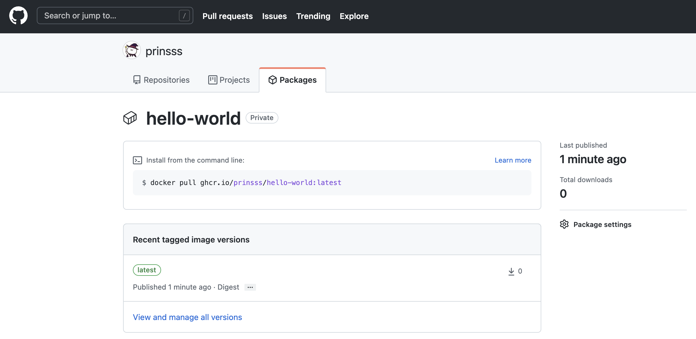
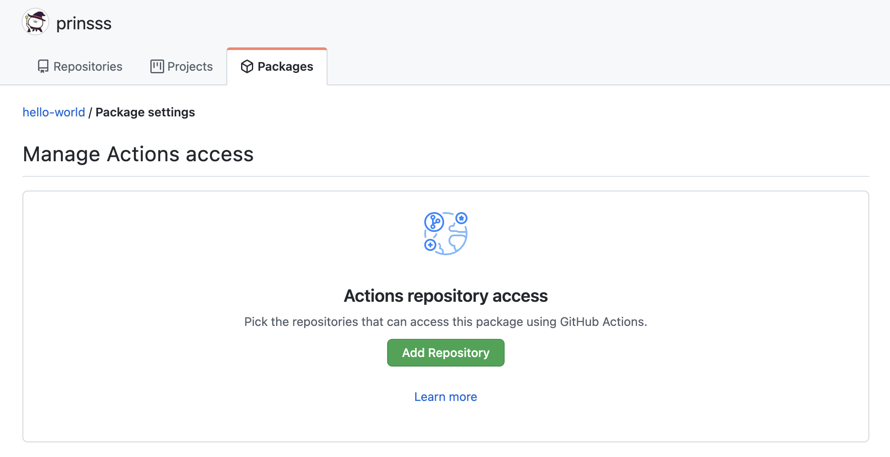

前段时间把 GitHub 的用户名修改成了 [@prinsss](https://github.com/prinsss)，准备把其他地方的账号也修改一下的时候，却发现 Docker Hub 的 username 不能改，只能[砍掉重练](https://hub.docker.com/support/doc/how-do-i-change-my-docker-username)（npm 也是）。

想想反正我 Docker Hub 上也没上传什么东西，不如就用 GitHub 自家的 Container registry 来托管镜像吧！

这里有个小插曲：其实我挺早之前就想要改名了，但当时在忙秋招，考虑到改名后可能会有一些后续要处理（擦屁股），所以只是创建了一个 organization 把名字占住，等有时间了再正式改名。然而后来我把组织删了，想要修改 GitHub 账户的用户名时，却提示 `prinsss` 这个名称 unavailable（我确定它是没被占用的，因为我还能再用这个名字创建组织），不知道是不是触发了内部的什么保留机制。

最后还是发工单找客服解决了，而且等了一个多星期才回复，也是挺无语的。原来的 `printempw` 这个名字我也保留了，所以 [printempw.github.io](https://printempw.github.io/) 这个域名还是可以访问的，目前是[两边同步更新](https://github.com/prinsss/prinsss.github.io/blob/source/_config.yml#L148)，后续再慢慢迁移。

<!--more-->

## GitHub Packages 介绍

其实最开始知道这个还是因为 Homebrew，看它每次安装软件下载 bottle 时都会从 ghcr.io 这个域名下载。好奇去查了一下，发现原来 GitHub 自己也整了一个软件包仓库，颇有一统天下的味道。

[GitHub Packages](https://docs.github.com/en/packages/learn-github-packages/introduction-to-github-packages) 支持托管 Docker、npm、Maven、NuGet、RubyGems 等软件包，用起来比较像私有库。比起官方 registry 的好处就是其与 GitHub 完全集成，可以把源代码和软件包整合在一起，包括权限管理都可以用 GitHub 的那一套。

GitHub Packages 对于开源项目完全免费，私有仓库也有一定的[免费额度](https://github.com/features/packages#pricing)。

## 手动上传镜像

基础用法和 Docker Hub 是一样的，只是 namespace 变为了 ghcr.io。

首先创建一个 PAT (Personal Access Token) 用于后续认证：

- 打开 https://github.com/settings/tokens/new?scopes=write:packages
- 创建一个 PAT，勾选 `write:packages` 权限

> **注意**：如果是在 GitHub Actions 中访问 GitHub Packages，则应该使用 `GITHUB_TOKEN` 而非 PAT 以提升安全性。后续章节会说明如何在 Actions 中使用 `GITHUB_TOKEN`。

然后我们就可以用这个 Token 登录镜像仓库了：

```bash
export CR_PAT=YOUR_TOKEN
echo $CR_PAT | docker login ghcr.io -u USERNAME --password-stdin
```

尝试一下推送镜像：

```bash
docker tag hello-world:latest ghcr.io/prinsss/hello-world:latest
docker push ghcr.io/prinsss/hello-world:latest
```

可以看到已经出现在 GitHub 上了：



刚上传的镜像默认都是 private，可以在 Package Settings 下方的 **Change package visibility** 处修改为公开镜像。

## 自动构建并上传

连镜像都放 GitHub 上了，那怎么好意思不用 GitHub Actions 呢！

下面就使用 Actions 实现代码更新后自动构建多架构 Docker 镜像，打 tag 并发布。

废话不多说，直接贴配置：

```yaml
# yaml-language-server: $schema=https://json.schemastore.org/github-workflow
name: Build Docker Image

# 当 push 到 master 分支，或者创建以 v 开头的 tag 时触发，可根据需求修改
on:
  push:
    branches:
      - master
    tags:
      - v*

env:
  REGISTRY: ghcr.io
  IMAGE: prinsss/ga-hit-counter

jobs:
  build-and-push:
    runs-on: ubuntu-latest

    # 这里用于定义 GITHUB_TOKEN 的权限
    permissions:
      packages: write
      contents: read

    steps:
      - name: Checkout
        uses: actions/checkout@v2

      # 缓存 Docker 镜像以加速构建
      - name: Cache Docker layers
        uses: actions/cache@v2
        with:
          path: /tmp/.buildx-cache
          key: ${{ runner.os }}-buildx-${{ github.sha }}
          restore-keys: |
            ${{ runner.os }}-buildx-

      # 配置 QEMU 和 buildx 用于多架构镜像的构建
      - name: Set up QEMU
        uses: docker/setup-qemu-action@v1

      - name: Set up Docker Buildx
        id: buildx
        uses: docker/setup-buildx-action@v1

      - name: Inspect builder
        run: |
          echo "Name:      ${{ steps.buildx.outputs.name }}"
          echo "Endpoint:  ${{ steps.buildx.outputs.endpoint }}"
          echo "Status:    ${{ steps.buildx.outputs.status }}"
          echo "Flags:     ${{ steps.buildx.outputs.flags }}"
          echo "Platforms: ${{ steps.buildx.outputs.platforms }}"

      # 登录到 GitHub Packages 容器仓库
      # 注意 secrets.GITHUB_TOKEN 不需要手动添加，直接就可以用
      - name: Log in to the Container registry
        uses: docker/login-action@v1
        with:
          registry: ${{ env.REGISTRY }}
          username: ${{ github.actor }}
          password: ${{ secrets.GITHUB_TOKEN }}

      # 根据输入自动生成 tag 和 label 等数据，说明见下
      - name: Extract metadata for Docker
        id: meta
        uses: docker/metadata-action@v3
        with:
          images: ${{ env.REGISTRY }}/${{ env.IMAGE }}

      # 构建并上传
      - name: Build and push
        uses: docker/build-push-action@v2
        with:
          context: .
          file: ./Dockerfile
          target: production
          builder: ${{ steps.buildx.outputs.name }}
          platforms: linux/amd64,linux/arm64
          push: true
          tags: ${{ steps.meta.outputs.tags }}
          labels: ${{ steps.meta.outputs.labels }}
          cache-from: type=local,src=/tmp/.buildx-cache
          cache-to: type=local,dest=/tmp/.buildx-cache

      - name: Inspect image
        run: |
          docker buildx imagetools inspect \
          ${{ env.REGISTRY }}/${{ env.IMAGE }}:${{ steps.meta.outputs.version }}
```

自动构建的效果可以在我的 [GitHub](https://github.com/prinsss/google-analytics-hit-counter) 上查看（其实就是之前写的那个 [使用 Google Analytics API 实现博客阅读量统计](https://prinsss.github.io/google-analytics-api-page-views-counter/)）。

另外有几个需要注意的点：

### 上传时出现 400 Bad Request

这个昨天搞得我真是一脸懵逼，报错是这样的：

```text
#16 exporting to image
#16 pushing layers 0.5s done
#16 ERROR: unexpected status: 400 Bad Request
------
 > exporting to image:
------
error: failed to solve: unexpected status: 400 Bad Request
Error: buildx failed with: error: failed to solve: unexpected status: 400 Bad Request
```

排查了好久，最后发现是我打 tag 的时候忘记加上用户名了，原本是 `ghcr.io/prinsss/ga-hit-counter` 的，我给打成了 `ghcr.io/ga-hit-counter`，难怪推不上去（也要吐槽一下这个报错，就一个 400 鬼知道是什么啊）。

### 上传时出现 403 Forbidden

把上面那个解决了以后，心想这次总该成了吧，结果又来了个 403，我又一脸懵逼：

```text
#16 exporting to image
#16 pushing layers 0.7s done
#16 ERROR: unexpected status: 403 Forbidden
------
 > exporting to image:
------
error: failed to solve: unexpected status: 403 Forbidden
Error: buildx failed with: error: failed to solve: unexpected status: 403 Forbidden
```

再一番排查，发现是需要在 Package Settings 中的 **Manage Actions access** 处指定可以访问该软件包的源码仓库（也就是 Actions 所在的仓库）。好吧……



添加了仓库，这下确实可以了。

### 元数据自动生成

[`docker/metadata-action`](https://github.com/docker/metadata-action) 这是一个比较有意思的 action，它可以从源码以及触发构建的 event 中获取数据，自动生成相应的 Docker 镜像 tag 以及 label。（在 GitHub 文档官方的示例中，这是由[一段脚本](https://docs.github.com/en/packages/managing-github-packages-using-github-actions-workflows/publishing-and-installing-a-package-with-github-actions#upgrading-a-workflow-that-accesses-ghcrio)完成的）

比如默认的效果就是：

| Event          | Ref                        | Docker Tags                |
| -------------- | -------------------------- | -------------------------- |
| `pull_request` | `refs/pull/2/merge`        | `pr-2`                     |
| `push`         | `refs/heads/master`        | `master`                   |
| `push`         | `refs/heads/releases/v1`   | `releases-v1`              |
| `push tag`     | `refs/tags/v1.2.3`         | `v1.2.3`, `latest`         |
| `push tag`     | `refs/tags/v2.0.8-beta.67` | `v2.0.8-beta.67`, `latest` |

也就是我现在使用的：源码推送到 `master` 分支则自动构建并更新 `master` tag 的镜像；在 git 上创建以 `v` 开头的 tag，Docker 那边也会自动创建相应的 tag 并且更新 `latest`，不错不错。（不过想想我可能保留一个 tag 触发就够了）

比如我 push 了一个 `v0.2.0` 的 tag 上去，自动生成的元数据就是这样的：

```text
Run docker/metadata-action@v3
Context info
  eventName: push
  sha: 6071f564087d49be48dc318b89fc22ff96cf6a17
  ref: refs/tags/v0.2.0
  workflow: Build Docker Image
  action: meta
  actor: prinsss
  runNumber: 11
  runId: 1495122573
Docker tags
  ghcr.io/prinsss/ga-hit-counter:v0.2.0
  ghcr.io/prinsss/ga-hit-counter:latest
Docker labels
  org.opencontainers.image.title=google-analytics-hit-counter
  org.opencontainers.image.description=Page views counter that pulls data from Google Analytics API.
  org.opencontainers.image.url=prinsss/google-analytics-hit-counter
  org.opencontainers.image.source=prinsss/google-analytics-hit-counter
  org.opencontainers.image.version=v0.2.0
  org.opencontainers.image.created=2021-11-23T14:10:35.953Z
  org.opencontainers.image.revision=6071f564087d49be48dc318b89fc22ff96cf6a17
  org.opencontainers.image.licenses=MIT
```

如果想要修改为其他方案，action 也提供了丰富的配置项，可以自行修改。

## 最后

用 GitHub Packages 托管 Docker 镜像，体验还是挺不错的。硬要说有什么缺点的话就是不好配置国内镜像吧，毕竟大部分国内镜像都是对应 Docker Hub 的。

另外多架构镜像的这个构建时间也是挺感人，模拟 arm64 一次要六七分钟，哈人。（所以写 Dockerfile 还是挺讲究的，怎么让缓存效率最大化，这方面还得再学习）

参考链接：

- [Introduction to GitHub Packages - GitHub Docs](https://docs.github.com/en/packages/learn-github-packages/introduction-to-github-packages)
- [Working with the Container registry - GitHub Docs](https://docs.github.com/en/packages/working-with-a-github-packages-registry/working-with-the-container-registry)
- [Automatic token authentication - GitHub Docs](https://docs.github.com/en/actions/security-guides/automatic-token-authentication)
- [Publishing and installing a package with GitHub Actions - GitHub Docs](https://docs.github.com/en/packages/managing-github-packages-using-github-actions-workflows/publishing-and-installing-a-package-with-github-actions#upgrading-a-workflow-that-accesses-ghcrio)
- [Inactive username can't be claimed? - GitHub Support Community](https://github.community/t/inactive-username-cant-be-claimed/189177)

题外话，秋招后这段时间我也折腾了一些东西，有空慢慢发出来吧。
