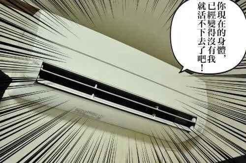

今天一天解锁了好几个人生成就：

- ✅ 中暑昏厥
- ✅ 被送上救护车
- ✅ 进急诊室

不开玩笑，以我的经历在此提醒各位，一定不能小瞧中暑的危害啊！！

<!--more-->

## 发生了什么

下午本来我舒舒服服躺在床上玩手机，突然来了一个电话，让我出门办事儿。地方远倒也不远，一公里多，我就寻思弄辆共享单车骑过去，权当锻炼身体了。

当时天气那叫一个热，估计正好是一天里最热的那段时间，才刚从空调房里出来身上就冒了一层汗，走了不到一百米感觉人都要蔫了。为了打起精神，我也特意选了点欢快的歌在路上听。

之后嘛，我也不知道吃错了什么药，上了路越骑越起劲，一辆破自行车蹬得飞快，差不多一首歌的时间就到了。就在我锁好车，准备步行过去的时候……

最开始是轻微的头晕，我也没怎么放在心上。

**然后突然视野开始变得昏暗、扭曲，整个人头晕目眩，意识也恍惚起来**（有点类似于蹲坑蹲久了，然后突然站起来的那种感觉）。要形容的话就是感觉天一下子变黑了，然后套了个重影 + 色差特效的滤镜，天旋地转，根本分不清到底是世界在摇晃还是我人在摇晃。我凭着剩余的思考能力，心想糟糕，八成是刚才骑太猛，现在脑部血液供应不上了。于是晃晃悠悠地想找个东西扶着缓一下。

结果我下一次睁眼的时候，面前已经是一个不认识的人了。

我分辨出他是在问我「没事吧？」，**这才忽然意识到，我刚才应该是失去意识晕过去了**，是这位路过的好心人叫醒了我。我赶忙向他道谢，说自己没事，缓一下就好了，于是他也好像稍微放心了的样子。

然而，我再下一次睁眼的时候，眼前又是那位好心人在问我，「你真的没事吗？要不我帮你打 120 吧」。这我真的没想到，**我竟然又晕过去了一次**……（梅开二度）。这次旁边的人也变多了，一位环卫阿姨和另一位应该也是路过的大姐在担心地看着这边。

不得不说失去意识的感觉很神奇。在我主观感受中，两次昏厥好像都是眼睛一闭一睁的事儿，前一秒我还在锁共享单车，下一秒人就在地上了，再下一秒他就打 120 了。我只能从他停在一旁的电瓶车推断出，他是先走远了，然后发现我又昏倒后再折回来帮我的。我却完全不知道这之间经过了多久，真的很感谢这几位好心人。🙏

在等救护车的途中，我的意识也开始逐渐恢复了：两只耳机都还挂在耳朵上，放着曲调轻快~~（害人）~~的爱抖露曲；检查了一下全身，手肘、膝盖都有不少擦伤，应该是倒地的时候留下的；呼吸急促，身体出汗量很大，衣服都湿了。

之后救护车到了，我也清醒得差不多了，不过为了以防万一还是给拉去医院挂了急诊（**长这么大，人生中第一次被救护车拉走……**），做了一大票检查，血常规呀 CT 啥的，先后排除了：低血压、低血糖、心脏病、脑部等问题，最后医生得出结论：

>  应该就是中暑了。

## 中暑真的会昏厥

以前我也有所耳闻，比如军训时有某某同学晕倒了，但没想到有这么夸张。

从医院回来以后我查了点资料，感觉我这种症状可能是属于「[热失神](https://zh.wikipedia.org/wiki/%E4%B8%AD%E6%9A%91#%E7%86%B1%E5%A4%B1%E7%A5%9E)」：

- 原因：多发于直射日光下长时间活动或高温高湿的室内[[1]](https://ja.wikipedia.org/wiki/%E7%86%B1%E4%B8%AD%E7%97%87#%E7%86%B1%E5%A4%B1%E7%A5%9E%EF%BC%88heat_syncope%EF%BC%89)。由于流汗引致的脱水和末端血管的扩张，全身的血液循环降低而导致。
- 症状：意识在突然之间消失。体温比平常的高，明显地流汗，脉搏呈现徐脉（缓慢的脉搏）。

搜集的一些相关资料：

- [晕厥 - 心脏和血管疾病 - 《默沙东诊疗手册家庭版》](https://www.msdmanuals.cn/home/heart-and-blood-vessel-disorders/symptoms-of-heart-and-blood-vessel-disorders/fainting)
- [小知识: 中暑 - 《默沙东诊疗手册家庭版》](https://www.msdmanuals.cn/home/quick-facts-injuries-and-poisoning/heat-disorders/heatstroke)
- [中暑 - 维基百科，自由的百科全书](https://zh.wikipedia.org/wiki/%E4%B8%AD%E6%9A%91)
- [夏季中暑的防与治 - 上海市卫生健康委员会](http://wsjkw.sh.gov.cn/zyfhyzybfz/20200819/fcdd9fc348124c46ba86a996d38280d0.html)
- [预防中暑/措施 - 环境省](https://www.wbgt.env.go.jp/zh-cn/doc_prevention.php)
- [Heat Stress Related Illness | NIOSH | CDC](https://www.cdc.gov/niosh/topics/heatstress/heatrelillness.html)

在我的印象里应该是要重度中暑，比如在阳光下暴晒、高温环境长时间工作那样的人才会晕倒，没想到我这就出门骑个自行车人也倒了。人类的身体真是脆弱啊……

而且我这次算是比较幸运的，下了车走在马路牙子上才晕倒。**如果是骑着骑着失去意识，给哪里磕个一下的话，那真是想想都觉得后怕。**

反省这次的事件，主要问题应该就是：

- 之前一直待在空调房里，突然出门温度不适应；
- 骑车太快，日照、高温下剧烈运动；
- 听歌导致注意力涣散，没有及时察觉身体异常。

早知道还不如打个车去，屁事没有。

## 最后

说实在话，我以前确实没觉得中暑有多严重，这次算是给我吃了个教训。

希望各位读者也能以我这次的经历为戒，不要小看中暑，炎热天气出门做好预防呀！

