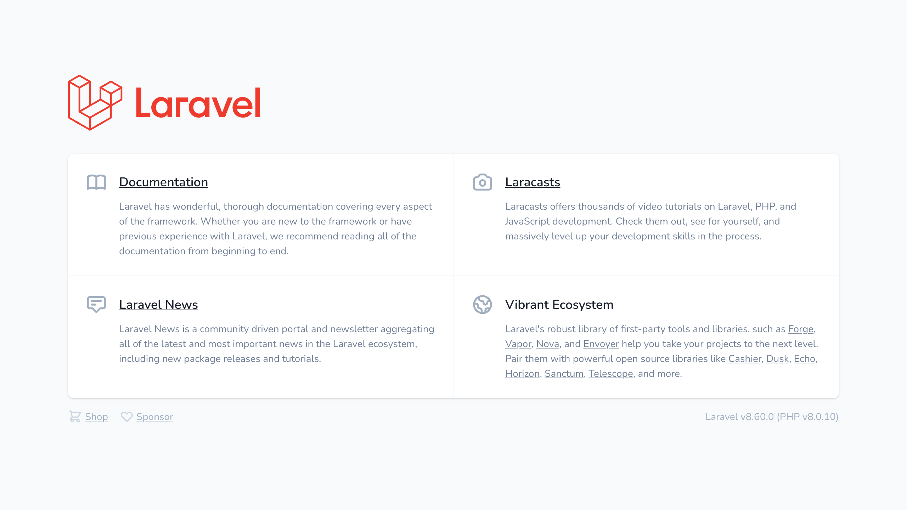

Laravel Sail 是什么？简单来说就是一个基于 Docker 的开发环境。其核心就是一个 `docker-compose.yml` 配置文件和 `sail` 脚本，定义了 PHP、MySQL、Redis 等一系列容器，然后把程序放里面跑。

至于好处嘛，主要就是**使用方便、运行环境统一、不会弄乱系统**。同样是 Laravel 开发，本机安装 LNMP、Valet、Homestead 这些方法我都用过，但现在我肯定首选 Laravel Sail（容器化是真滴爽）。

不过 Laravel Sail 好是挺好，想要在墙内顺利使用还是要费点功夫的。

<!--more-->

## 创建项目

> 以下操作均在国内网络环境下运行。~~其实挂个全局代理这些都不是事啦~~

安装 Docker 和配置 Docker Hub 国内镜像的步骤可以参考[这篇文章](https://yeasy.gitbook.io/docker_practice/install/mirror)。

创建项目时，直接用 Laravel 官方的[安装脚本](https://laravel.com/docs/8.x/installation)大概率会卡在 Updating dependencies 上，为什么你懂的。不过我们还是可以借鉴下官方脚本的内容：

```bash
curl -s https://laravel.build/example-app -o install.sh
```

临时新建一个 composer 容器：

```bash
docker run -it --rm -v $(pwd):/opt -w /opt \
  laravelsail/php80-composer:latest bash
```

在容器内配置 composer 镜像，创建 Laravel 项目：

```bash
composer config -g repo.packagist composer https://mirrors.aliyun.com/composer/
laravel new example-app
```

安装 Laravel Sail 相关文件（这里可自定义需要使用的服务）：

```bash
cd example-app
php ./artisan sail:install --with=mysql,redis,meilisearch,mailhog,selenium
```

导出底层 Dockerfile，方便后续定制：

```bash
php ./artisan sail:publish
```

完成后，可以看到项目下多出了一个 `docker` 目录和 `docker-compose.yml` 文件。

## 定制 Dockerfile

Laravel Sail 有一个主要的容器，用于运行 PHP 主程序。其他比如 `composer`, `artisan`, `node`, `npm` 命令也是在这个容器里运行的。

> 后续你可以通过 `sail shell` 来访问这个容器。

这个主容器的 [Dockerfile](https://github.com/laravel/sail/blob/1.x/runtimes/8.0/Dockerfile) 就是我们上面导出的那个。可以看到它主要就是在 Ubuntu 的基础上安装了一些软件包，大部分的网络问题都是这里造成的。

使用国内镜像替换之，主要需要替换的软件源有：

- Ubuntu
- PPA
- Composer
- Node.js
- Npm

修改后的 Dockerfile 如下：

```dockerfile
FROM ubuntu:21.04

LABEL maintainer="Taylor Otwell"

ARG WWWGROUP

WORKDIR /var/www/html

ENV DEBIAN_FRONTEND noninteractive
ENV TZ=Asia/Shanghai
ENV APT_MIRROR http://mirrors.ustc.edu.cn
ENV NVM_DIR /usr/local/nvm
ENV NODE_VERSION 16.9.1
ENV NVM_NODEJS_ORG_MIRROR https://mirrors.ustc.edu.cn/node
ENV NVM_SOURCE https://hub.fastgit.org/nvm-sh/nvm.git

SHELL ["/bin/bash", "-o", "pipefail", "-c"]

RUN ln -snf /usr/share/zoneinfo/$TZ /etc/localtime && echo $TZ > /etc/timezone

RUN echo 'APT::Acquire::Retries "5";' > /etc/apt/apt.conf.d/80-retries \
  && sed -i "s|http://archive.ubuntu.com|$APT_MIRROR|g; s|http://security.ubuntu.com|$APT_MIRROR|g" /etc/apt/sources.list \
  && sed -i "s|http://ports.ubuntu.com|$APT_MIRROR|g" /etc/apt/sources.list \
  && apt-get update \
  && apt-get install -y gnupg gosu curl ca-certificates zip unzip git supervisor sqlite3 libcap2-bin libpng-dev python2 \
  && mkdir -p ~/.gnupg \
  && chmod 600 ~/.gnupg \
  && echo "disable-ipv6" >> ~/.gnupg/dirmngr.conf \
  && apt-key adv --homedir ~/.gnupg --keyserver hkp://keyserver.ubuntu.com:80 --recv-keys E5267A6C \
  && apt-key adv --homedir ~/.gnupg --keyserver hkp://keyserver.ubuntu.com:80 --recv-keys C300EE8C \
  # PHP
  && echo "deb https://launchpad.proxy.ustclug.org/ondrej/php/ubuntu hirsute main" > /etc/apt/sources.list.d/ppa_ondrej_php.list \
  && apt-get update \
  && apt-get install -y php8.0-cli php8.0-dev \
    php8.0-pgsql php8.0-sqlite3 php8.0-gd \
    php8.0-curl php8.0-memcached \
    php8.0-imap php8.0-mysql php8.0-mbstring \
    php8.0-xml php8.0-zip php8.0-bcmath php8.0-soap \
    php8.0-intl php8.0-readline php8.0-pcov \
    php8.0-msgpack php8.0-igbinary php8.0-ldap \
    php8.0-redis php8.0-swoole php8.0-xdebug \
  # Composer
  && curl -so /usr/bin/composer https://mirrors.aliyun.com/composer/composer.phar \
  && chmod a+x /usr/bin/composer \
  && composer --version \
  && composer config -g repo.packagist composer https://mirrors.aliyun.com/composer/ \
  # Node.js
  && mkdir -p $NVM_DIR \
  && curl -so- https://raw.fastgit.org/nvm-sh/nvm/v0.38.0/install.sh | bash \
  && source $NVM_DIR/nvm.sh \
  && nvm install $NODE_VERSION \
  && nvm use $NODE_VERSION \
  && node -v && npm -v \
  && npm config set registry https://registry.npm.taobao.org \
  # Yarn
  && npm install --global yarn \
  && yarn config set registry https://registry.npm.taobao.org \
  && apt-get install -y mysql-client \
  && apt-get install -y postgresql-client \
  && apt-get -y autoremove \
  && apt-get clean \
  && rm -rf /var/lib/apt/lists/* /tmp/* /var/tmp/*

ENV NODE_PATH $NVM_DIR/v$NODE_VERSION/lib/node_modules
ENV PATH $NVM_DIR/versions/node/v$NODE_VERSION/bin:$PATH

RUN setcap "cap_net_bind_service=+ep" /usr/bin/php8.0

RUN groupadd --force -g $WWWGROUP sail
RUN useradd -ms /bin/bash --no-user-group -g $WWWGROUP -u 1337 sail

COPY start-container /usr/local/bin/start-container
COPY supervisord.conf /etc/supervisor/conf.d/supervisord.conf
COPY php.ini /etc/php/8.0/cli/conf.d/99-sail.ini
RUN chmod +x /usr/local/bin/start-container

EXPOSE 8000

ENTRYPOINT ["start-container"]
```

目前有个不足之处就是 Node.js 的安装，原来用的 [NodeSource](https://github.com/nodesource/distributions) 现在没有可用的国内镜像源，只能改用 [nvm](https://github.com/nvm-sh/nvm) 安装。但是 nvm 在 `PATH` 的处理上有些问题（它是通过一个脚本修改环境变量，把当前启用的 Node 版本添加到 `PATH` 里去，但是 Dockerfile 里不能动态设置 `ENV`），目前只能手动指定要安装的 Node 版本了。

## 运行容器

使用 Laravel Sail 提供的脚本运行容器：

```bash
./vendor/bin/sail up
```

这个脚本主要的工作就是读取 `.env` 里配置的环境变量，然后通过 `docker-compose` 在容器里执行相应命令，所以基本用法和 `docker-compose` 是一致的：

```bash
sail up -d  # 后台运行
sail down   # 停止运行
```

耐心等待镜像构建完成，Laravel Sail 就可以正常运行啦。

```nohighlight
Creating network "example-app_sail" with driver "bridge"
Creating example-app_redis_1       ... done
Creating example-app_selenium_1    ... done
Creating example-app_meilisearch_1 ... done
Creating example-app_mailhog_1      ... done
Creating example-app_mysql_1       ... done
Creating example-app_laravel.test_1 ... done
```



## 参考链接

- [将 Laravel 开发环境由 Homestead 迁移到 Laravel Sail (Docker) 完整详细教程](https://learnku.com/articles/56987)
- [Laravel Sail - Laravel - The PHP Framework For Web Artisans](https://laravel.com/docs/8.x/sail)
- [Install node and npm with nvm using Docker.](https://gist.github.com/remarkablemark/aacf14c29b3f01d6900d13137b21db3a)

