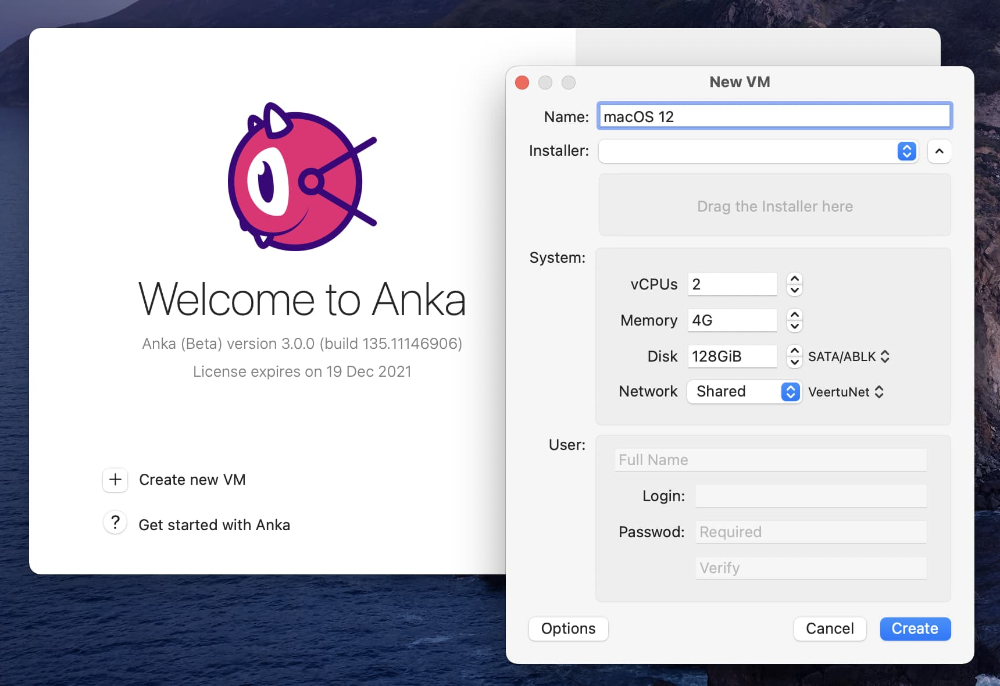
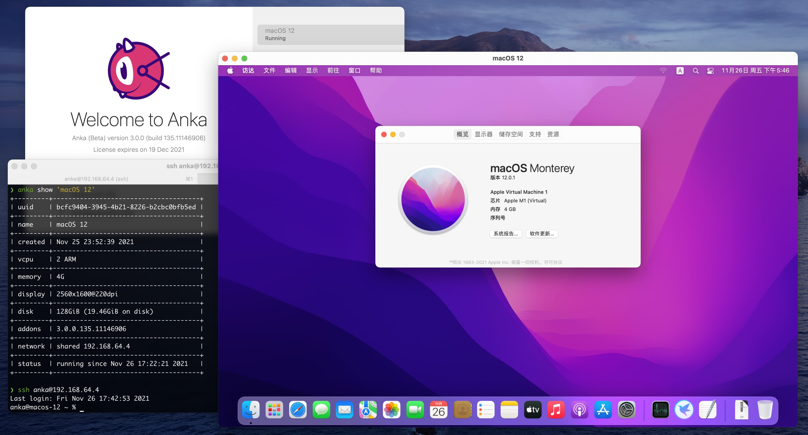
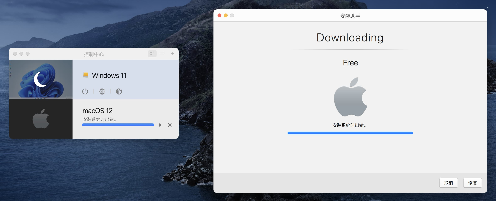
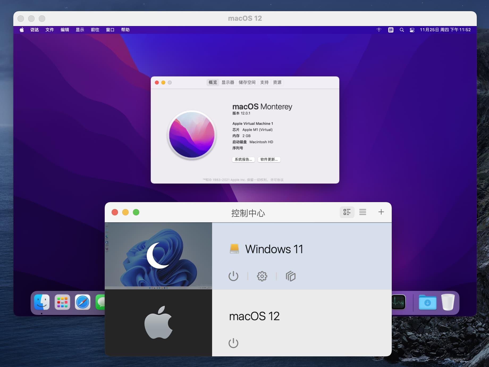
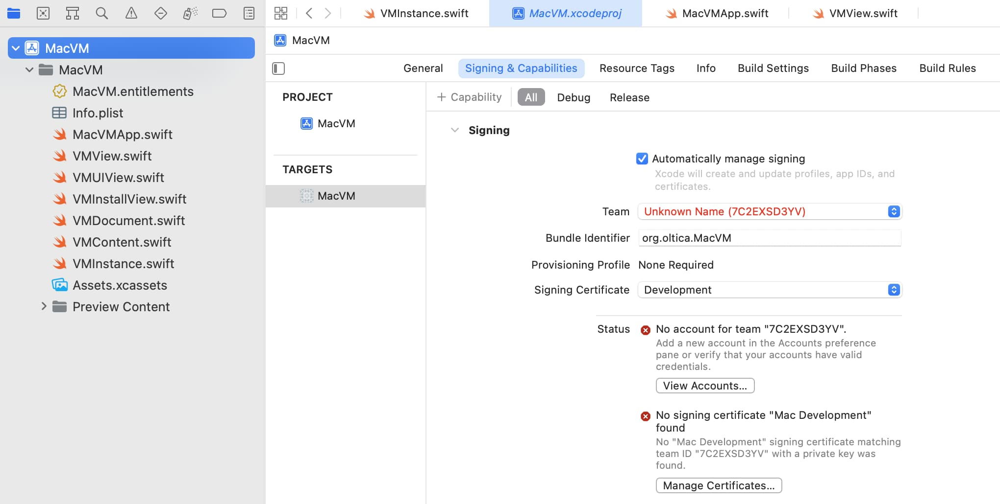
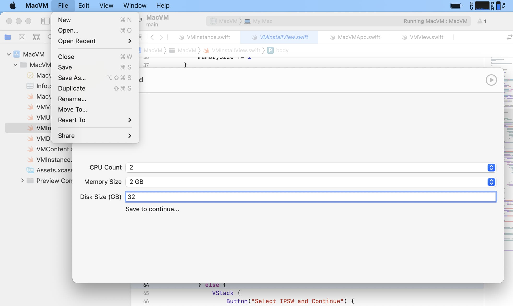
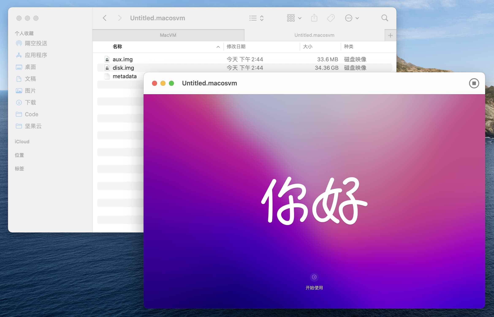

Apple M1 芯片问世一年有余，时至今日，在 M1 Mac 上运行 Windows、Linux 虚拟机的方法都已经比较成熟了。然而 macOS 本身的虚拟化却并非如此：直到 Monterey 发布，于 M1 Mac 上运行 macOS 虚拟机才成为可能。

最近有几个小实验需要在 macOS 虚拟机上跑，本来以为去 Parallels Desktop 上开一个就完事了，搜了一下才发现，其实事情没那么简单……实际配置过程中也是踩了几个坑，所以顺带记录一下。

<!--more-->

## 前提

目前想要在 M1 Mac 上运行 macOS 虚拟机，有以下要求：

- Host OS 和 Guest OS 都必须是 Monterey
- 安装镜像必须是 [IPSW 格式](https://en.wikipedia.org/wiki/IPSW)

为什么 Big Sur 不行？因为在 Virtualization framework 中运行 macOS 虚拟机是 [Monterey 才加入的功能](https://twitter.com/zhuowei/status/1402004538194808833)。

那以前怎么就能虚拟呢？因为 ARM 架构的 M1 Mac 在引导上用的其实是 iOS 那一套，不是传统的 UEFI，所以苹果官方没提供 [bootloader](https://developer.apple.com/documentation/virtualization/vzmacosbootloader) 的话自然没戏。黑苹果也是一样的道理，只能说且用且珍惜吧。

至于 `.ipsw` 文件，这玩意其实就是 iOS 固件的格式……真就大号 iPad 呗！

IPSW 镜像文件可以在这里下载：[Apple Silicon M1 Full macOS Restore IPSW Firmware Files Database – Mr. Macintosh](https://mrmacintosh.com/apple-silicon-m1-full-macos-restore-ipsw-firmware-files-database/)

## Veertu\'s Anka

这个是我目前最推荐的一种方法，所以放在第一个说。

Anka 是什么？根据官网的介绍，[Anka](https://docs.veertu.com/anka/arm/what-is-anka/) 是一个专门用来管理 macOS 虚拟机的软件，可以与现有的基于容器的 DevOps 工作流集成，为 iOS 应用的构建与测试提供 CI/CD 自动化支持。再看下其开发者 [Veertu](https://veertu.com/)，也是做 iOS CI 和 macOS 云这一块的。

并且今年十月发布的 [Anka 3.0 (beta)](https://veertu.com/create-macos-vms-for-ios-ci-using-apple-m1-hardware/) 已经支持在 M1 Mac 上创建 macOS 虚拟机了，正是我们所需要的。

下载 [Anka M1 beta](https://veertu.com/downloads/anka-m1-beta) 版，安装后打开，就可以直接通过图形界面创建虚拟机了：



或者，你也可以使用命令行创建虚拟机（相关文档在[这里](https://docs.veertu.com/anka/arm/anka-virtualization/command-reference/)）：

```bash
anka create --ram-size 4G --cpu-count 4 --disk-size 80G \
  --app ~/Downloads/UniversalMac_12.0.1_21A559_Restore.ipsw 'macOS 12'
```

运行虚拟机：

```bash
anka start -uv
```

Anka 默认将虚拟机存储在 `~/Library/Application Support/Veertu/Anka` 目录下，可以参考[这里](https://docs.veertu.com/anka/arm/anka-virtualization/modifying-the-global-configuration/)修改保存位置，或者干脆做个软链接也行。虚拟机的配置文件也在同目录下的 `config.yaml` 文件中，有些图形界面不提供的配置项可以在这里修改。

也可以使用命令行修改，比如修改虚拟机的分辨率和 DPI：

```bash
anka modify 'macOS 12' display -r 2560x1600 -d 220
```

另外，Anka 提供的 Guest Tool 会自动打开虚拟机内 macOS 的自动登录、SSH 并且阻止系统休眠（应该都是为了自动化服务的），并且提供了剪贴板共享、`anka cp` 文件复制，以及可以直接在虚拟机内执行命令的 `anka run` 等功能。



不过有一个需要顾虑的是 [License](https://docs.veertu.com/anka/arm/licensing/) 的问题，在 beta 期间可以免费使用 Anka 没问题，但不知道正式版发布以后如何。不过原本 Veertu 家面向个人开发者的 [Anka Develop](https://veertu.com/anka-develop/) 就是免费的，所以或许并不需要担心。

或者，你也可以使用本文最后提到的开源方案，体验也是不错的。

## Parallels Desktop

毕竟是 Mac 虚拟机行业名声最响的，其实我第一个想到的也是 PD。

查了一下，macOS 作为 Guest OS 是 [PD17 才支持的功能](https://www.parallels.com/cn/blogs/parallels-desktop-17-just-released/)（前略，天国的 PD16 用户），然后 [17.1 更新](https://www.parallels.com/cn/blogs/parallels-desktop-17-update/)添加了 Parallels Tools 的支持，还提了一嘴「虚拟机默认磁盘大小从 32 GB 增加至 64 GB」。

我最开始还不知道这有什么好拿出来说的，后来才知道原因：你在 PD 中甚至无法调整 Mac 虚拟机的磁盘大小。不仅是磁盘，CPU 核心数、内存大小、网络连接方式都不能改，可配置项为零（至少无法在图形界面中配置），完完全全就是个半成品。

如果你确实想安装，这里是官方教程：[Install macOS Monterey 12 virtual machine on a Mac with Apple M1 chips](https://kb.parallels.com/125561)

点「新建虚拟机」以后，安装助手里就有直接下载 macOS 的选项。看起来很友好，然而……



啃哧啃哧下载了半天，最后提示「安装系统时出错」，也不知道为什么。查了下官方 Knowledge Base，貌似也不是个例：[Inability to create a macOS Monterey 12 VM on Mac computers with Apple M1 chips](https://kb.parallels.com/en/128442)

后来我找到了这篇文章：[Customizing MacOS guest VMs in Parallels 17 on Apple Silicon](http://blog.rolpdog.com/2021/08/customizing-macos-guest-vms-in.html)，按照其中的介绍，通过命令行创建虚拟机，竟然就可以运行了……

```bash
/Applications/Parallels\ Desktop.app/Contents/MacOS/prl_macvm_create \
  ~/Downloads/UniversalMac_12.0.1_21A559_Restore.ipsw \
  /Volumes/xxx/Parallels/macOS\ 12.macvm \
  --disksize 80000000000
```

> 我之前用 17.0.1 版本的时候也尝试用 `prl_macvm_create` 创建虚拟机，但是在进度到 90% 的时候失败了，提示「内部虚拟化错误。安装失败」。升级到 17.1.0 后虽然安装助手还是「安装系统时出错」，但命令行是可以正常创建虚拟机的。

命令行启动虚拟机：

```bash
/Applications/Parallels\ Desktop.app/Contents/MacOS/Parallels\ Mac\ VM.app/Contents/MacOS/prl_macvm_app \
  --openvm /Volumes/xxx/Parallels/macOS\ 12.macvm
```

安装完成后，在 PD 控制中心可以导入 `.macvm` 格式的虚拟机文件，导入以后就可以从图形界面启动了。



作为一个商业虚拟机软件，且不说快照、Suspend，连最基本的 VM 管理功能都欠奉，我也是无话可说了。想知道还有哪些功能是目前还不能用的，可以查看 [Known issues and limitations](https://kb.parallels.com/125561)。

## MacVM

[MacVM](https://github.com/KhaosT/MacVM) 是一个开源项目，基于 Virtualization framework（当然啦，大家都是用的这个），提供了简单的图形界面用于配置虚拟机。

因为作者并没有提供编译好的程序，所以需要自己使用 Xcode 从源码编译。

下载源码，用 Xcode 打开 `MacVM.xcodeproj`，在 Signing & Capabilities 中修改为自己的开发者证书：



点击运行，会跳出来一个文件选择框，不用管先叉掉。

然后菜单栏 File -> New，新建虚拟机。输入 CPU 核心数、内存和磁盘大小后点菜单栏 File -> Save 保存，会生成一个 `.macosvm` 包。之后虚拟机的虚拟磁盘镜像也会保存在这个 bundle 中，所以要留意选择保存的位置。



然后点 Select IPSW and Continue 按钮，选择之前下载的镜像文件，点 Install，等它安装完就好了。（最开始的版本还要自己生成磁盘镜像，然后拷贝到应用容器中，还要用 Apple Configurator 2 手动装系统，相比起来现在已经友好很多了）

安装完成后，窗口会整个儿变黑，此时就可以点右上角的启动按钮启动虚拟机了。



用这种方法优点是开源，有啥不爽的都可以自己改，包括没有提供配置项的地方。缺点就是要自己编译，毕竟不是谁都装了 Xcode 的。

跑起来以后和上面两种基本没差别，因为实际的虚拟机创建、安装和运行都是 Virtualization framwork 实现的，整个项目的代码其实并不多。

GitHub 上还有一些类似的项目，这里也列出来供参考：

- [ming900518/macOS-Virtual-Machine: A ARM macOS Virtual Machine.](https://github.com/ming900518/macOS-Virtual-Machine)
- [zhuowei/VirtualizationDemo: demoing Virtualization.framework changes in macOS 12 beta](https://github.com/zhuowei/VirtualizationDemo)
- [jspahrsummers/Microverse: macOS virtualization app for M1/Apple Silicon](https://github.com/jspahrsummers/Microverse)

## 最后

以上三种方法，其实底层大家都是一样的，就看在此之上谁做得更完善了。综合来看，目前感觉 Anka 的使用体验是最好的。

关于 M1 Mac 运行 macOS 虚拟机的一些参考链接：

- [Is there a way to run a macOS guest virtual machine on an M1 / Apple Silicon host? - Ask Different](https://apple.stackexchange.com/questions/420494/is-there-a-way-to-run-a-macos-guest-virtual-machine-on-an-m1-apple-silicon-hos)
- [macOS as guest on macOS host · Issue #2360 · utmapp/UTM](https://github.com/utmapp/UTM/issues/2360)
- [Virtualization on M1: MacOS Guest - Apple Community](https://discussions.apple.com/thread/252330935)
- [Big Sur installation | Parallels Forums](https://forum.parallels.com/threads/big-sur-installation.351864/)
- [Is it possible to run a macOS virtual machine on M1 yet?](https://forums.macrumors.com/threads/is-it-possible-to-run-a-macos-virtual-machine-on-m1-yet.2272694/)
- [You can now virtualize macOS Monterey on M1 Macs!](https://forums.macrumors.com/threads/you-can-now-virtualize-macos-monterey-on-m1-macs.2303480/)

UTM 有一个 [`dev-monterey`](https://github.com/utmapp/UTM/tree/dev-monterey) 分支，我还没有尝试，不知道以后会不会推出支持 macOS Guest 的版本。

听说还有人使用 [OSX-KVM](https://github.com/kholia/OSX-KVM) 和 [Docker-OSX](https://github.com/sickcodes/Docker-OSX) 跨架构在 M1 上运行了 x86 的 macOS，但是性能很糟糕（simulation 嘛）。

另外，以上的这些虚拟机方案都不支持快照恢复，有点麻烦。不过好在我用来放虚拟机的移动硬盘是 APFS 格式的，支持写时复制 (Copy on write)，所以直接把镜像整个儿复制一份就好了，很快，也不会占用多余的存储空间。
