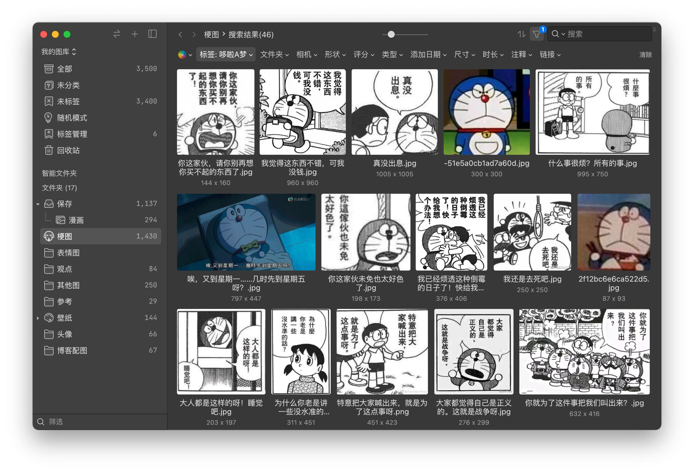
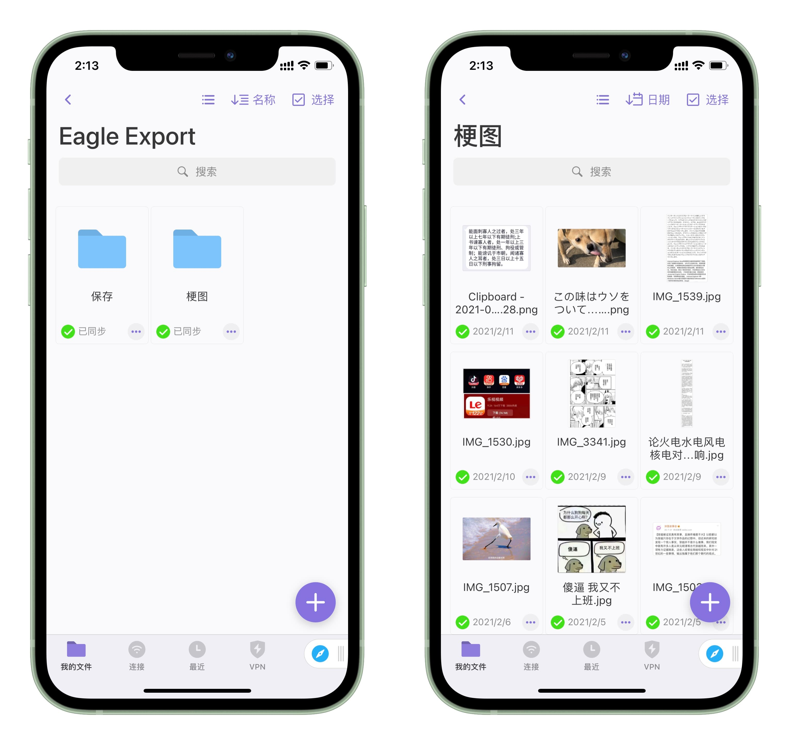

不知道各位有没有遇到过这种问题？

上网冲浪存了好多沙雕梗图，有时候突然感觉其中一张图能派上用场，但想找却怎么也找不到，也不知道当初存哪里去了；

大事小事都喜欢截图，玩游戏截图，看动画片也截图，截了一大堆到头来也不怎么用，乱七八糟的混在一起，删了又感觉怪可惜的；

看到喜欢的图总之先右键保存（话说现在是不是已经不兴说「右键保存」了，「长按保存」可能还更普遍一点，大人时代变啦），久而久之图库越来越大，又分散在硬盘的不同角落，整理起来也愈发力不从心……

啊。没有吗。好吧。🥲

说正经的，如果你也有很多图片需要管理，那么你应该试试 [Eagle](https://cn.eagle.cool/) 这款软件。

<!--more-->

-----

为什么呢？

如果单纯依靠文件系统整理（用文件夹分类），缺点还是很明显的：

- 一张图片只能属于一个分类，除非复制多份；
- 不能给图片加标签、备注；
- 浏览切换目录不方便，需要借助其他看图软件；
- 目录下图片太多容易把 Explorer/Finder 卡住。

使用专业的素材管理软件，可以解决绝大多数的这种问题。

当然了，这种类型的软件不只有 Eagle 一个。但是我只用过 Eagle，所以就不推荐其他的啦。如果有更好的选择，欢迎在评论区告诉我。


我目前用到的功能基本上有这些：

- 分类、标签、备注
- 按颜色、图片尺寸等筛选
- 瀑布流浏览
- **重复图片检查**
- 浏览器扩展拖拽保存网页图片

以我自己的体验来说，比起原来用文件管理的时候，真的舒适了太多。相见恨晚啊！

比如下面是我珍藏的~~（到处偷来的）~~小叮当图：



还有这几天在看~~（吹）~~的[《佐贺偶像是传奇》](https://bgm.tv/subject/252655)：


不过有一点遗憾的是，目前在手机上还没有浏览 Eagle 资源库的办法。

Eagle 资源库的目录结构是这样的：

```text
我的图库.library
├── images
│   ├── KEZAL1JG0RN32.info
│   │   ├── IMG_1507.png
│   │   ├── IMG_1507_thumbnail.png
│   │   └── metadata.json
│   ├── KEZAL1JG2YXNI.info
│   │   ├── 我太菜了 对不起.jpg
│   │   └── metadata.json
│   ├── KEZAL1JG34XY6.info
│   │   ├── 可恶 你们这些被资本主义毒惑到骨子里的猪.jpg
│   │   └── metadata.json
│   ├── KEZAL1JG4HFBR.info
│   │   ├── illust_71093876_20191005_193032.jpg
│   │   ├── illust_71093876_20191005_193032_thumbnail.png
│   │   └── metadata.json
...
```

每张图片外面都包了一个文件夹，包括分类、文件夹层级等元信息都存在里面的 `metadata.json` 中，从外界无法直接浏览（这也是为部分人所诟病的一点）。

而官方似乎也没有出移动端 App 的打算……

一个妥协的办法就是使用 Eagle 的导出功能，导出成正常目录结构，然后放到手机上（可以用 Documents 等应用从电脑自动同步）。



这样算是勉强能看，不过到底还是不方便。

前段时间看到 Eagle [公开了 API](https://www.yuque.com/augus-gsjgn/eagle-api)，本来想弄个简陋的网页客户端，写了个小 demo，倒是确实能浏览图库了。所以功能实现估计是没什么障碍的，奈何后来犯懒，一直搁置到现在，只能有缘再说了。

最后，Eagle 是[收费软件](https://cn.eagle.cool/store)，¥199 两台设备，终身授权，学生有教育优惠。

如果你有图片整理需求的话，去试用一下吧，不会亏的。
