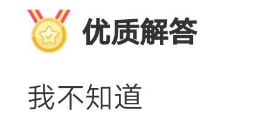
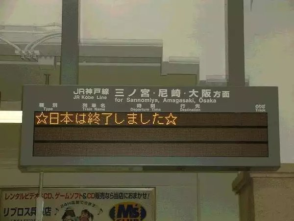

学习使我快乐。才怪。

要不是为了多少增加点竞争力，我又何必折腾自己去考这些证。快要大学毕业找工作了，最近这段时间明显感觉自己比以前焦虑了不少。俗话说得好，打不过就加入。虽然也不知道这些证以后能不能派上用场，不过总比没有好，万一用上那就是赚了。

这次考的几个其实我都没有花很多时间准备，不过所幸还是都拿到手了。所以记录一下感想，也顺便给博客除除草。在网上说这些其实无异于增加实名上网的风险……不过 fxck it，随他去吧。

<!--more-->

## 软考

**软考是什么？**

软考也叫软件水平考试，全称计算机技术与软件专业技术资格（水平）考试，是由国家人力资源和社会保障部、工业和信息化部领导的国家级考试。

**有什么用？**

国企评职称、积分落户、写简历上唬人。

**有哪些项目？**

软考有高级、中级、初级三种级别，每个级别中又有不同的资格设置。比如高级就有分为信息系统项目管理师、系统分析师、系统架构设计师、网络规划设计师、系统规划与管理师。完整列表可以看[这里](https://www.ruankao.org.cn/introduction/zgsz)。

据我观察，高级里报的人最多的是**信息系统项目管理师**（俗称高项），中级的是**软件设计师**，初级都没啥人报，可能是太简单了没含金量吧。

**考试安排？**

每年考两次，分别安排在上半年和下半年。上半年考试时间为5月下旬，下半年考试时间为11月上旬。

**考试题型？**

考试分为上午场和下午场，初级、中级是上午考基础知识，下午考应用技术。高级则是上午综合知识，下午案例分析加论文。以中级为例，上午题型都是选择题，下午是主观问答题。

每科目总分都是 75 分，45 分及格，上午下午都考 45 分以上就算过了。

**考试感想？**

就说我报考的软件设计师（中级），感觉不难。考的东西基本都是大学计算机专业课教的那些，**微机原理、程序设计语言、数据结构、操作系统、软件工程、面向对象、算法、数据库、计算机网络**，其他就没啥了，范围广但不深。

说句欠揍的话，我这次考试的准备时间全部加起来可能都没有三天……倒也不是我自大，就纯粹是拖延症犯了，一直拖啊拖，直到考前一天才开始刷真题（我当时都快放弃了）。最后看了一个通宵，第二天下午的时候差点昏睡考场。

个人感觉如果大学 CS 专业课都过了的话，那过个软考中级应该还是没啥压力的。考试当天我在考场逛了一下，来考的除了几位头顶显得有些寂寥的大叔，基本上都是大学生。所以趁着专业课学的东西还没忘，直接考掉正好。

**怎么准备？**

首先看一下报考科目的考试大纲（比如：[2021年软件设计师考试大纲](https://www.educity.cn/rk/2149521.html)），了解一下大致要考的内容。就像我说的，基本都是大学专业课里教过的东西。

教材的话有官方指定的教材，比如软件设计师就是《软件设计师教程（第5版）》。这本教材我就是大致浏览了一遍，然后等做题碰到有不会的再来翻书了。

最重要的是刷题，做历年的真题（网上资源很多）。

真题看几遍后就能发现很明显的题型规律，比如哪几题会考微机原理，哪几题会考网络、操作系统等等，还有最后 5 题是雷打不动的完形填空，考英语的。至于下午场那就更是换汤不换药了，第一题数据流图，第二题数据库设计，第三题 UML，第四题算法，第五题代码填空 Java/C++ 二选一。

**考完了有用吗？**

至少能证明你计算机专业还是学到点东西的，聊胜于无吧。我这次报了中级没报高级，也是寻思一口不能吃成个胖子，毕竟高级要写的论文我完全没练过，肯定是写不来的。

这次中级过了，下次有机会就挑战高级吧。

## JLPT N1

**N1 是什么？**

日本语能力测试（Japanese-Language Proficiency Test，简称 JLPT）是以母语非日语者为主要对象的日语能力考试。目前考试设有 N1 至 N5 级、共 5 个级别，当中以 N1 级难度最高。

据我观察，大部分人都是报的 N1、N2，N3 以下就没多少人报了。

**有什么用？**

JLPT 是现时最具认受性的日语能力考试。留学、进外企的时候用得到吧，大概。

反正是公认知名度、认可度最高的日语考试，蛮考一个放着。

**考试安排？**

每年举办两次，于 7 月和 12 月的第一个星期日实施。

然而最近因为新冠疫情导致去年 7 月的考试被取消，后来又取消了部分考点，导致现在  JLPT 报名经常「一座难求」，考场座位都得靠抢（我这次运气不错，捡漏抢到了一个）。微博上甚至有个狠人，因为附近的考点名额已满，最后报了个内蒙古的考点……大老远的坐飞机去考试，只能说是够拼的。

还有，这破考试报名费老他妈贵了，N1、N2 报名费要 550 块，你怎么不去抢！

**考试题型？**

分为语言知识、阅读、听力三部分，全是选择题。

N1 总分 180，100 分合格（要求每项分数都大于等于 19 分）。

**考试感想？**

不考察口语和写作，而且全是选择题，要及格真的挺简单的。何况我从高中开始自学日语，要是 N1 都考不过那我一头撞死算了。而且过了 N1 但实际水平堪忧的人我这几年也见过不少，所以确实没啥好拿出来说的。

考试的话，重要的就是词汇、语法和听力。词汇方面不是我吹牛逼，看了这么久的小说漫画动画片，词汇量总归是累积了不少的。语法的话，不少 N1 文法在日常生活中其实不怎么见得到，所以还是要专门看看。听力就不说了，以前看虚拟管人的那段时间算是给我锻炼出来了，就听力考试那字正腔圆的，给我两倍速都没问题好吧。

**考完了有用吗？**

不知道，我从来没有想过这个问题.jpg

权当自我满足了，证明下自己吧。

## 驾照

嗯……这个真没什么好说的了，写上来凑数的。科一到科四都是一把过，爽到。

我考的是手动挡 C1 驾照，感想的话就是汽车比想象中的要好开，挂档踩油门就走，踩刹车就停，方向盘转车也跟着转，说实话还挺爽的。以前我就喜欢看发动机、变速箱原理之类的视频，实际上手理解起来也算快。

不如说学车的时候感觉大部分时间是在学交通规则，比如左转直行右转都有专门车道、红灯也可以右转（除非有右转信号灯）这些都是我学了以后才知道的。另外一点就是发现路上不守交规的人其实挺多的，越实线超车、变道转向不打灯的看到过好多次。以前我也不知道所以没感觉，现在自己开车的时候就看的明白了。

总之，多个证多一种可能性吧，本拿到了以后有机会就能自驾游了，happy 😋

