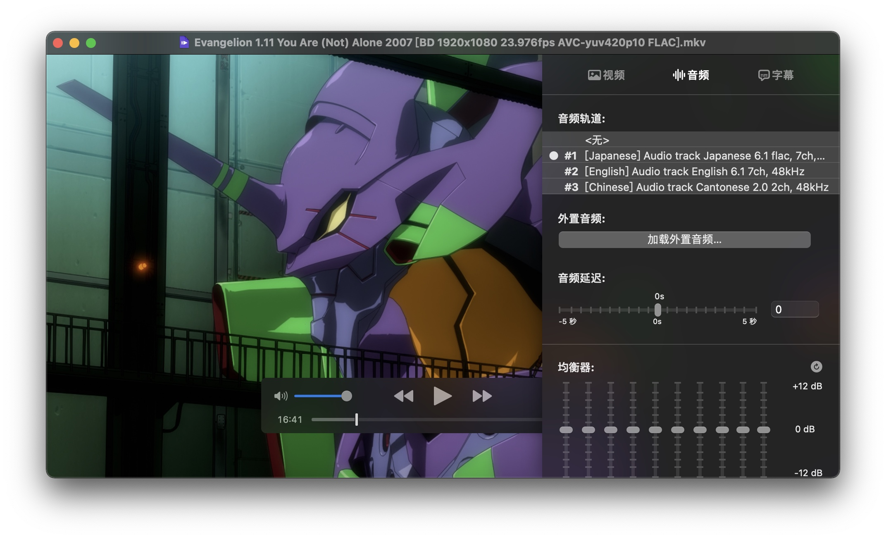

继 [AirPods 2](https://printempw.github.io/airpods-2-are-great/) 之后，前段时间我又没忍住，入手了传说中的~~豌豆射手~~ AirPods Pro。

第一次体验到的「主动降噪」功能确实惊艳，虽然感觉对人声的处理还是差了点意思，但开和不开真的是两种完全不同的感受。尤其是乘坐公共交通的时候，感觉是终于夺回了一点耳朵的主导权，不用再一味地被各种噪声强奸了。

用了几个月，总的来说挺满意的，就是这人声降噪实在是普通，近处的人说话大声点就挡不住了（比如室友），只能开音乐盖过去。有人说是后续固件削弱了，不过我感觉买来就这吊样。可惜市面上还是没有能达到聋子模拟器效果的降噪耳机，遗憾。

<!--more-->

-----

AirPods Pro 另外一个比较受关注的新功能就是「[空间音频](https://support.apple.com/zh-cn/HT211775)」，简单来说就是通过耳机里的各种传感器和一系列计算来调整声音，模拟出影院级（据说）的环绕声效果。到手的时候我就拿爱奇艺上的《复仇者联盟4》测试了一下，确实挺 amazing 的。

为什么要说这些呢？其实是因为我最近下了个 EVA 新剧场版的资源，里面封装的音轨是 6.1 声道的。然而就是这个视频文件，在播放到战斗激烈的场景时，我的所有设备上，无论扬声器还是耳机都会出现爆音（clipping）。



~~新剧场版终章真的要上映了，你庵野鸽鸽什么时候骗过你~~

初步排查应该是多声道音源 downmix 成双声道播放的时候出问题了，因为封装在一起的双声道粤语音轨并不会爆音。感觉挺奇怪的，难道这些播放器在 downmix 的时候默认都没有音量电平限制吗？

就在搜索解决方法时，我突然想到了 AirPods Pro 的「空间音频」功能：既然这音轨本身就是环绕声，那么如果用空间音频来播放，岂不是正好？

查了一下，目前支持为本地视频开启空间音频的播放器不多：

- [List of Apps that work with Spatial Audio | MacRumors Forums](https://forums.macrumors.com/threads/list-of-apps-that-work-with-spatial-audio.2255160/)
- [Thread: Apps that work with Spatial Audio : AirpodsPro](https://www.reddit.com/r/AirpodsPro/comments/iteiov/thread_apps_that_work_with_spatial_audio/)

比如我主力使用的 nPlayer 目前就还不支持，遗憾。

> 另外也发现了个有意思的 App：[Surround Sound Speaker Check](https://apps.apple.com/us/app/surround-speaker-check/id1052439918)
>
> 貌似原本是用来给家庭影院的环绕声音响系统做测试的，没想到还能拿来测试 AirPods Pro 空间音频，哈哈哈。用这个测试了一下，空间音频确实很有感觉，普通的双声道模拟环绕声的效果相形见绌，推荐各位也试试。

下面对帖子中提到的几个播放器做一下测试。

-----

使用的视频文件如下。

测试文件①：[杜比官方宣传片](https://download.dolby.com/us/en/test-tones/dolby-atmos-trailer_amaze_1080.mp4)（`H.264` + `AC-3`，`MP4` 封装）

```text
Input #0, mov,mp4,m4a,3gp,3g2,mj2, from 'dolby-atmos-trailer_amaze_1080.mp4':
  Duration: 00:01:03.55, start: 0.000000, bitrate: 9396 kb/s
    Stream #0:0(und): Video: h264 (Main) (avc1 / 0x31637661), yuv420p, 1920x1080 [SAR 1:1 DAR 16:9], 8946 kb/s, 24 fps, 24 tbr, 24 tbn, 48 tbc (default)
    Stream #0:1(und): Audio: eac3 (ec-3 / 0x332D6365), 48000 Hz, 5.1(side), fltp, 448 kb/s (default)
```

测试文件②：[网上摸来的多声道 AAC](https://www2.iis.fraunhofer.de/AAC/ChID-BLITS-EBU.mp4)（`H.264` + `AAC`，`MP4` 封装）

```text
Input #0, mov,mp4,m4a,3gp,3g2,mj2, from 'ChID-BLITS-EBU.mp4':
  Duration: 00:00:46.63, start: 0.000000, bitrate: 188 kb/s
    Stream #0:0(und): Video: h264 (Main) (avc1 / 0x31637661), yuv420p, 800x600, 26 kb/s, 8 fps, 8 tbr, 8 tbn, 16 tbc (default)
    Stream #0:1(und): Audio: aac (HE-AAC) (mp4a / 0x6134706D), 44100 Hz, 5.1, fltp, 159 kb/s (default)
```

测试文件②：[上面提到过的 EVA 新剧场版](https://share.dmhy.org/topics/view/553703_Neon_Genesis_Evangelion_TV_ONA_CD_2020_12_01.html)（`H.264` + `FLAC`，`MKV` 封装）

```text
Input #0, matroska,webm, from 'Evangelion 1.11 You Are (Not) Alone 2007 [BD 1920x1080 23.976fps AVC-yuv420p10 FLAC].mkv':
  Duration: 01:40:58.57, start: 0.000000, bitrate: 12663 kb/s
    Stream #0:0(jpn): Video: h264 (High 10), yuv420p10le(progressive), 1920x1080, SAR 1:1 DAR 16:9, 23.98 fps, 23.98 tbr, 1k tbn, 47.95 tbc (default)
    Stream #0:1(jpn): Audio: flac, 48000 Hz, 6.1, s16 (default)
    Stream #0:2(eng): Audio: flac, 48000 Hz, 6.1, s16
    Stream #0:3(chi): Audio: flac, 48000 Hz, stereo, s16
```

测试文件④：对测试文件③进行转码（`H.264` + `AC-3`，`MP4` 封装）

```bash
ffmpeg -i 'Evangelion 1.11 You Are (Not) Alone 2007 [BD 1920x1080 23.976fps AVC-yuv420p10 FLAC].mkv' -map 0:v:0 -map 0:a:0 -c:v h264_videotoolbox -c:a ac3 output.mp4
```

```text
Input #0, mov,mp4,m4a,3gp,3g2,mj2, from 'output.mp4':
  Duration: 01:40:58.57, start: 0.000000, bitrate: 52 kb/s
    Stream #0:0(jpn): Video: h264 (High) (avc1 / 0x31637661), yuv420p, 1920x1080 [SAR 1:1 DAR 16:9], 559 kb/s, 23.98 fps, 23.98 tbr, 24k tbn, 48k tbc (default)
    Stream #0:1(jpn): Audio: ac3 (ac-3 / 0x332D6361), 48000 Hz, 5.1(side), fltp, 448 kb/s (default)
```


测试结果（✅ 表示可以激活空间音频）：

|                  | 文件1 | 文件2 | 文件3 | 文件4 |
| ---------------- | ----- | ----- | ----- | ----- |
| PlayerXtreme     | ✅     | ✅     | ❌     | ✅     |
| FE File Explorer | ✅     | ✅     | ❓ *   | ✅     |
| Plex             | ✅     | ✅     | ✅ **  | ✅     |

\* FE File Explorer 播放 MKV 格式视频需要高级版，我就没测

\*\* 需要修改 Plex Media Server 的配置，参考[这篇文章](https://dwffls.com/posts/plex-spatial-audio/)

-----

目前猜测触发空间音频的条件是：

- 使用系统解码器播放
- 音频为环绕声 AAC 或 AC-3 (E-AC-3)

由于有服务端转码的配合，Plex 的兼容性表现最好，推荐。

题外话：经过 Plex 转码以后，就算关闭耳机的空间音频，直接播放也不会出现爆音了，不知道是不是转码的时候做了处理。另外空间音频效果确实好，结尾主题曲响起的时候差点以为我没戴耳机，感觉声音真的像是从 iPad 那边发出来的一样，神奇。
