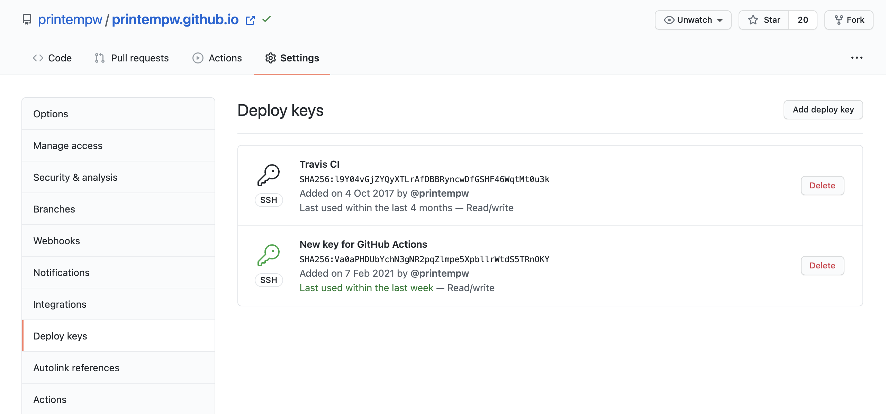
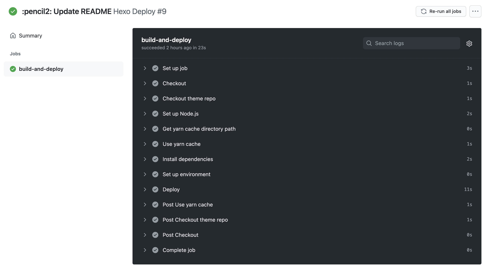

联动三年前的文章：[使用 Travis CI 自动部署 Hexo 博客](https://printempw.github.io/deploy-hexo-blog-automatically-with-travis-ci/)

今天更新了一下博客，寻思着好歹也改一下页脚的 Copyright 年份，改完 push 上去以后却发现 GitHub Pages 迟迟没有更新。进去 Travis CI 一看，发现任务一直处于 Queued 状态，半小时了都没开始构建。

查了一下，并不是只有我遇到了类似情况（似乎是因为 Travis CI 正在将  travis-ci.org 迁移至 travis-ci.com）：

- [Builds hang in queued state](https://travis-ci.community/t/builds-hang-in-queued-state/10250)
- [Builds queuing for hours with public git repo](https://travis-ci.community/t/builds-queuing-for-hours-with-public-git-repo/10351)

看了一圈感觉有点悬，干脆换成 GitHub Actions 吧。

<!--more-->
-----

我的博客完全托管在 GitHub 上：[printempw/printempw.github.io](https://github.com/printempw/printempw.github.io)，其中 `source` 分支放的是源码，`master` 分支（即 GitHub Pages）是 Hexo 生成的静态博客页面。

要做的也和之前 Travis CI 差不多，当 `source` 分支有更新时，自动使用 Hexo 构建新页面并更新 GitHub Pages 就可以了。

## 配置部署密钥

生成一个新的 SSH 密钥，用于 push 至 GitHub Pages 所在的 repo：

```bash
ssh-keygen -f hexo-deploy-key -C "printempw.github.io"
```

将公钥 `hexo-deploy-key.pub` 设置为仓库的部署密钥（Settings > Deploy keys）：



然后在 Settings > Secrets 中新增一个 secret，命名为 `DEPLOY_KEY`，把私钥 `hexo-deploy-key` 的内容复制进去，供后续使用。

## 编写 Workflow

Workflow 就是 GitHub Actions 的配置文件，类似于 `.travis.yml`。

首先新建文件：

```bash
mkdir -p .github/workflows
touch .github/workflows/deploy.yml
```

编辑 `deploy.yml`：

```yaml
name: Hexo Deploy

# 只监听 source 分支的改动
on:
  push:
    branches:
      - source

# 自定义环境变量
env:
  POST_ASSET_IMAGE_CDN: true

jobs:
  build-and-deploy:
    runs-on: ubuntu-latest

    steps:
      # 获取博客源码和主题
      - name: Checkout
        uses: actions/checkout@v2

      - name: Checkout theme repo
        uses: actions/checkout@v2
        with:
          repository: printempw/hexo-theme-murasaki
          ref: master
          path: themes/murasaki

      # 这里用的是 Node.js 14.x
      - name: Set up Node.js
        uses: actions/setup-node@v1
        with:
          node-version: '14'

      # 设置 yarn 缓存，npm 的话可以看 actions/cache@v2 的文档示例
      - name: Get yarn cache directory path
        id: yarn-cache-dir-path
        run: echo "::set-output name=dir::$(yarn cache dir)"

      - name: Use yarn cache
        uses: actions/cache@v2
        id: yarn-cache
        with:
          path: ${{ steps.yarn-cache-dir-path.outputs.dir }}
          key: ${{ runner.os }}-yarn-${{ hashFiles('**/yarn.lock') }}
          restore-keys: |
            ${{ runner.os }}-yarn-

      # 安装依赖
      - name: Install dependencies
        run: |
          yarn install --prefer-offline --frozen-lockfile

      # 从之前设置的 secret 获取部署私钥
      - name: Set up environment
        env:
          DEPLOY_KEY: ${{ secrets.DEPLOY_KEY }}
        run: |
          sudo timedatectl set-timezone "Asia/Shanghai"
          mkdir -p ~/.ssh
          echo "$DEPLOY_KEY" > ~/.ssh/id_rsa
          chmod 600 ~/.ssh/id_rsa
          ssh-keyscan github.com >> ~/.ssh/known_hosts

      # 生成并部署
      - name: Deploy
        run: |
          npx hexo deploy --generate
```

当然，具体步骤还是得根据自己的需求进行相应的修改。

GitHub Pages 相关的具体配置放在了 Hexo 的 `_config.yml` 里：

```yaml
deploy:
  type: git
  repo: git@github.com:printempw/printempw.github.io.git
  branch: master
  name: printempw
  email: printempw@gmail.com
```

## 部署结果

更新 `source` 分支，push 后 GitHub Actions 就会自动执行。



不到半分钟就 build 完了，只能说微软爸爸还是牛逼。

## 参考链接

- [Workflow syntax for GitHub Actions - GitHub Docs](https://docs.github.com/en/actions/reference/workflow-syntax-for-github-actions)
- [利用 Github Actions 自动部署 Hexo 博客 | Sanonz](https://sanonz.github.io/2020/deploy-a-hexo-blog-from-github-actions/)
- [Hexo Action · Actions · GitHub Marketplace](https://github.com/marketplace/actions/hexo-action)
