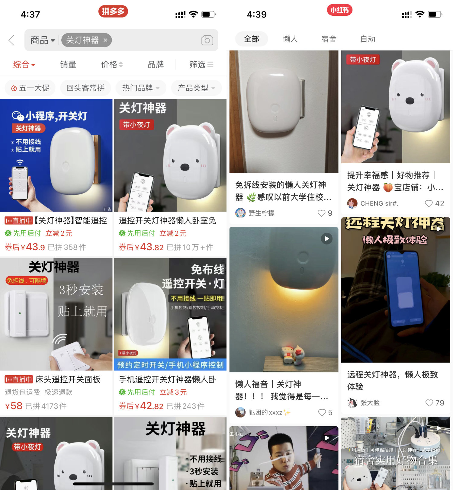
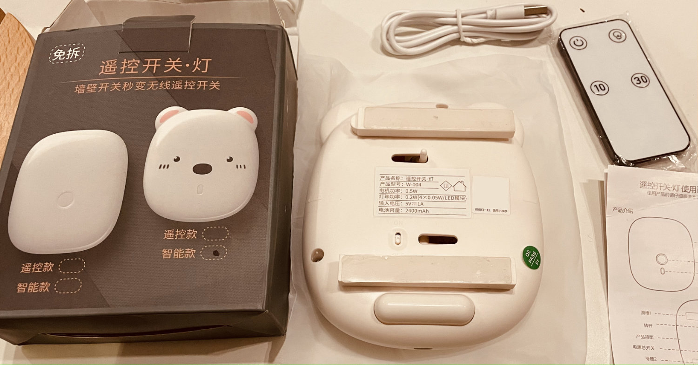
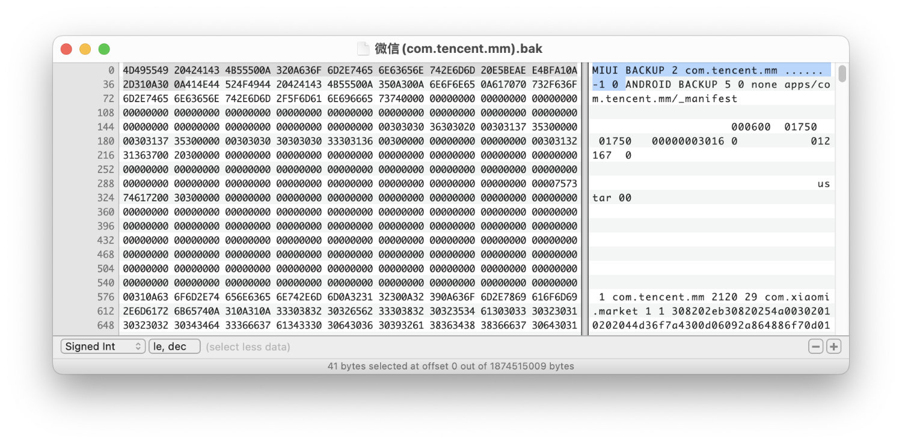
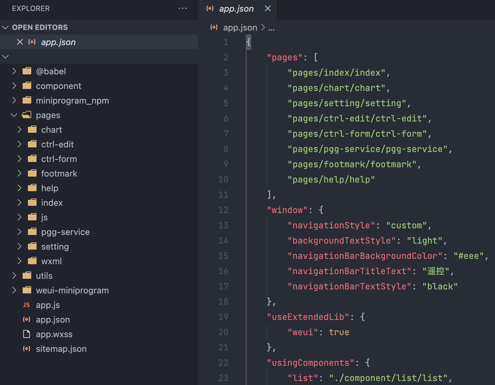
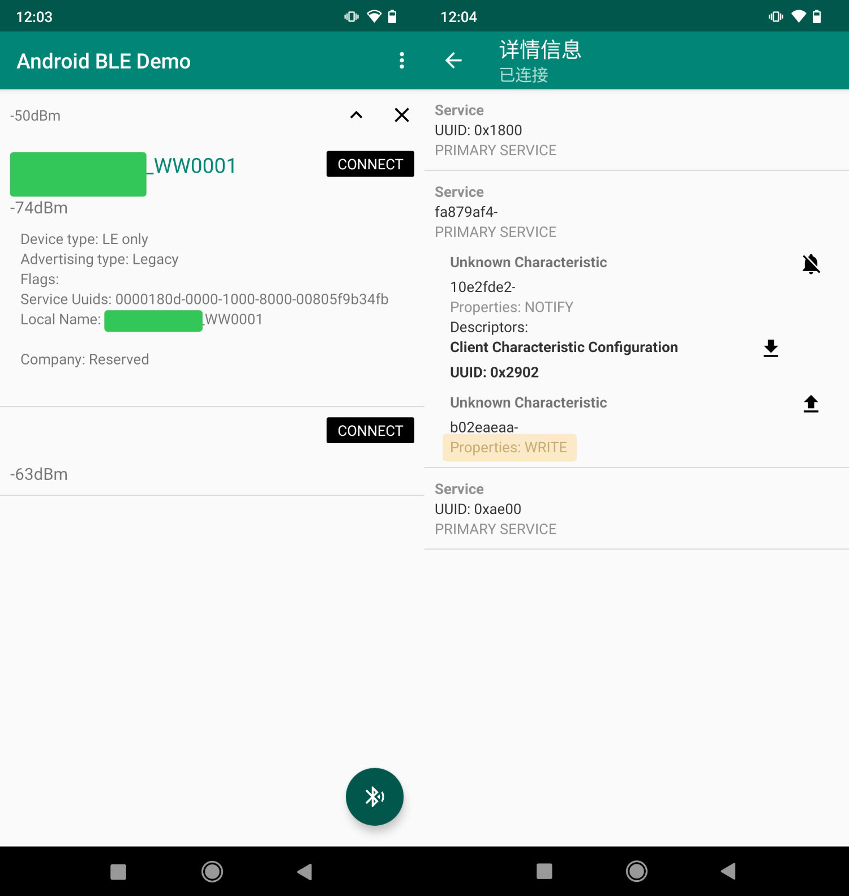
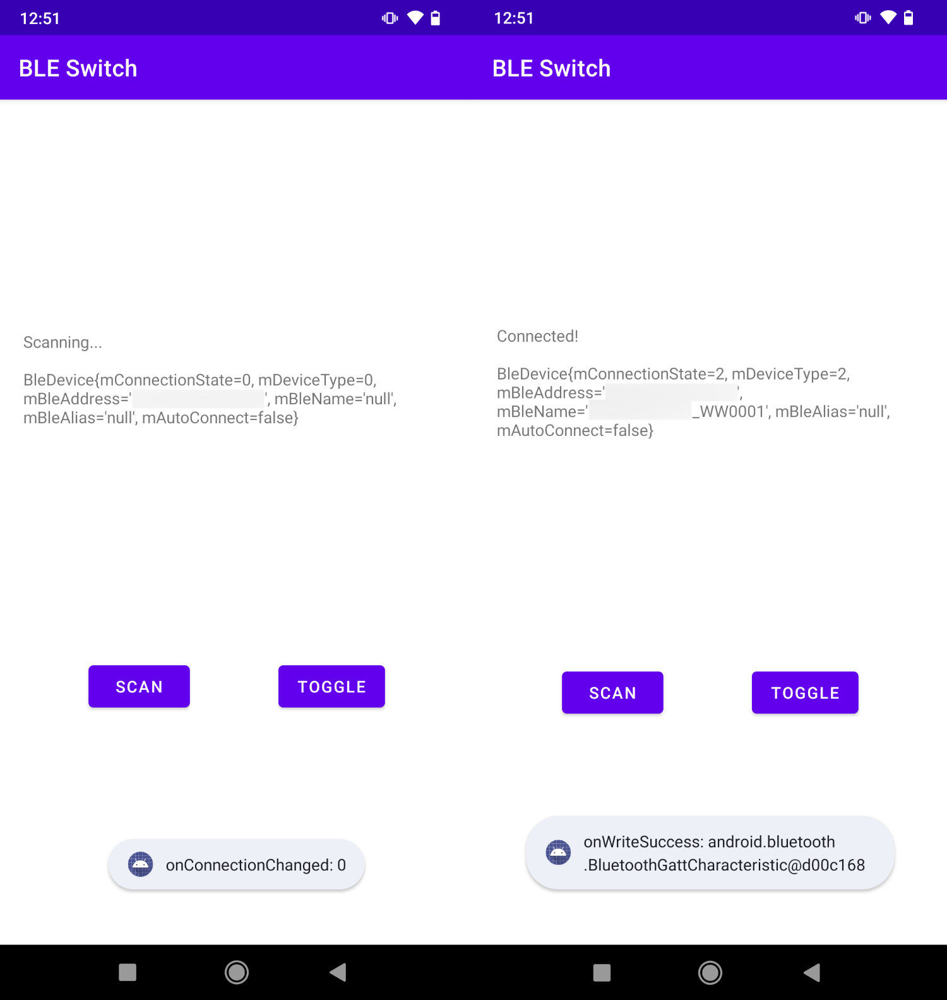
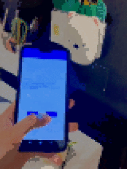

依稀记得以前在某个友链博主那边看到过一篇文章，讲的是因为他们寝室所有人都懒得下床关灯，所以就用树莓派和舵机做了个远程遥控关灯的小玩意儿，当时我就感叹，果然懒才是第一生产力。

自从今年初开始出来租房住，突然就感觉睡前关灯变得好麻烦好麻烦。我的房间里是有好几盏灯的，床头的开关只能控制其中的两盏，剩下的开关在另一个地方，另外还有一个总开关位于进门的门厅处。于是我就陷入了两难之境：

- 不用总开关：每天睡前把灯一一关掉，第二天回家又得一一开回来；
- 直接用总开关：开关离床太远，关完灯要摸黑上床，早上起来又得先过去开灯。

不爽，太不爽了！现在都讲究智能家居，我这他喵的是智障家居啊……

<!--more-->

作为租房一族，咱们也没法对灯啊开关啥的做电气改造（不然直接换个智能开关就完事儿了），只能使用一些「非侵入式」的方案。首先想到的就是上面提到的开发板 + 舵机，搜了一下似乎已经烂大街了，有不少成熟的方案（ESP8266 居多）。

不过我还是低估了我的懒癌，连动手都不想动了，于是直接去万能的某宝搜索「关灯神器」：



（为什么不是某宝？别问，问就是消费降级）

哎呀，没想到还真有现成的，竟然还能红外 + 手机遥控，不错哦！

## 入手「关灯神器」

所谓关灯神器，其实也是一个能接收红外和蓝牙信号的主板，加上一个舵机来控制开关。



我买的这款是 🐻 卡通款，还带了个小夜灯功能，聊胜于无吧。内置锂电池供电，可以通过 micro USB 接口充电。开模挺精准，普通 86 型墙壁开关完美适配，通过无痕胶和滑槽安装，可以卸下来充电，总体还是挺满意的。

然而，这玩意最操蛋的其实是软件部分……除了附带的红外遥控器，如果想要用手机遥控它开关灯，竟然只能用微信小程序！

微信小程序……小程序……程序……序……

讲道理，我第一次知道微信小程序是还有提供[蓝牙能力](https://developers.weixin.qq.com/miniprogram/dev/framework/device/bluetooth.html)的，而且还真有人用，我和小伙伴们表示都孤陋寡闻，惊了个呆。

但是这我 TMD 就很不爽了，关个灯我还要打开微信，还得用你的小程序？


作为一个合格的折腾星人，自然不能如此任人宰割。不就是一个蓝牙设备嘛，小程序能遥控，我难道就不能遥控了？

## 逆向「关灯神器」小程序

这里主要用到的是 [wxappUnpacker](https://github.com/xuedingmiaojun/wxappUnpacker) 这个工具对小程序解包、反混淆。以 Android 手机为例，小程序的包文件位于：

```text
/data/data/com.tencent.mm/MicroMsg/{hash}/appbrand/pkg/xxxxx.wxapkg
```

这个目录一般需要 root 权限才能访问，但不巧的是哥已经不折腾 Magisk/Xposed 好多年，手上已经没有 root 过的机器了……不过天无绝人之路，我想起来 MIUI 有自带一个应用数据备份功能，可以备份 App 的 `/data` 目录。

这玩意儿备份出来的东西其实就是标准的 Android 备份格式 (.ab) 前面加了个自己的文件头，~~去掉头就可以吃了（划掉）~~，用 Hex Editor 删掉文件头部 `414E44` 以前的部分，就可以直接当做 `.ab` 文件处理了。



（谢谢你，雷军！金凡！）

我这里用的是 [android-backup-extractor](https://github.com/nelenkov/android-backup-extractor)，完整流程如下：

```bash
# MIUI 的备份目录
adb pull /sdcard/MIUI/backup/AllBackup/20220501_010000/ ./

# 去掉 .bak 文件的头部后另存为 .ab 文件
java -jar ./abe.jar unpack '微信(com.tencent.mm).ab' mm.tar

# 小程序位于 apps/com.tencent.mm/r/MicroMsg/{hash}/appbrand/pkg/*.wxapkg
tar xvf mm.tar
```

目录下可能会有很多小程序的 `.wxapkg` 包，这里就只能按照时间一个一个试过去了……拿到正确的小程序包以后，使用 `wxappUnpacker` 解包：

```bash
./bingo.sh xxx.wxapkg
```

解包出来呢，大概就是这样的：



接下来就是在源码里找控制逻辑和通信值了，看看有没有加密什么的。不得不说，小程序这种前端技术做的东西，确实和裸奔没什么区别，真的能叫做逆向吗……标题党实锤了~~（作为一个前端仔，看到这些东西就像回家了一样）~~

随便看了一圈，发现这家制造商的业务线是真的广，光看里面内置的设备类型就有：风扇、茶吧机、干衣机、夜灯、颈椎按摩仪、腰部按摩器、足部按摩器、足浴器、水暖毯、灭蚊器、加湿器、电暖器、按摩椅，感觉像是专门给人生产贴牌智能硬件的，然后遥控模块和小程序用的都是同一套，十分强大。

下面贴几块处理过的关键代码：

```jsx
// 遥控按钮的入口
<i-btn
  hover
  bindtap="remoteIR"
  icon="icon-power"
  id="0"
  label="大灯"
  type="round-big"
></i-btn>

// 按钮事件处理
function remoteIR(e) {
  var id = e.currentTarget.id;

  // cmd = "01" + "807F" + "12"
  // 每种产品都有不同配置，前两个都是固定的，最后的 "12" 代表开关大灯，"08" 为氛围灯
  // 还有 "01" 定时十分钟，"03" 定时三十分钟，以及氛围灯亮度等等
  var cmd = config.irType + config.irAddr + config.irCMD[id].value;

  this.sendCMD("3201", cmd);
  this.vibrateLong();
}

function sendCMD(e, B) {
  // format2Byte 函数的作用其实就是补零到 4 位，比如 6 -> 0006
  // s = "fe010006320101807F12";
  var s = "fe01" + format2Byte(((e.length + B.length) / 2).toString(16)) + e + B;
  sendData(s);
}
```

下面的 `sendData` 也就是实际调用微信小程序 SDK 蓝牙能力的地方：

```js
function sendData(n) {
  // ArrayBuffer(10) = FE 01 00 06   32 01 01 80   7F 12
  var t = new Uint8Array(
    n.match(/[\da-f]{2}/gi).map(function (n) {
      return parseInt(n, 16);
    })
  ).buffer;

  wx.writeBLECharacteristicValue({
    // 蓝牙设备 ID
    deviceId: this.globalData.deviceInfo.deviceId,
    // 对应的服务 UUID
    serviceId: this.globalData.deviceInfo.serviceId,
    // 可写入的特征值 UUID
    characteristicId: this.globalData.deviceInfo.writeCharacteristicsId,
    // 写入值
    value: t,
    success: function (n) {},
    fail: function (n) {},
  });
}
```

简单来说，就是通过 BLE (Bluetooth Low Energy, 蓝牙低功耗) 协议连接开关设备，通过读写对应 Characteristic 的值与其通信，实现设备的控制（如开关灯）。

## 手动连接设备发送开关灯指令

好了，所有需要的数值现在都已经到手了，下面就尝试跳过微信小程序，手动连接设备发送指令，看看能不能正常操作吧。

这里我用到的是 [BLE-调试工具](https://www.coolapk.com/apk/com.example.admin.mybledemo) 这个 Android 应用，打开后扫描蓝牙设备，找到并连接「关灯神器」。如果不知道具体是哪个设备，就选看起来比较可疑的。

然后在设备的 Service 中，找到带有 `WRITE` 属性的特征值 (Characteristic)，就是我们用来通信的特征值了。点旁边的写入按钮，把上面逆向出的值填进去……



见证奇迹的时刻，灯关上了！再次写入同样的值，灯又打开了！

欧耶✌️

还有其他的指令值也可以试一试，比如最后两位改成 `08` 就是开关氛围灯，等等。

## 写一个 Android App

想要让这个开关更“智能”，单靠手动操作手机遥控肯定是不够看的。因为手头没有开发板（听说现在树莓派都被炒上天了，不懂），所以还是让闲置的手机发挥余热吧。

好在之前学的那点 Android 开发还没有全忘光，基于 [Android-BLE](https://github.com/aicareles/Android-BLE) 这个库（其实上面我们用来测试的 App 就是这个库的 demo）和小程序里扒出来的控制逻辑糊了一个遥控 App 出来（代码放在 [GitHub](https://github.com/prinsss/ble-light-switch)）：



可以看到界面非常简约~~陋~~，不过比什么微信小程序可好用多了。幸福感 UP！

等以后有时间的话，再捣鼓捣鼓接入一下 Home Assistant，加几个自动化，不用动手直接喊 Siri 关灯，岂不美哉？（dreaming）



## 参考链接

- [蓝牙低功耗 (Bluetooth Low Energy, BLE) | 微信开放文档](https://developers.weixin.qq.com/miniprogram/dev/framework/device/ble.html)
- [蓝牙低功耗概览 | Android Developers](https://developer.android.com/guide/topics/connectivity/bluetooth-le?hl=zh-cn)
- [aicareles/Android-BLE: Android-BLE蓝牙框架](https://github.com/aicareles/Android-BLE)
