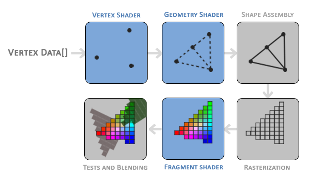
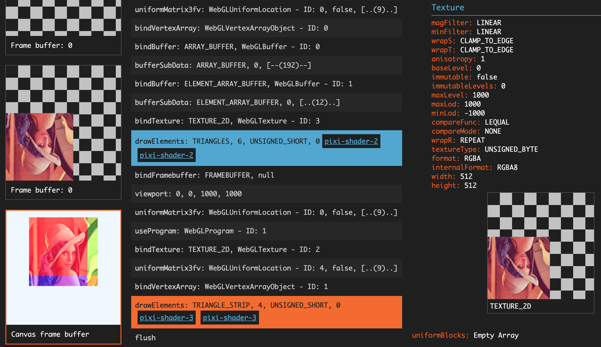

除草啦除草啦，再不更新博客就要变成热带雨林啦！🌿

最近在给一个 PixiJS 程序编写 WebGL Shader，被各种参数和坐标系搞得晕头转向。痛定思痛，整理了一下 PixiJS Filter 系统中的各种概念，以供后续参阅。

在 WebGL 中，我们可以通过编写顶点着色器 (Vertex Shader) 和片元着色器 (Fragment Shader) 来实现各种各样的渲染效果。而在 [PixiJS](https://pixijs.com/) 中，渲染引擎为我们屏蔽了绝大多数的底层实现，通常情况下用户是不需要自己调用 WebGL API 的。如果有编写自定义着色器代码的需求，一般是使用 [Filter](https://pixijs.download/dev/docs/PIXI.Filter.html) 来实现。

<!--more-->

## PixiJS Filter 是什么

`PIXI.Filter` 其实就是一个 WebGL 着色程序，即一组顶点着色器 + 片元着色器的封装。和 Photoshop 中的滤镜功能类似，它接受一个纹理 (Texture) 输入，然后将处理后的内容输出到 Framebuffer 中。使用滤镜，可以实现模糊、扭曲、水波、烟雾等[高级特效](https://filters.pixijs.download/main/demo/index.html)。

用户只需要定义着色器的 GLSL 代码，传入对应的参数，剩下的工作就全部交给 PixiJS 完成。如果你对这些概念不太熟悉，可以看看：[WebGL 着色器和 GLSL](https://webglfundamentals.org/webgl/lessons/zh_cn/webgl-shaders-and-glsl.html)。

## 默认的 Filter 着色器代码

在 PixiJS 中，Filter 自带了一组默认的顶点着色器和片元着色器代码。用户在定义 Filter 时，如果省略了其中一个，就会使用默认的着色器代码运行。

```js
new Filter(undefined, fragShader, myUniforms); // default vertex shader
new Filter(vertShader, undefined, myUniforms); // default fragment shader
new Filter(undefined, undefined, myUniforms);  // both default
```

这是 Filter 默认的[顶点着色器代码](https://github.com/pixijs/pixijs/blob/v7.3.2/packages/core/src/filters/defaultFilter.vert)：

```glsl
attribute vec2 aVertexPosition;

uniform mat3 projectionMatrix;

varying vec2 vTextureCoord;

uniform vec4 inputSize;
uniform vec4 outputFrame;

vec4 filterVertexPosition(void)
{
    vec2 position = aVertexPosition * max(outputFrame.zw, vec2(0.)) + outputFrame.xy;

    return vec4((projectionMatrix * vec3(position, 1.0)).xy, 0.0, 1.0);
}

vec2 filterTextureCoord(void)
{
    return aVertexPosition * (outputFrame.zw * inputSize.zw);
}

void main(void)
{
    gl_Position = filterVertexPosition();
    vTextureCoord = filterTextureCoord();
}

```

这是默认的[片元着色器代码](https://github.com/pixijs/pixijs/blob/v7.3.2/packages/core/src/filters/defaultFilter.frag)：

```glsl
varying vec2 vTextureCoord;

uniform sampler2D uSampler;

void main(void)
{
    gl_FragColor = texture2D(uSampler, vTextureCoord);
}
```

看着一脸懵逼不要紧，下面我们逐一解释。

## WebGL 知识回顾

先来复习一下 WebGL [基础知识](https://webglfundamentals.org/webgl/lessons/zh_cn/webgl-fundamentals.html)。

- **WebGL** - 基于 OpenGL ES 的图形渲染 API，可根据代码绘制点、线和三角形
- **着色器 (Shader)** - 运行在 GPU 上的代码，一种将输入转换为输出的程序
- **GLSL** - 专门用于编写着色器的语言，语法类似 C 语言
- **顶点 (Vertex)** - 一个 2D/3D 坐标的数据集合，表示空间中的一个点
- **顶点着色器 (Vertex Shader)** - 处理顶点数据，生成裁剪空间坐标值
- **片元 (Fragment)** - 也叫片段，包含了渲染一个像素所需的所有数据
- **片元着色器 (Fragment Shader)** - 计算当前光栅化的像素的颜色值
- **参数** - 着色器中获取数据的方法，主要有：attribute、uniform、texture、varying



*▲ OpenGL 图形渲染管线的流程。插图来自 [LearnOpenGL](https://learnopengl.com/Getting-started/Hello-Triangle)*

> 不太熟悉的同学可能会以为 WebGL 是 3D 渲染 API，但其实 WebGL 本身只是一个光栅化引擎，并没有提供什么 3D 功能。如果想要实现 3D 渲染，你需要将模型中的三维坐标点转换为裁剪空间的二维坐标，并提供对应的颜色。WebGL 负责将这些图元绘制到屏幕上，仅此而已。
>
> 试想：任何 3D 模型，不管怎样旋转、缩放、平移，最终展示到你的屏幕上，都是 2D 的。同样，不管模型上有什么贴图、光照、阴影、反射，最终改变的其实都是这个像素的颜色值。

再来复习一下 WebGL 中的坐标系统：

- **局部坐标 (Local Coordinate)**
	- 或称模型坐标，对应局部空间
	- 一个物体中的点相对于该物体原点的局部坐标
- **世界坐标 (World Coordinate)**
	- 对应世界空间
	- 局部坐标相对于世界原点的坐标，把物体放到整个世界中去看
- **观察坐标 (View Coordinate)**
	- 对应观察空间
	- 从摄像机/人眼的角度去观察世界，所看到的物体相对于观察者的坐标
	- 同一个世界坐标，从不同的距离、角度、视野去观察，得到的观察坐标也不同
- **裁剪坐标 (Clip Coordinate)**
	- 对应裁剪空间
	- 将观察空间内超出一定范围的坐标点都裁剪掉，只保留一定范围内的坐标
	- 任何超过这个范围的点都不会显示在你的屏幕上
	- 从观察坐标转换为裁剪坐标的过程，称作投影变换 (Projection)
- **标准化设备坐标 (Normalized Device Coordinate, NDC)**
	- 将裁剪空间的坐标值范围映射到 `[-1, 1]` 范围之间，即为 NDC
	- 坐标 `(0, 0)` 位于裁剪空间的正中间，左下角为 `(-1, -1)`，右上角为 `(1, 1)`
- **屏幕坐标 (Screen Coordinate)**
	- 对应屏幕空间
	- 将标准化设备坐标映射到屏幕坐标的过程，称做视口变换
- **纹理坐标 (Texture Coordinates)**
	- 即纹理图像上的坐标
	- 纹理坐标与像素坐标不同，无论纹理是什么尺寸，纹理坐标范围始终是 `[0, 1]`
	- 纹理图像的左下角坐标为 `(0, 0)`，右上角坐标为 `(1, 1)`


*▲ 各种坐标与变换矩阵的关系。插图来自 [LearnOpenGL](https://learnopengl.com/Getting-started/Coordinate-Systems)*

## Filter 中的几种坐标系

下面介绍 [PixiJS Filter 中的坐标系](https://github.com/pixijs/pixijs/wiki/v5-Creating-filters)，以及它们和 WebGL 坐标系之间的关系。

### Input Coordinate

输入坐标，用于表示传入 FilterSystem 的纹理上的坐标。

Normalized Input Coordinate 是标准化之后的输入坐标，即**纹理坐标**，范围是 `[0, 1]`。

### Screen Coordinate

相对于 canvas 视口的**屏幕坐标**，单位是 CSS 像素。

CSS 像素乘以分辨率 `resolution` 即为屏幕物理像素。

### Filter Coordinate

滤镜坐标，即被 Filter 所覆盖的范围内的**局部坐标**，单位是 CSS 像素。

Normalized Filter Coordinate 是标准化之后的滤镜坐标，滤镜覆盖范围的左上角坐标是 `(0, 0)`，右下角坐标是 `(1, 1)`。

### Sprite Texture Coordinate

额外的图片纹理坐标。可以用于采样其他输入中的纹理。

[Demo: DisplacementFilter](https://filters.pixijs.download/main/demo/index.html?enabled=DisplacementFilter)

### Sprite Atlas Coordinate

额外的精灵图集纹理坐标。

## Filter 的输入参数

讲完坐标的种类，下面介绍 Filter 着色器代码中传入的各个参数（attributes、uniform、varying）分别代表什么，对应的是什么坐标系，以及它们的取值分别是多少。

> ⚠️ 以下参数适用于 PixiJS v7 版本，不排除后续版本中有变动的可能。

### aVertexPosition

* 类型：`vec2` 二维向量
* 含义：Filter 所覆盖的范围内的标准化坐标
* 坐标系：Normalized Filter Coordinate
* 取值范围：0.0 ~ 1.0

假设有一个长宽为 300x300 的**矩形 A**，其原点左上角位于 (100, 30) 世界坐标处。则有：

- aVertexPosition `(0.0, 0.0)` 对应矩形左上角
- aVertexPosition `(1.0, 1.0)` 对应矩形右下角

### projectionMatrix

* 类型：`mat3` 3x3 矩阵
* 含义：投影矩阵，用于将观察空间坐标变换到裁剪空间坐标

具体是怎么变换的，请阅读本文底部的「投影矩阵」章节。

### inputSize

* 类型：`vec4` 四维向量
* 含义：输入 filter 的临时 framebuffer 大小
* 坐标系：Input Coordinate
* 取值范围：长宽 > 0，单位 CSS 像素

假设有一个大小为 512x512 的 framebuffer，则 inputSize 的值为：

```glsl
vec4(512, 512, 0.0020, 0.0020)
```

其中，前两个分量 `x, y` 为像素大小，后两个分量 `z, w` 是像素大小的倒数。倒数可用于将除法转换为乘法，因为乘以一个数的倒数等于除以这个数。

以下两个表达式是等价的：

```glsl
aVertexPosition * (outputFrame.zw * inputSize.zw);

aVertexPosition * (outputFrame.zw / inputSize.xy);
```

但是在计算机中，乘法比除法的[计算速度更快](https://stackoverflow.com/questions/12977050/what-has-a-better-performance-multiplication-or-division)。所以在 GLSL 着色器这类需要高速运行的代码中，通常会尽量[避免直接使用除法](https://www.khronos.org/opengl/wiki/GLSL_Optimizations)，而使用倒数乘法替代。

### outputFrame

* 类型：`vec4` 四维向量
* 含义：Filter 所覆盖的区域在屏幕坐标中的位置与大小
* 坐标系：Screen Coordinate
* 取值范围：位置不限，长宽 > 0，单位 CSS 像素

还是以矩形 A 为例，其 outputFrame 取值为：

```glsl
vec4(100, 30, 300, 300)
```

其中，前两个分量 `x, y` 为输出区域的位置，后两个分量 `z, w` 为输出区域的长宽。

### vTextureCoord

* 类型：`vec4` 四维向量
* 含义：用于采样输入 filter 的临时 framebuffer 的纹理坐标
* 坐标系：Normalized Input Coordinate
* 取值范围：0.0 ~ 1.0

### uSampler

* 类型：`sampler2D` 纹理
* 含义：输入 filter 的纹理图像，可配合 vTextureCoord 纹理坐标进行采样

### inputPixel

* 类型：`vec4` 四维向量
* 含义：输入 filter 的临时 framebuffer 物理像素大小
* 坐标系：Input Coordinate
* 取值范围：长宽 > 0，单位物理像素

和 inputSize 类似，但是单位不是 CSS 像素，而是物理像素。以下两个表达式等价：

```glsl
inputPixel.xy

inputSize.xy * resolution
```

同样地，`inputPixel.zw` 是 `inputPixel.xy` 的倒数，用于转换除法为乘法。

### inputClamp

* 类型：`vec4` 四维向量
* 含义：用于将纹理坐标钳制 (clamp) 在 framebuffer 的有效范围内
* 坐标系：Normalized Input Coordinate
* 取值范围：0.0 ~ 1.0

有效范围指的是临时 framebuffer 中实际包含纹理图像的部分，其余部分可能是透明的（具体原因可阅读文章下方的注意事项）。使用示例：

```glsl
vec4 color = texture2D(uSampler, clamp(modifiedTextureCoord, inputClamp.xy, inputClamp.zw));
```

其中，`inputClamp.xy` 表示有效范围的左上角，`inputClamp.zw` 表示有效范围的右下角。

### resolution

* 类型：`float`
* 含义：分辨率，即 CSS 像素与物理像素的比率，类似 `window.devicePixelRatio`

### filterArea (legacy)

* 类型：`vec4` 四维向量
* 含义：Filter 所覆盖的区域在屏幕坐标中的位置与大小

注意，filterArea 已经被标记为 **legacy**，你应该考虑使用其他参数替代。

```glsl
// 以下语句等价与直接使用 filterArea uniform
vec4 filterArea = vec4(inputSize.xy, outputFrame.xy)
```

### filterClamp (legacy)

* 类型：`vec4` 四维向量
* 含义：兼容旧版本的 **legacy** uniform，与 inputClamp 等价

## 坐标系之间的转换

Filter 中的各种坐标系直接可以通过公式转换。

参考：[v5 Creating filters · pixijs/pixijs Wiki](https://github.com/pixijs/pixijs/wiki/v5-Creating-filters)。

```js
// Input Coord
// 单位：标准化坐标
vTextureCoord

// Input Coord -> Filter Coord
// 单位：标准化坐标 -> CSS 像素
vTextureCoord * inputSize.xy

// Filter Coord -> Screen Coord
// 单位：CSS 像素
vTextureCoord * inputSize.xy + outputFrame.xy

// Filter Coord -> Normalized Filter Coord
// 单位：CSS 像素 -> 标准化坐标
vTextureCoord * inputSize.xy / outputFrame.zw

// Input Coord -> Physical Filter Coord
// 单位：标准化坐标 -> 物理像素
vTextureCoord * inputPixel.xy

// Filter Coord -> Physical Filter Coord
// 单位：CSS 像素 -> 物理像素
vTextureCoord * inputSize.xy * resolution // 与上一条语句等价
```

## 注意事项

需要注意的是，在应用 Filter 之前，PixiJS 的 [FilterSystem](https://pixijs.download/dev/docs/PIXI.FilterSystem.html) 会先把目标的 DisplayObject 渲染到一个临时的 [Framebuffer](https://pixijs.download/dev/docs/PIXI.Framebuffer.html) 中。

这个 framebuffer 的大小不一定等于 DisplayObject 的大小，它是一个二次幂纹理 (Power-of-two Texture)。假如你有一个 300x300 的图片要应用滤镜，那么 PixiJS 会将其渲染到一个 512x512 尺寸的 framebuffer 上，然后将这个 framebuffer 作为输入传递给着色器代码。

根据这个 DisplayObject 上的 `filters` 属性定义，PixiJS 会依次执行数组中的 filter，前一个的输出作为后一个的输入，最后一个输出的将渲染到最终的 render target 中。

不过这个创建临时 framebuffer 的行为可能会在自定义着色器代码中导致一些问题，比如纹理坐标的偏移，有时间后续我会另外发文章讨论。



*▲ 通过 [Spector.js](https://spector.babylonjs.com/) 抓取到的 PixiJS 渲染过程*

## 回顾默认着色器代码

好了，梳理完各种坐标系和参数后，我们再来回头看看上面的默认着色器代码：

```glsl
// 标准化的「滤镜坐标」，范围是 filter 所覆盖的矩形区域
attribute vec2 aVertexPosition;

// 投影矩阵
uniform mat3 projectionMatrix;

// 纹理坐标
varying vec2 vTextureCoord;

// 输入 filter 的临时 framebuffer 大小
uniform vec4 inputSize;

// filter 所覆盖的区域在屏幕坐标中的位置与大小
uniform vec4 outputFrame;

vec4 filterVertexPosition(void)
{
    // position 算出来的是 filter 所覆盖的区域的屏幕坐标
    vec2 position = aVertexPosition * max(outputFrame.zw, vec2(0.)) + outputFrame.xy;

    // 通过投影矩阵，将屏幕坐标转换为裁剪空间 NDC 坐标
    return vec4((projectionMatrix * vec3(position, 1.0)).xy, 0.0, 1.0);
}

vec2 filterTextureCoord(void)
{
    // 等价于 aVertexPosition * (outputFrame.zw / inputSize.xy)
    // 也就是将「滤镜坐标」从 outputFrame 的范围缩放到 inputSize 的范围
    // 计算出来的就是 inputSize 范围内的「纹理坐标」
    return aVertexPosition * (outputFrame.zw * inputSize.zw);
}

void main(void)
{
    // 裁剪空间 NDC 坐标传递给 WebGL
    gl_Position = filterVertexPosition();

    // 纹理坐标传递给片元着色器
    vTextureCoord = filterTextureCoord();
}

```

```glsl
// 纹理坐标
varying vec2 vTextureCoord;

// 输入 filter 的临时 framebuffer 纹理
uniform sampler2D uSampler;

void main(void)
{
    // 使用纹理坐标在传入的纹理上采样得到颜色值，传递给 WebGL
    gl_FragColor = texture2D(uSampler, vTextureCoord);
}
```

怎么样，是不是感觉清晰了很多呢？

## Bonus: 投影矩阵

如果你很好奇上面的投影矩阵是怎么做到乘一下就能把屏幕坐标转换为裁剪空间坐标的，那么这一小节就可以解答你的疑惑。

> 🤫 偷偷告诉你，CSS 中的 [`transform: matrix()`](https://developer.mozilla.org/en-US/docs/Web/CSS/transform-function/matrix) 也是用了同样的矩阵变换原理。

投影矩阵的默认计算方式如下，代码来自 [ProjectionSystem#calculateProjection](https://github.com/pixijs/pixijs/blob/v7.3.2/packages/core/src/projection/ProjectionSystem.ts#L145)：

```js
// 矩阵表示：
// | a | c | tx|
// | b | d | ty|
// | 0 | 0 | 1 |
// 数组表示：
// [a, b, 0, c, d, 0, tx, ty, 1]
//
// 主要参数：
// sourceFrame - Filter 所覆盖的区域的世界坐标，长、宽、X、Y，像素单位
// root - 控制 Y 轴反转，当渲染到 framebuffer 时投影为 y-flipped
calculateProjection()
{
    const pm = this.projectionMatrix;
    const sign = !root ? 1 : -1;

    pm.identity();

    pm.a = (1 / sourceFrame.width * 2);
    pm.d = sign * (1 / sourceFrame.height * 2);

    pm.tx = -1 - (sourceFrame.x * pm.a);
    pm.ty = -sign - (sourceFrame.y * pm.d);
}
```

这个投影矩阵主要做了两件事：

1. 缩放变换，从像素坐标转换到 0.x ~ 2.x 范围
2. 平移变换，将坐标转换为 -1.0 ~ 1.0 范围内的标准坐标

对于一个长宽为 300x300，原点左上角位于 (100, 30) 世界坐标处的矩形，可得：

- sourceFrame.width = 300
- sourceFrame.height = 300
- sourceFrame.x = 100
- sourceFrame.y = 30
- sign = 1 (此处假设为渲染至 framebuffer)

计算出投影矩阵为：

$$
\begin{bmatrix}
0.0067 & 0      & -1.6667 \\
0      & 0.0067 & -1.2000 \\
0      & 0      & 1
\end{bmatrix}
$$

<!--
```
| 0.0067 | 0      | -1.6667 |
| 0      | 0.0067 | -1.2000 |
| 0      | 0      | 1       |
```
-->

使用矩阵乘法对世界坐标进行变换：

$$
\begin{split}

\begin{bmatrix}
\frac{2}{300} & 0             & -\frac{5}{3} \\
0             & \frac{2}{300} & -\frac{6}{5} \\
0             & 0             & 1
\end{bmatrix} \cdot
\begin{bmatrix} 100 \\ 30 \\ 1 \end{bmatrix} &=
\begin{bmatrix} -1 \\ -1 \\ 1 \end{bmatrix}

\\
\vdots
\\

\begin{bmatrix}
\frac{2}{300} & 0             & -\frac{5}{3} \\
0             & \frac{2}{300} & -\frac{6}{5} \\
0             & 0             & 1
\end{bmatrix} \cdot
\begin{bmatrix} 400 \\ 330 \\ 1 \end{bmatrix} &=
\begin{bmatrix} 1 \\ 1 \\ 1 \end{bmatrix}

\end{split}
$$

得到如下坐标：

- 局部坐标：(0, 0) ~ (300, 300)
- 世界坐标：(100, 30) ~ (400, 330)
- 缩放变换：(0.67, 0.20) ~ (2.68, 2.21)
- 平移变换：(-1.0, -1.0) ~ (1.0, 1.0)

即可将世界坐标转换为裁剪空间的标准化设备坐标。

更多关于矩阵变换的资料可参考：

- [WebGL 二维矩阵 - WebGL Fundamentals](https://webglfundamentals.org/webgl/lessons/zh_cn/webgl-2d-matrices.html)
- [Matrix math for the web - MDN](https://developer.mozilla.org/zh-CN/docs/Web/API/WebGL_API/Matrix_math_for_the_web)
- [矩阵乘法 - 数学乐](https://www.shuxuele.com/algebra/matrix-multiplying.html)
