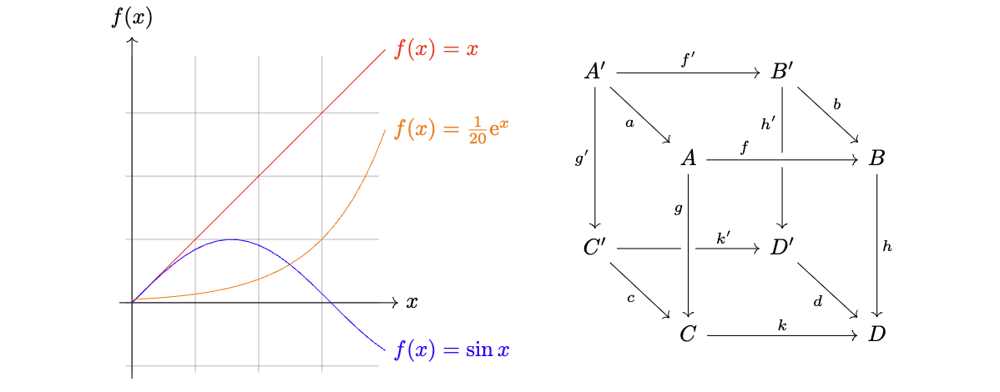

一转眼就到 2024 年了！大家新年快乐！

前段时间在写文章时，需要一些配图，于是就使用了 [Ti*k*Z](https://tikz.dev) 来绘制。Ti*k*Z 是一个强大的 $\LaTeX$ 宏包，可以使用代码的形式绘制出各种各样精美的矢量图。

```tikz
\usepackage{tikz-cd}

\begin{document}
  \begin{tikzpicture}[domain=0:4,baseline={(0,1.6)}]
    \draw[very thin,color=gray] (-0.1,-1.1) grid (3.9,3.9);
    \draw[->] (-0.2,0) -- (4.2,0) node[right] {$x$};
    \draw[->] (0,-1.2) -- (0,4.2) node[above] {$f(x)$};
    \draw[color=red]    plot (\x,\x)             node[right] {$f(x) =x$};
    \draw[color=blue]   plot (\x,{sin(\x r)})    node[right] {$f(x) = \sin x$};
    \draw[color=orange] plot (\x,{0.05*exp(\x)}) node[right] {$f(x) = \frac{1}{20} \mathrm e^x$};
  \end{tikzpicture}

  \quad\quad

  \begin{tikzcd}[row sep=2.5em]
  A' \arrow[rr,"f'"] \arrow[dr,swap,"a"] \arrow[dd,swap,"g'"] &&
    B' \arrow[dd,swap,"h'" near start] \arrow[dr,"b"] \\
  & A \arrow[rr,crossing over,"f" near start] &&
    B \arrow[dd,"h"] \\
  C' \arrow[rr,"k'" near end] \arrow[dr,swap,"c"] && D' \arrow[dr,swap,"d"] \\
  & C \arrow[rr,"k"] \arrow[uu,<-,crossing over,"g" near end]&& D
  \end{tikzcd}
\end{document}
```

<details>
<summary>
如果你的阅读器看不到上面的 SVG 格式图片，可以点这里查看 [PNG](https://prinsss.github.io/graphics-with-tikz-in-hexo/example-tikz-graph.png) 格式。
</summary>

</details>

上面的图对应的 Ti*k*Z 代码可以在[这里](https://github.com/prinsss/node-tikzjax/tree/main/demo)找到。然而画是画爽了，想把它贴到博客里时却犯了难——目前竟然没有什么好办法可以直接在博客里使用 Ti*k*Z！

<!--more-->

## TL;DR

咱们废话不多说，直接上结果：我写了一个 Hexo 插件，可以直接把 Markdown 源码里的 Ti*k*Z 代码渲染成 SVG 矢量图，然后在博客构建时嵌入到页面 HTML 中，用起来就和 MathJax 写数学公式一样简单。

而且最重要的是渲染完全在构建时完成，浏览器上无需运行任何 JavaScript。同时构建机上也无需安装 $\TeX$ 环境，因为其底层运行的是 WebAssembly。

👉 [prinsss/hexo-filter-tikzjax: Server side PGF/TikZ renderer plugin for Hexo.](https://github.com/prinsss/hexo-filter-tikzjax)

```
npm install hexo-filter-tikzjax
```

**注意：插件安装成功后，需要运行 `hexo clean` 清除已有的缓存。**

安装插件后，只需要在博客文章中添加 Ti*k*Z 代码块：

<!-- Here is a zero-width space to escape. -->
````markdown
---
title: '使用 TikZ 在 Hexo 博客中愉快地画图'
tikzjax: true
---

Markdown text here...

```​​tikz
\begin{document}
  \begin{tikzpicture}
    % Your TikZ code here...
    % The graph below is from https://tikz.dev/library-3d
  \end{tikzpicture}
\end{document}
```
````

插件就会自动把代码渲染成对应的图片，非常方便：

```tikz
\begin{document}
\usetikzlibrary {3d}
\begin{tikzpicture}[z={(10:10mm)},x={(-45:5mm)}]
  \def\wave{
    \draw[fill,thick,fill opacity=.2]
     (0,0) sin (1,1) cos (2,0) sin (3,-1) cos (4,0)
           sin (5,1) cos (6,0) sin (7,-1) cos (8,0)
           sin (9,1) cos (10,0)sin (11,-1)cos (12,0);
    \foreach \shift in {0,4,8}
    {
      \begin{scope}[xshift=\shift cm,thin]
        \draw (.5,0)  -- (0.5,0 |- 45:1cm);
        \draw (1,0)   -- (1,1);
        \draw (1.5,0) -- (1.5,0 |- 45:1cm);
        \draw (2.5,0) -- (2.5,0 |- -45:1cm);
        \draw (3,0)   -- (3,-1);
        \draw (3.5,0) -- (3.5,0 |- -45:1cm);
      \end{scope}
    }
  }
  \begin{scope}[canvas is zy plane at x=0,fill=blue]
    \wave
    \node at (6,-1.5) [transform shape] {magnetic field};
  \end{scope}
  \begin{scope}[canvas is zx plane at y=0,fill=red]
    \draw[help lines] (0,-2) grid (12,2);
    \wave
    \node at (6,1.5) [rotate=180,xscale=-1,transform shape] {electric field};
  \end{scope}
\end{tikzpicture}
\end{document}
```

## Ti*k*Z 教程

不做过多介绍。贴几个链接，有兴趣的可以学学：

- [[LaTeX 绘图指南 - 001] TikZ 的简介、资源以及学习方法 - 知乎](https://zhuanlan.zhihu.com/p/48300815)
- [Hansimov/pgfmanual-zh: PGF/TikZ 中文手册](https://github.com/Hansimov/pgfmanual-zh)
- [PGF/TikZ Manual - Complete Online Documentation](https://tikz.dev/)
- [xiaohanyu/awesome-tikz: A curated list of awesome TikZ documentations, libraries and resources](https://github.com/xiaohanyu/awesome-tikz)

比如这就是我在写文章时画的图，全部用 Ti*k*Z 代码生成，画起来改起来都很方便。

```tikz
\begin{document}
\begin{tikzpicture}[scale=1.5]
  \draw[help lines] (-1.6,-1.6) grid (1.6,1.6);
  \node[below left] at (0,0) {$O$};
  \draw[->,thick,color=gray] (-1.8,0) -- (1.8,0) node[right] {$x$};
  \draw[->,thick,color=gray] (0,-1.8) -- (0,1.8) node[above] {$y$};
  \draw[thick,dotted] (0,1) -- (1,1) -- (1,0);
  \draw[thick,dotted,rotate=30] (0,0) rectangle (1,1) node[right] {$1\vec{i'} + 1\vec{j'}$};
  \draw[->,very thick,green] (0,0) -- (0.86,0.5) node[right] {$\vec{i'}$};
  \draw[->,very thick,orange] (0,0) -- (-0.5,0.86) node[left] {$\vec{j'}$};

  \begin{scope}
  \path[clip] (0,0) -- (0.86,0.5) -- (1,0);
  \fill[red, opacity=0.5, draw=black] (0,0) circle (0.4);
  \end{scope}
  \node[below right] at (0.4,0.35) {$\phi$};
\end{tikzpicture}
\end{document}
```

$$
\begin{align}
\mathbf{M}_{rotate} &= \begin{bmatrix}\cos \phi & -\sin \phi \\ \sin \phi & \cos \phi \end{bmatrix}
\end{align}
$$

## 原理

在本插件之前，主流的在网页上渲染 Ti*k*Z 绘图的方式是使用 [Ti*k*ZJax](https://tikzjax.com)。Ti*k*ZJax 有点类似 [MathJax](https://www.mathjax.org)，都是通过 JavaScript 去渲染 $\TeX$ 语法。

```html
<link rel="stylesheet" type="text/css" href="https://tikzjax.com/v1/fonts.css">
<script src="https://tikzjax.com/v1/tikzjax.js"></script>

<script type="text/tikz">
  \begin{tikzpicture}
    \draw (0,0) circle (1in);
  \end{tikzpicture}
</script>
```

然而这样做的问题是，太重了。在网页上动态加载 Ti*k*ZJax，需要加载 955KB 的 JavaScript + 454KB 的 WebAssembly + 1.1MB 的内存数据，如果再[另外安装一些宏包](https://github.com/artisticat1/tikzjax/tree/output-single-file/tex_files)，最终打包产物大小甚至可以达到 5MB+。

对于一些有加载性能要求的网站，这显然是难以接受的。

那怎么办呢？答案就是 <abbr title="Server Side Rendering">SSR</abbr> / <abbr title="Static Site Generation">SSG</abbr>，把渲染过程搬到服务端/构建时去做。这很适合博客这样的场景，尤其是静态博客，只需要构建时渲染一下，把生成的图片塞到 HTML 里就完事了，完全不需要客户端 JavaScript 参与，加载速度大幅提升。

因为 Ti*k*ZJax 底层跑的是 WebAssembly，而 Node.js 也支持运行 [WebAssembly](https://nodejs.org/en/learn/getting-started/nodejs-with-webassembly)，所以很自然地我就想，能不能把它的渲染流程直接搬到 Node.js 里面去做？

说干就干。于是就有了 [node-tikzjax](https://github.com/prinsss/node-tikzjax)，一个 Ti*k*ZJax 的移植版，可以在纯 Node.js 环境下运行，无需安装第三方依赖或者 $\TeX$ 环境。轻量化的特性很适合拿来做服务端渲染，也支持在 Cloudflare Worker 等 Runtime 上运行，非常好用。

[hexo-filter-tikzjax](https://github.com/prinsss/hexo-filter-tikzjax) 则是 node-tikzjax 的一个上层封装，主要就是在渲染 Hexo 博客文章时提取 Markdown 源码中的 Ti*k*Z 代码，交给 node-tikzjax 执行并渲染出 SVG 图片，然后将其内联插入到最终的 HTML 文件中。

如果是其他博客框架，也可以用类似的原理实现 Ti*k*Z 静态渲染的接入。

## 局限性

因为 [node-tikzjax](https://github.com/prinsss/node-tikzjax) 并不是完整的 $\TeX$ 环境，所以不是所有宏包都可以使用。目前支持在 `\usepackage{}` 中直接使用的宏包有：

- chemfig
- tikz-cd
- circuitikz
- pgfplots
- array
- amsmath
- amstext
- amsfonts
- amssymb
- tikz-3dplot

如果希望添加其他宏包，可以参考 [extractTexFilesToMemory](https://github.com/prinsss/node-tikzjax/blob/v1.0.3/src/bootstrap.ts#L182) 这里的代码添加。

如果在使用插件的过程中 Ti*k*Z 代码编译失败了，可以通过 `hexo s --debug` 或者 `hexo g --debug` 开启调试模式，查看 $\TeX$ 引擎的输出排查问题：

```plaintext
This is e-TeX, Version 3.14159265-2.6 (preloaded format=latex 2022.5.1)
**entering extended mode
(input.tex
LaTeX2e <2020-02-02> patch level 2
("tikz-cd.sty" (tikzlibrarycd.code.tex (tikzlibrarymatrix.code.tex)
(tikzlibraryquotes.code.tex) (pgflibraryarrows.meta.code.tex)))
No file input.aux.
ABD: EveryShipout initializing macros [1] [2] (input.aux) )
Output written on input.dvi (2 pages, 25300 bytes).
Transcript written on input.log.
```

或者也可以在这个 [Live Demo](https://stackblitz.com/edit/node-tikzjax) 中输入你的 Ti*k*Z 代码，提交后可在控制台查看报错。

## 致谢

首先要感谢 @kisonecat 开发的 [web2js](https://github.com/kisonecat/web2js) 项目，这是一个 Pascal 到 WebAssembly 的编译器，使我们可以在 JavaScript 中运行 $\TeX$ 引擎，也是下面所有项目的基石。

这里有作者关于构建基于 Web 的 $\TeX$ 引擎的一篇文章，可以拜读一下：[Both TEX and DVI viewers inside the web browser](https://www.tug.org/TUGboat/tb40-1/tb124fowler-js.pdf)。

感谢 @drgrice1 对 Ti*k*ZJax 和 dvi2html 的修改，TA 的 [fork](https://github.com/drgrice1/tikzjax/tree/ww-modifications) 中包含了很多有用的新功能，并且修复了一些原始代码中的问题。

感谢 @artisticat1 对 Ti*k*ZJax 的修改，这是基于上述 @drgrice1 的 fork 的又一个 [fork](https://github.com/artisticat1/tikzjax/tree/output-single-file)，也添加了一些有用的功能。本插件依赖的 node-tikzjax，其底层使用的 WebAssembly 二进制和其他文件就是从这个仓库中获取的。

感谢 @artisticat1 开发的 [obsidian-tikzjax](https://github.com/artisticat1/obsidian-tikzjax) 插件，这是本项目的灵感来源。本项目和该插件底层共享同一套 $\TeX$ 引擎，使用语法也很类似，基本可以在 Obsidian 和 Hexo 之间无缝切换（实际上也是我开发这个的原因 😹）。

如有任何问题，请在 GitHub 上提交 [issue](https://github.com/prinsss/hexo-filter-tikzjax/issues)。祝使用愉快！
