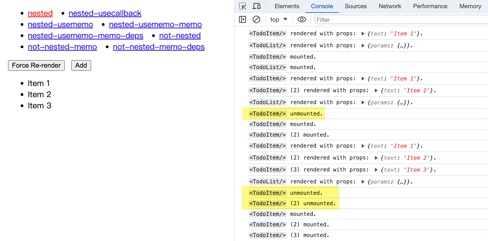
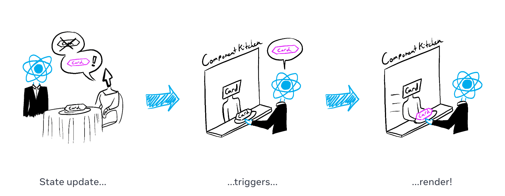
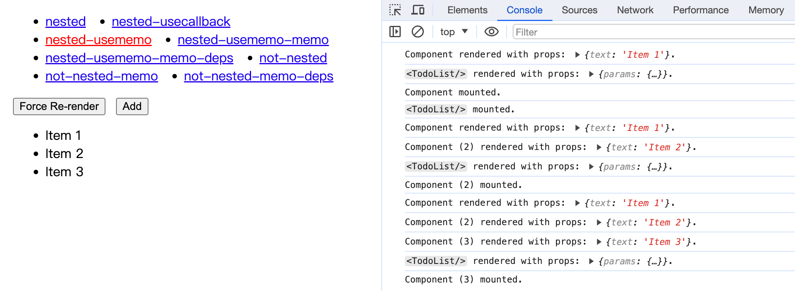
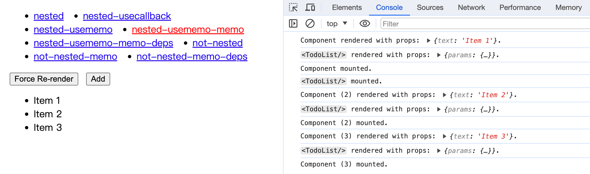
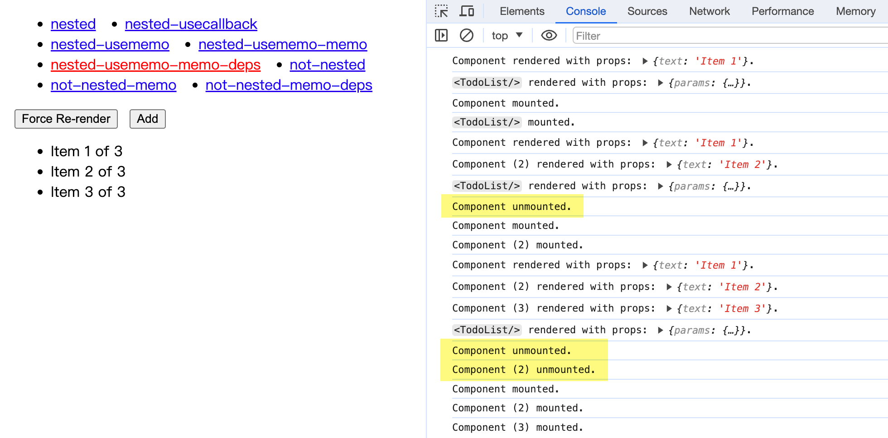

最近在 Code Review 时，看到有同事写了这样的代码：

```jsx
function TodoList() {
  const [list, setList] = useState([]);

  const TodoItem = useCallback((props) => {
    return <li>{props.text}</li>;
  }, []);

  return <ul>{list.map((item, index) => <TodoItem key={index} text={item} />)}</ul>;
}
```

有经验的 React 开发者肯定一下子就看出问题了：**在组件内部嵌套定义组件，会导致子组件每次都重新挂载**。因为每次渲染时，创建的函数组件其实都是不同的对象。

但是他又有包了 `useCallback` 让引用保持一致，好像又没什么问题……？

这波骚操作让我突然有点拿不准了，所以今天咱们一起来验证一下，用 `useMemo` 或者 `useCallback` 包裹嵌套定义的子组件，对 React 渲染会有什么影响。以及如果有影响，应该如何用更合适的方法重构。

<!--more-->

## TL;DR

先说结论：

> **永远不要在 React 组件内部嵌套定义子组件。**

如果你有类似的代码，请使用以下方法替代：

1. 把子组件移到最外层去，将原有的依赖项作为 props 传入
2. 把子组件改为「渲染函数」，通过调用函数插入 JSX 节点

为什么？请接着往下看。

## 组件重新挂载会造成的问题

来看这段代码（可以在 [StackBlitz Demo](https://stackblitz.com/edit/react-unstable-nested-components?file=src%2FApp.tsx) 中运行）：

```jsx
function TodoList() {
  const [list, setList] = useState([]);

  // 嵌套定义子组件（好孩子不要学哦）
  const TodoItem = (props) => {
    return <li>{props.text}</li>;
  };

  const handleAdd = () => setList([...list, `Item ${list.length + 1}`]);

  return (
    <div>
      <button onClick={handleAdd}>Add</button>
      {/* 渲染刚才定义的子组件 */}
      <ul>
        {list.map((item, index) => (
          <TodoItem key={index} text={item} />
        ))}
      </ul>
    </div>
  );
}
```

可能不少初学者都写出过类似的代码：JavaScript 语言可以嵌套定义函数，React 函数式组件就是函数，那 React 组件不也可以嵌套定义？

还真不是这么回事。我们来实际运行一下这段代码看看：

> Tips: 这里使用了 [`useTilg`](https://github.com/shuding/tilg) 这个库来展示组件生命周期。



可以看到，每次点击 Add 按钮在 `<TodoList/>` 列表中添加元素时，之前旧的 `<TodoItem/>` 组件实例就会被卸载 (unmount)、销毁。React 会创建全新的组件实例，然后再挂载 (mount) 上去。

也就是说，**这些组件实例全都变成一次性的了**。

这还只是一个简单的示例，如果是实际应用场景，一个组件和它的子组件中，可能包含了成百上千个 DOM 节点。如果每次状态更新都会导致这些组件和对应的 DOM 节点被卸载、创建、重新挂载……那应用性能可就是「画面太美我不敢看」了。

更严重的是，组件的卸载还会导致其内部的[状态全部丢失](https://codepen.io/ariperkkio/pen/vYLodLB)。

那怎么会这样呢？这要从 React 的渲染机制，以及 Reconciliation 流程说起。

## React 渲染机制之 Reconciliation

我们知道 React 的渲染大致可以分为[两个阶段](https://react.dev/learn/render-and-commit)：

1. `Render` 阶段：执行组件的渲染方法，**找出更新前后节点树的变化**，计算需要执行的改动；
2. `Commit` 阶段：已经知道了需要执行哪些改动，于是**操作真实 DOM** 完成节点的修改。

其中，「找出变化 + 计算改动」这个过程就被叫做 `Reconciliation` (协调)。React 的协调算法可以在保证效率的同时，最大程度复用已有的 DOM，使得对 DOM 做出的修改尽量小。



*▲ 图片来自：[Render and Commit – React](https://react.dev/learn/render-and-commit)*

那么问题来了，React 怎么知道一个组件对应的 DOM 需要更新呢？

简单来说，React 在比较两棵 Fiber 树时，会从根节点开始递归遍历所有节点：

1. 如果节点类型和之前一致
    1. 对于 DOM 元素，保持元素实例不变，仅更新有变化的属性
    2. 对于组件元素，需要重渲染的，使用新属性调用组件渲染方法
2. 如果节点类型有改变
    1. 卸载该节点及其子节点 ⚠️
    2. 将对应的 DOM 元素标记为待删除
    3. 创建新的节点
    4. 将新的 DOM 元素标记为待插入

上面所说的子组件被卸载再挂载、状态丢失等问题，其实都是因为它们**被判断为了「节点类型有改变」**。

## 引用相等性与组件重渲染

在 JavaScript 中，比较值时有两种相等性：

- **值相等性** (Value Equality)，即两个值类型一致，内容也一致
- **引用相等性** (Reference Equality)，即两个对象的引用在内存中指向同一块区域

举个例子：

```js
// 两个长得一样的对象
const a = { name: 'Anon Tokyo' };
const b = { name: 'Anon Tokyo' };

// "引用相等性" 比较 - false
console.log(a === b);
console.log(Object.is(a, b));

// "值相等性" 比较 - true
console.log(lodash.isEqual(a, b));
console.log(a.name === b.name);
```

JavaScript 函数也是对象，所以这对于函数（React 组件）也成立。

到这里问题就比较明朗了。

```jsx
function TodoList() {
  const [list, setList] = useState([]);

  // WARN: 这个语句每次都会创建一个全新的 TodoItem 函数组件！
  const TodoItem = (props) => {
    return <li>{props.text}</li>;
  };

  return <ul>{list.map((item, index) => <TodoItem key={index} text={item} />)}</ul>;
}
```

在这段代码中，每次 `<TodoList/>` 组件重渲染时（即 `TodoList` 函数被调用时），其内部创建的 `TodoItem` 都是一个全新的函数组件。

虽然它们长得一样，但它们的「引用相等性」是不成立的。

回到上一节介绍的渲染流程中，[React 在比较节点的 `type` 时](https://github.com/facebook/react/blob/v18.2.0/packages/react-reconciler/src/ReactChildFiber.new.js#L405)，使用的是 `===` 严格相等。也就是说像上面那样不同的函数引用，**会被视作不同的组件类型**。进而导致在触发重渲染时，该组件的节点及其子节点全部被卸载，内部的状态也被全部丢弃。

## 如果我用 useMemo 包一下呢

到这里我们已经介绍了「在组件内部嵌套定义组件」会造成问题的原理。

这时候可能就有小机灵鬼要问了，既然组件每次都被判断为是不同 `type` 的原因是对象引用不同，那我用 `useMemo` / `useCallback` Hooks，让它每次都返回相同的函数对象不就行了？

能考虑到这一层的都是爱动脑筋的同学，点个赞！让我们再来试验一下：

```jsx
function TodoList() {
  const [list, setList] = useState([]);

  // useMemo 允许我们缓存一个值，每次重渲染时拿到的缓存是一样的
  // 这里我们返回了一个函数组件，让 useMemo 把这个子组件的函数对象缓存下来
  const TodoItem = useMemo(
    () => (props) => {
      return <li>{props.text}</li>;
    },
    []
  );

  // 或者用 useCallback 也可以，都一样
  // const TodoItem = useCallback((props) => {
  //   return <li>{props.text}</li>;
  // }, []);

  const handleAdd = () => setList([...list, `Item ${list.length + 1}`]);

  return (
    <div>
      <button onClick={handleAdd}>Add</button>
      <ul>
        {list.map((item, index) => (
          <TodoItem key={index} text={item} />
        ))}
      </ul>
    </div>
  );
}
```



可以看到，包一层 `useMemo` 之后，子组件确实不会再被 unmount 了。看起来十分正常呢！

让我们再拿 `React.memo` 来包一下，在 `props` 相同时跳过不必要的重渲染：

```jsx
const TodoItem = useMemo(
  () =>
    memo((props) => {
      return <li>{props.text}</li>;
    }),
  []
);
```



OHHHHHHHHH!!

[如果一个东西看起来像鸭子，叫起来也像鸭子，那么它就是鸭子。](https://en.wikipedia.org/wiki/Duck_typing)

同理，如果我们通过一系列操作可以让「嵌套定义的 React 组件」在渲染时表现得与「在外层定义的组件」一致，那是不是就意味着这种操作其实也是 OK 的呢？

嗯……答案是：没那么简单。

> 稍微偏个题，你可能会好奇 Hooks 和 memo 为什么也可以在嵌套定义的子组件内正常使用，因为这看起来和我们平时的用法完全不同。
>
> 实际上不管是模块顶层定义的函数组件，还是嵌套定义的函数组件，在 React Reconciler 看来都是独立的组件类型，且在渲染时都有着自己的 Fiber 节点来储存状态，而定义该函数的作用域是什么并不重要。想想看：HOC 高阶组件有时候也会返回内联定义的函数组件，其实是一个道理。

## useMemo 的缓存失效策略

**第一点，`useMemo` 和 `useCallback` 的缓存并非完全可靠。**

在某些条件下，缓存的值会被 React 丢弃。如果缓存失效，函数组件就会被重新创建，同样会被判断为是不同的组件类型。React 官方肯定不会推荐你把 Hooks 用于这种歪门邪道的用途。

> In the future, React may add more features that take advantage of throwing away the cache—for example, if React adds built-in support for virtualized lists in the future, it would make sense to throw away the cache for items that scroll out of the virtualized table viewport. This should be fine if you rely on useMemo solely as a performance optimization.
>
> Ref: [useMemo – React](https://react.dev/reference/react/useMemo)

**第二点，`useMemo` 和 `useCallback` 都有依赖数组。**

虽然上面的示例里嵌套组件定义的依赖数组都是空的，但是我们再想想，什么情况下会想要在组件内部定义子组件，而非将其拆成一个单独的组件呢？最主要的原因就是，这个子组件想要直接访问父组件函数作用域中的某些变量。

```jsx
function TodoList() {
  const [list, setList] = useState([]);

  const TodoItem = useMemo(
    () =>
      memo((props) => {
        // 注意看，这里子组件直接使用了父级作用域中的 list 变量
        return <li>{`${props.text} of ${list.length}`}</li>;
      }),
    [list.length]
  );

  const handleAdd = () => setList([...list, `Item ${list.length + 1}`]);

  return (
    <div>
      <button onClick={handleAdd}>Add</button>
      <ul>
        {list.map((item, index) => (
          <TodoItem key={index} text={item} />
        ))}
      </ul>
    </div>
  );
}
```



从实际测试中可以看到，有了依赖项的 `useMemo` + 嵌套组件，又退化成了最开始的样子，每次都会被当成不同的组件类型，每次都会被 unmount。之前所做的努力全部木大！（顺带一提用 `useRef` [也是一样的](https://stackblitz.com/edit/react-unstable-nested-components?file=src%2Fcomponents%2F10-nested-useref.jsx)，有依赖就歇菜）

也就是说，只有你的嵌套子组件完全不依赖父组件作用域时，才能保证 `useMemo` 的缓存一直有效，才能做到完全不影响渲染性能。但既然都已经完全不依赖了，那么又还有什么理由一定要把它定义在父组件内部呢？

## 重构包含嵌套组件的代码

所以我再重复一遍开头的结论：**永远不要在 React 组件内部嵌套定义子组件。**

因为这在大部分情况下会造成渲染问题，即使对这种写法做优化也没有意义，因为一不留神就可能掉进坑里，还有可能会误导其他看到你的代码的人。

如果你的代码库中已经有了这样的 💩 代码，可以使用下面的方法重构。

**第一种方法，把子组件移到最外层去。**

这种方法适用于子组件依赖项不多的情况，如果有之前直接使用的父级作用域中的变量，可以将其改造为 `props` 传入的方式。

```jsx
// 组件定义移到模块顶层
const TodoItem = memo((props) => {
  return <li>{`${props.text} of ${props.listLength}`}</li>;
});

function TodoList() {
  const [list, setList] = useState(['Item 1']);

  const handleAdd = () => setList([...list, `Item ${list.length + 1}`]);

  return (
    <div>
      <button onClick={handleAdd}>Add</button>
      <ul>
        {list.map((item, index) => (
          // 改造后：从 props 传入原来的依赖项
          <TodoItem key={index} text={item} listLength={list.length} />
        ))}
      </ul>
    </div>
  );
}
```

**第二种方法，把子组件改为渲染函数 (Render Function)。**

JSX 的本质就是 `React.createElement(type)`，React 节点的本质其实就是一个 JavaScript 对象。你在组件 `return` 语句中直接写 JSX，和定义一个函数返回 JSX 然后再调用这个函数，本质上是一样的。

```jsx
function TodoList() {
  const [list, setList] = useState([]);

  // 这不是函数组件，只是一个「返回 JSX 的函数」（函数名首字母非大写）
  // 所以每次渲染都重新创建也没问题，也可以直接访问作用域内的变量
  const renderTodoItem = (key, text) => {
    return <li key={key}>{`${text} of ${list.length}`}</li>;
  };

  const handleAdd = () => setList([...list, `Item ${list.length + 1}`]);

  return (
    <div>
      <button onClick={handleAdd}>Add</button>
      {/* 调用的时候也和调用普通函数一样，而非组件的标签形式 */}
      <ul>{list.map((item, index) => renderTodoItem(index, item))}</ul>
    </div>
  );
}
```

不过需要注意的是，在使用「渲染函数」时，一定要搞清楚和「函数组件」的区别：

- 渲染函数虽然和组件一样都返回 JSX，但它不是组件；
- 渲染函数就是普通 JavaScript 函数，没有状态，也没有对应的 Fiber 节点；
- 渲染函数只是当前组件的一部分，对于 React 渲染来说没有额外开销；
- 渲染函数内部不能使用 Hooks，只有组件内部才能使用 Hooks；
- 渲染函数命名一般以 `render` 开头，首字母小写（否则容易和组件搞混）。

另外，当渲染函数作为 `props` 传入其他组件时，它也被叫做[渲染属性 (Render Props)](https://legacy.reactjs.org/docs/render-props.html)。这种设计模式在 React 生态中有着大量的应用，可以放心使用。

## 结语

最后聊一下，如何避免这类问题的发生。

**第一，配置 Lint 规则。**

防范于未然，合理的 Lint 配置可以减少起码 80% 的代码规范问题。比如本文介绍的坑，其实完全可以通过 [`react/no-unstable-nested-components`](https://github.com/jsx-eslint/eslint-plugin-react/blob/master/docs/rules/no-unstable-nested-components.md) + [`react-rfc/no-component-def-in-render`](https://github.com/xgbuils/eslint-plugin-react-rfc/blob/main/docs/rules/no-component-def-in-render.md) 规则提前规避。

最好再配合代码提交后的 CI 卡点检查，有效避免因开发者环境配置不当或者偷摸跳过检查，导致规则形同虚设的情况。

**第二，定期 Code Review。**

代码腐化是难以避免的，但我们可以通过流程和规范提早暴露、纠正问题，减缓腐化的速度。Code Review 同时也是一个知识共享、学习和成长的过程，对于 reviewer 和 reviewee 来说都是。

没有人一开始就什么都会，大家都是在不断的学习中成长起来的。

**第三，了解一些 React 的原理与内部实现。**

因为我自己就是吃这碗饭的，之前写过 React 的 Custom Renderer，也做过渲染性能优化，所以底层原理看的比较多，自然也就知道什么样的代码对性能会有影响。

我一直以来秉持的观点就是，学习框架时也要学习它「引擎盖下」的东西，知其然且知其所以然。如果你希望在这条路上一直走下去，相信这一定会对你有所帮助。

***

扩展阅读：

- [A (Mostly) Complete Guide to React Rendering Behavior](https://blog.isquaredsoftware.com/2020/05/blogged-answers-a-mostly-complete-guide-to-react-rendering-behavior/)
- [How does React do the initial mount internally?](https://jser.dev/2023-07-14-initial-mount/)
- [Rule proposal: react/no-unstable-nested-components](https://github.com/jsx-eslint/eslint-plugin-react/issues/2749)
- [Rule to forbid calling components as functions?](https://github.com/jsx-eslint/eslint-plugin-react/issues/3208)
