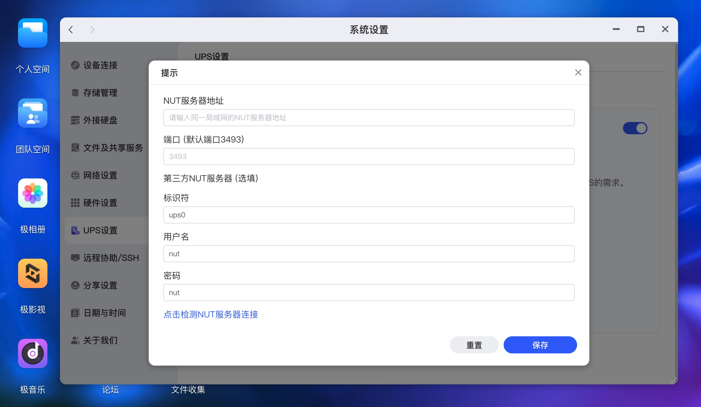
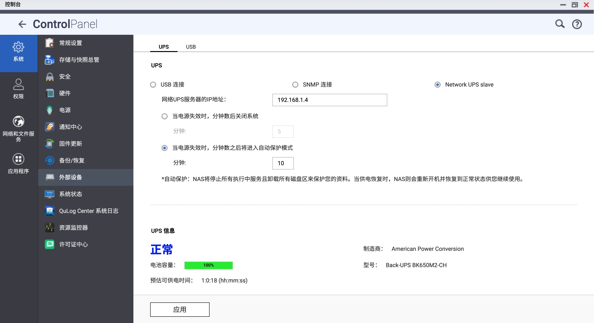
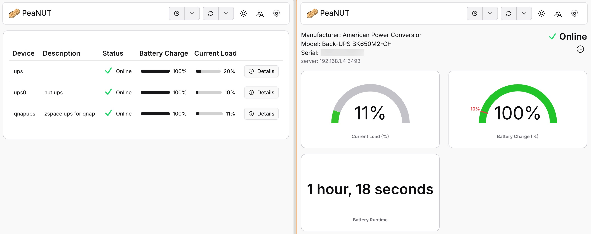

我有三台 NAS，Synology 群晖、QNAP 威联通和 ZSpace 极空间，前者放在出租屋里作为主力，后两台放在老家作为备份。

因为极空间是 arm64 版本双盘位的，功耗不高，所以和 QNAP 共用一台 UPS 就好了。之前折腾了一下，让极空间作为 Master 通过 USB 连接 UPS，然后 QNAP 作为 Slave 通过 NUT ([Network UPS Tools](https://networkupstools.org)) 局域网连接。

不过因为涉及到系统文件改动，每次极空间系统升级后都需要重新操作一遍，每次我都会忘记要怎么捣鼓……所以写篇博客记录下。

话说 2025 年居然一篇博客都没写，工作太忙了呀，而且总是犯懒。以前上学的时候写博客，不怎么理解那些断更的博主，现在可以体会到那种感觉了……草稿倒是堆了很多，希望明年可以发出来吧！

<!--more-->

## TL;DR

以 root 权限登录极空间，运行以下命令，然后重启服务即可。

```bash
sed -i 's/127.0.0.1/0.0.0.0/g' /zspace/applications/services/nut/config/upsd.conf

cat >> /zspace/applications/services/nut/config/upsd.users << EOF
[admin]
        password = 123456
        upsmon slave
        allowfrom = %
EOF

cat >> /zspace/applications/services/nut/config/ups.conf << EOF
[qnapups]
        driver = usbhid-ups
        port = auto
        desc = "zspace ups for qnap"
        lowbatt = 15
        pollfreq = 15
        offdelay = 60
EOF
```

## 备注

首先要吐槽的就是 QNAP 这个傻逼系统，我已经不知道吐槽过多少次了。

**QNAP 的天才工程师的天才设计**：在作为 Network UPS Slave 连接时，用户只能指定「网络 UPS 服务器的 IP 地址」这一个选项，剩下的都是写死的：

- 用户名 admin
- 密码 123456
- 端口 3493
- 名称 qnapups

只要任何一个不对都连不上。[Man! What can I say?](https://community.home-assistant.io/t/adding-remote-access-to-network-ups-tools-resolved/351798/1)

所以如果你想让 QNAP 和极空间共享一台 UPS，有两个选择：

1. QNAP as Master，极空间 as Slave
2. 极空间 as Master，QNAP as Slave

不过当时 24 年我折腾的时候，极空间还不支持 NUT Slave 模式。虽然那会儿极空间已经开放了 ssh 和 root 权限（也是这家之前总是被吐槽的一点），但是考虑到如果通过修改系统文件的方式让极空间支持 NUT Slave，可能不稳，毕竟这种定制系统也不知道哪里改了些什么东西。

所以我选择的是极空间通过 USB 物理连接 UPS，启动 NUT Server 作为 Master，QNAP 作为 Slave 客户端连接 NUT Server。

```text
UPS <---{USB Cable}---> ZSpace <---{TCP 3493}---> QNAP
                    (NUT Server)              (NUT Client)
```

> P.S. 现在（2025 年 12 月）极空间已经支持 NUT Slave 模式了，各种参数都可以自定义，所以更好的方式应该是上述的第一种。不过我懒得去改接线了，先这样吧。又不是不能用.jpg



## 在极空间上的操作

因为 QNAP 的弱智系统只能接受固定的用户名、密码和 UPS 名称，所以需要修改极空间的 NUT Server 配置。

首先要拿到极空间 NAS 的 ssh 和 root 权限，这里就不赘述了。登上去以后：

```bash
ls -al /etc/nut
# lrwxrwxrwx 1 root root 33 Sep 17  2024 /etc/nut -> /zspace/applications/services/nut

cd /zspace/applications/services/nut
ls -a ./
# .       config                     restart.sh         setting.json  ups.conf     upssched
# ..      external_ups_setting.json  restart_driver.sh  start.sh      upsd.conf    upssched-cmd.sh
# client  nut.conf                   restart_upsd.sh    stop.sh       upsd.users   upssched.conf
# conf    realstart.sh               server             u2600_tools   upsmon.conf
```

然后 `cat ./server/nut-server.service` 看看配置文件在哪（后续系统版本升级后实际路径可能会变，最好确认一下）：

```bash
#!/bin/sh

#use upsd.conf
export NUT_CONFPATH=/zspace/applications/services/nut/config

/sbin/upsd -u root
```

看看配置文件 `./config/upsd.conf`：

```bash
# Network UPS Tools: example upsd configuration file
#
# ... 其他注释省略 ...
# =======================================================================
# LISTEN <address> [<port>]
LISTEN 127.0.0.1 3493
LISTEN ::1 3493
```

**把这里的 127.0.0.1 改成 0.0.0.0**，允许局域网（QNAP NAS）访问。或者也可以起一个 socat 做转发，都行。有需要的话也可以配一下 ACL，只允许 QNAP IP 访问。

```bash
cp /zspace/applications/services/nut/config/upsd.conf ~/upsd.conf.bak
sed -i 's/127.0.0.1/0.0.0.0/g' /zspace/applications/services/nut/config/upsd.conf
```

再看看用户配置文件 `./config/upsd.users`：

```bash
# Network UPS Tools: Example upsd.users
#
# ... 其他注释省略 ...
# --------------------------------------------------------------------------
[upsmaster]
        password = sekret
        upsmon master
        actions = SET
        instcmds = ALL
[nut]
        password = nut
        upsmon slave
        allowfrom = %
```

往里面加上 QNAP 需要的用户：

```bash
cp /zspace/applications/services/nut/config/upsd.users ~/upsd.users.bak
cat >> /zspace/applications/services/nut/config/upsd.users << EOF
[admin]
        password = 123456
        upsmon slave
        allowfrom = %
EOF
```

然后再看看 UPS 配置文件 `./config/ups.conf`：

```bash
# Network UPS Tools: example ups.conf
#
# ... 其他注释省略 ...
# ------------------------
maxretry = 3
xretry = 5
pollinterval = 15

[ups0]
        driver = usbhid-ups
        port = auto
        desc = "nut ups"
        lowbatt = 15
        pollfreq = 15
        offdelay = 60
```

往里面加上 QNAP 需要的 UPS 名称：

```bash
cp /zspace/applications/services/nut/config/ups.conf ~/ups.conf.bak
cat >> /zspace/applications/services/nut/config/ups.conf << EOF
[qnapups]
        driver = usbhid-ups
        port = auto
        desc = "zspace ups for qnap"
        lowbatt = 15
        pollfreq = 15
        offdelay = 60
EOF
```

最后，重启 NUT 服务：

本来想直接执行 `/zspace/applications/services/nut/restart.sh` 重启服务的，但似乎缺少某些环境变量，可能不是拿来直接调用的。

可以直接去极空间的网页面板，设置 > UPS 设置，把开关关闭然后再打开就行了。再检查下进程，看到 `qnapups` 就算成功了。

```bash
ps aux | grep ups
# root     29716  /usr/share/nut/usbhid-ups -a ups0 -u root
# root     29718  /usr/share/nut/usbhid-ups -a qnapups -u root
# root     29722  /sbin/upsd -u root
```

## 在 QNAP 上的操作

不需要做什么，在网页面板上填入极空间 NAS 的局域网 IP 就能连上了。



通过 `upsc qnapups@192.168.1.4` 查看 UPS 信息：

```text
battery.charge: 100
battery.charge.low: 10
battery.mfr.date: 2001/01/01
battery.runtime: 3618
battery.runtime.low: 120
battery.type: PbAc
battery.voltage: 13.6
battery.voltage.nominal: 12.0
device.mfr: American Power Conversion
device.model: Back-UPS BK650M2-CH
device.type: ups
driver.name: usbhid-ups
```

顺便看看 QNAP 上的 NUT 服务配置：

```bash
ls -al /etc/config
# lrwxrwxrwx 1 admin administrators 21 2025-12-31 13:14 /etc/config -> /mnt/HDA_ROOT/.config

ls -a /mnt/HDA_ROOT/.config/ups
# .  ..  ups.conf  upsd.conf  upsd.users  upsmon.conf
```

配置文件在 `/mnt/HDA_ROOT/.config/ups/upsmon.conf`：

```bash
# Network UPS Tools: example upsmon configuration
#
# ... 其他注释省略 ...
# --------------------------------------------------------------------------
MONITOR qnapups@192.168.1.4 1 admin 123456 slave
#MONITOR zspaceups@192.168.1.4 1 upsmaster sekret slave

# ... 其他注释省略 ...
RUN_AS_USER admin
MINSUPPLIES 1
SHUTDOWNCMD "/sbin/shutdown -h +0"
POLLFREQ 5
POLLFREQALERT 5
HOSTSYNC 15
DEADTIME 15
POWERDOWNFLAG /etc/killpower
RBWARNTIME 43200
NOCOMMWARNTIME 300
FINALDELAY 5
```

其实我之前也试过直接改这个文件，把 `MONITOR` 里写死的配置改成极空间的配置。但是试下来发现改完以后虽然服务是跑起来了，但是在 QNAP 的网页面板上不会显示 UPS 信息和已连接到 UPS 设备的图标。也不知道是这系统魔改了什么地方，担心会出现奇怪的问题，遂作罢。

如果你需要将 QNAP 作为 NUT Server，那可以关注 `upsd.conf` 和 `upsd.users` 文件，网上也有相关教程。

## 可视化 UPS 监控面板

因为 NUT 的[网络协议](https://networkupstools.org/docs/developer-guide.chunked/net-protocol.html)走的是 TCP 3493，所以就算是异地的 UPS，组建虚拟局域网后也可以互相访问。

这里推荐一个开源的 NUT UPS 管理面板 [PeaNUT](https://github.com/brandawg93/peanut)，用起来挺方便的。


