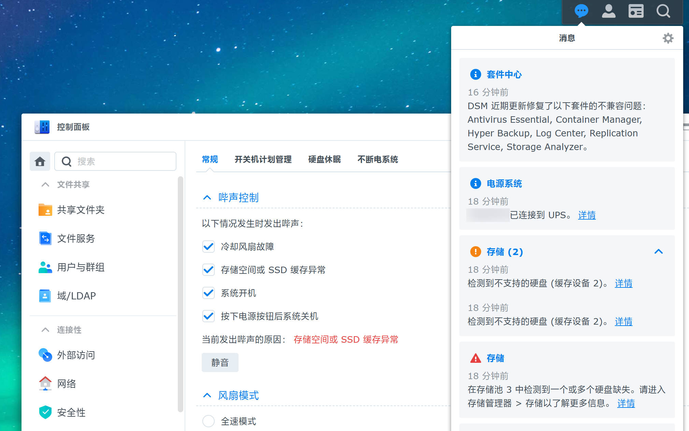
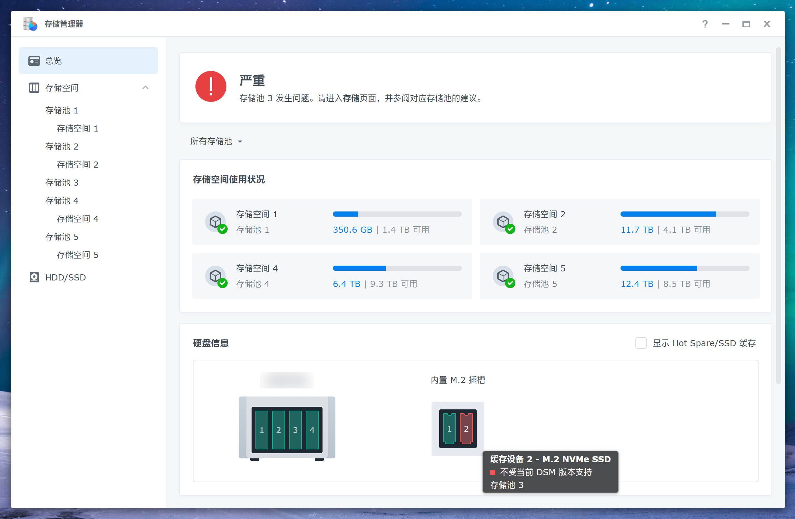
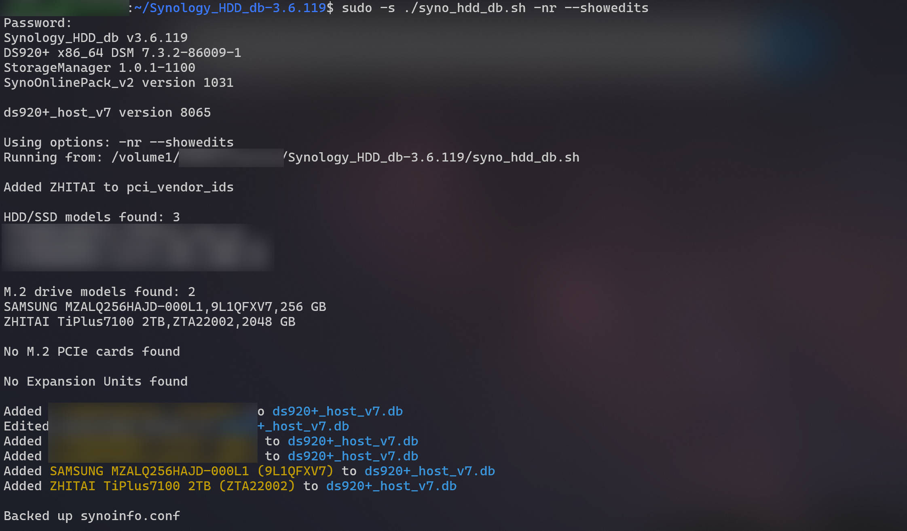
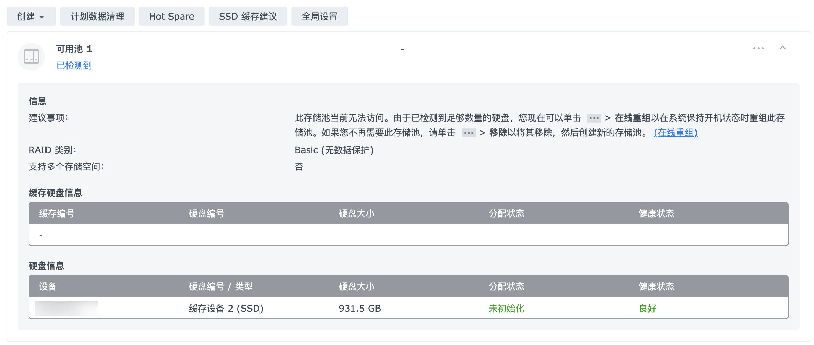

我的主力 NAS 是 Synology 群晖 DS920+，陪了我也快 4 年了。DS920+ 出厂默认是不支持将 M.2 NVMe SSD 作为存储池的，只能作为缓存使用。后来出的 DS923+ 倒是支持创建 M.2 存储池了，但是只能用它自家的[兼容性列表](https://www.synology.cn/zh-cn/compatibility?search_by=drives&model=DS923%2B&category=m2_ssd_internal)中的盘，也不知道套的哪家 OEM，贵得要死，买是不可能买的这辈子不可能买的。

好在有大神写了脚本 [Synology_HDD_db](https://github.com/007revad/Synology_HDD_db)，可以直接修改这个「兼容性列表」所在的数据库，把你在用的硬盘型号加进去。系统一读这个数据库发现型号在里面，就可以正常使用了。不过缺点是每次系统更新后，都需要重新执行一遍脚本。

今天看到关于 [飞牛 fnOS 0day 漏洞](http://archive.today/02RKX) 的帖子，寻思着也给 DS920+ 更新一下系统，毕竟一直都稳定运行着，也没有特意去升级。虽然我没用飞牛，也没有把服务暴露到公网，不过各家 NAS 系统的 CVE 其实都挺多的，以防万一嘛。

结果升级完系统 NAS 就开始疯狂嘀嘀嘀叫，才想起来还有硬盘兼容性这一茬……太久远了，顺手记录一下，免得下次再忘了。

<!--more-->

------

报错界面是这样的：

- 当前发出哔声的原因：存储空间或 SSD 缓存异常
- 检测到不支持的硬盘（缓存设备 2）
- 在存储池 3 中检测到一个或多个硬盘缺失
- 严重 存储池 3 发生问题
- 缓存设备 2 - M.2 NVMe SSD 不受当前 DSM 版本支持





## 更新硬盘兼容性数据库

这个 M.2 存储池是 2023 年建的，记得当时好像还不需要捣鼓什么兼容性数据库，应该是后来 DSM 7 加上的。

总之就是运行一下 [Synology_HDD_db](https://github.com/007revad/Synology_HDD_db) 这个脚本，每次系统更新完都要跑一遍，然后重启设备生效。

```bash
# 版本号自己改成最新的
wget https://github.com/007revad/Synology_HDD_db/archive/refs/tags/v3.6.119.zip
7z x v3.6.119.zip
cd Synology_HDD_db-3.6.119

sudo -s ./syno_hdd_db.sh -nr --showedits
# 用到的脚本参数：
# -n, --noupdate        Prevent DSM updating the compatible drive databases
# -r, --ram             Disable memory compatibility checking (DSM 7.x only)
# -s, --showedits       Show edits made to <model>_host db and db.new file(s)
```

比如我这里用的就是一条致态的 2TB 作为下载盘，另一条 256GB 的作为 HDD 缓存。



脚本运行以后，就会把你目前插着的硬盘加到 NAS 本地的兼容性列表数据库里了。

```bash
ls -al /var/lib/disk-compatibility/ | grep ds920+_host_v7
# -rw-r--r--  1 root root 156K Feb  1 02:07 ds920+_host_v7.db
# -rw-r--r--  1 root root 148K Jan 19 17:11 ds920+_host_v7.db.bak
# -rw-r--r--  1 root root  97K Oct 27  2023 ds920+_host_v7.db.new.bak
# -rw-r--r--  1 root root    8 Jan 19 17:11 ds920+_host_v7.release
# -rw-r--r--  1 root root    4 Jan 19 17:11 ds920+_host_v7.version

cat /var/lib/disk-compatibility/ds920+_host_v7.db | jq .
```

所谓数据库，其实就是个大 JSON：

```jsonc
{
  "disk_compatbility_info": {
    // ...
    "ZHITAI TiPlus7100 2TB": {
      "ZTA22002": {
        "compatibility_interval": [
          {
            "compatibility": "support",
            "not_yet_rolling_status": "support",
            "fw_dsm_update_status_notify": false,
            "barebone_installable": true,
            "barebone_installable_v2": "auto",
            "smart_test_ignore": false,
            "smart_attr_ignore": false
          }
        ]
      },
      // ...
    }
  },
  "nas_model": "ds920+"
}
```

## 建立 M.2 SSD 存储池

如果是 DS923+，运行完上面的脚本之后应该直接在 DSM Web UI 上创建存储池就可以了。

DS920+ 还是得自己手搓，记录一下用到的命令（之前参考的是 [这篇博客](https://blog.sylo.space/use-nvme-ssd-as-storage-volume-instead-of-cache-in-ds920/)）：

```bash
# 查看当前的 NVMe 设备，找到你要的 SSD
ls -al /dev/nvme*
sudo fdisk -l /dev/nvme0n1

# 给 SSD 分区，有多块盘的话小心别弄错了
sudo synopartition --part /dev/nvme0n1 12

# 看看当前的 RAID 状态，如果已经有 md5 了就新建 md6
cat /proc/mdstat
sudo mdadm --create /dev/md6 --level=1 --raid-devices=1 --force /dev/nvme0n1p3

# 创建文件系统
sudo mkfs.btrfs -f /dev/md6

sudo mdadm --detail /dev/md6
sudo reboot
```

重启 NAS 后，检查一下：

```bash
sudo fdisk -l /dev/nvme0n1
# Disk /dev/nvme0n1: 1.9 TiB, 2048408248320 bytes, 4000797360 sectors
# Disk model: ZHITAI TiPlus7100 2TB
# Units: sectors of 1 * 512 = 512 bytes
# Sector size (logical/physical): 512 bytes / 512 bytes
# I/O size (minimum/optimal): 512 bytes / 512 bytes
# Disklabel type: dos
# Disk identifier: 0xae2a9134

# Device         Boot   Start        End    Sectors  Size Id Type
# /dev/nvme0n1p1          256    4980735    4980480  2.4G fd Linux raid autodetect
# /dev/nvme0n1p2      4980736    9175039    4194304    2G fd Linux raid autodetect
# /dev/nvme0n1p3      9437184 4000795469 3991358286  1.9T fd Linux raid autodetect

sudo mdadm --detail /dev/md6
# /dev/md6:
#         Version : 1.2
#   Creation Time : Fri Jun  2 02:16:39 2023
#      Raid Level : raid1
#      Array Size : 1995678080 (1903.23 GiB 2043.57 GB)
#   Used Dev Size : 1995678080 (1903.23 GiB 2043.57 GB)
#    Raid Devices : 1
#   Total Devices : 1
#     Persistence : Superblock is persistent

#     Update Time : Sun Feb  1 03:25:45 2026
#           State : clean
#  Active Devices : 1
# Working Devices : 1
#  Failed Devices : 0
#   Spare Devices : 0

#            Name : localhost:6  (local to host localhost)
#            UUID : 2729425e:28782224:04f5d205:be6fcc6c
#          Events : 45

#     Number   Major   Minor   RaidDevice State
#        0     259        3        0      active sync   /dev/nvme0n1p3
```

然后去 Web UI 的「存储管理器 > 存储空间 > 可用池」，点击「在线重组」就好了。



## 小尾巴

顺便吐槽一下，这系统升级完把我所有的容器都停了，也不给我自动重启，我还得一个一个过去 `docker compose up -d` 拉起来……

下次有空的话聊聊 HomeLab 的安全性问题：不仅仅是这次飞牛 fnOS 的[路径穿越漏洞](https://www.v2ex.com/t/1189672)，还有之前影响到多个 self-hosted 软件乃至众多生产环境的 [React Server Component RCE 漏洞](https://github.com/umami-software/umami/issues/3829)，claude-relay-service 的[鉴权绕过漏洞](https://github.com/Wei-Shaw/claude-relay-service/commit/982cca10206b6729e837d73ac79a0d76e81fcc67)等等，都说明了把内网服务暴露到公网是极其危险的。很多人图方便喜欢搞什么内网穿透、DDNS、公网 IP、域名访问、DMZ、UPnP，殊不知距离被入侵可能只有一步之遥。
